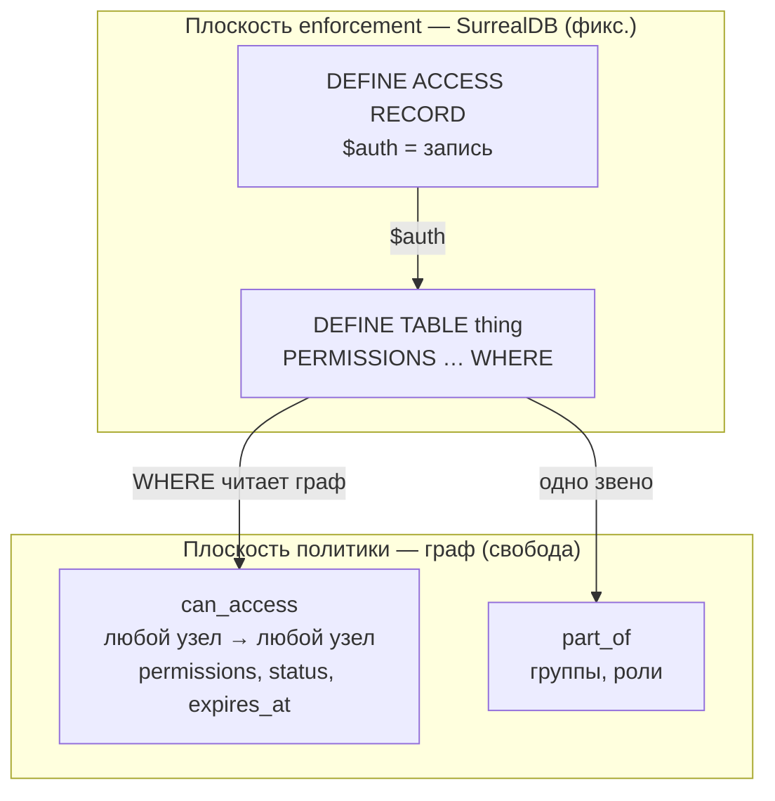
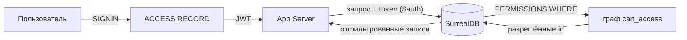

# Модель доступа и маппинг на SurrealDB

Как свободная граф-модель доступа Домового (`can_access`, см. раздел «Доступ и шаринг» в [`database.md`](database.md)) ложится на фиксированные примитивы аутентификации и авторизации SurrealDB.

## Два мира, которые кажутся несовместимыми

**Наша модель — свобода.** Всё — `thing`. `can_access` — свободное ребро между *любыми* двумя узлами: человек, группа, сервис-аккаунт, агент могут получить доступ к чему угодно. Права — множество (`view / edit / delete / run / share / manage`), плюс approval, expiry, группы. Новый домен = новые рёбра, без правки схемы.

**SurrealDB — жёсткие рамки.** Фиксированные примитивы:
- системные пользователи на ROOT / NAMESPACE / DATABASE с ролями `OWNER / EDITOR / VIEWER` — они **обходят** все табличные права;
- record-пользователи (`DEFINE ACCESS TYPE RECORD`), аутентифицированные как запись → `$auth`;
- `PERMISSIONS` на таблицах и полях: `NONE | FULL | WHERE <условие>`.

Кажется, что богатую свободную модель надо как-то втиснуть в три роли. **Это и есть источник путаницы — и это неверная постановка задачи.**

## Разрешение: свобода живёт в данных, а не в схеме

Мы **не маппим** наши права на роли SurrealDB. Вместо этого:

> **`can_access` — это данные политики. `PERMISSIONS … WHERE` — тонкий движок, который делегирует решение обратно в граф.**

`WHERE` в SurrealDB — полноценный запрос. Значит, enforcement пишется **один раз, обобщённо**: «покажи запись, если граф `can_access` это разрешает». Вся свобода (любой `kind`, любой сценарий шаринга, новый домен) реализуется добавлением *рёбер*, а не правкой схемы или прав. Жёсткость SurrealDB — это рамка-шлюз; гибкость в том, что шлюз спрашивает граф.

Маппинг получается **многие-к-одному**: вся наша модель → один record-access + один обобщённый шаблон `PERMISSIONS` на `thing`.



Аналогия: роли SurrealDB (`OWNER / EDITOR / VIEWER`) — это грубый уровень **админа БД** (как root в Unix). `can_access` — тонкий **прикладной** уровень (как ACL / policy). Прикладные права через DB-роли не выражаются.

## Что из SurrealDB мы реально используем

| Примитив SurrealDB | Используем для | Частота |
|--------------------|----------------|---------|
| ROOT-пользователь | миграции, `DEFINE` схемы, бэкап / restore | только админ |
| `ACCESS TYPE RECORD` | все люди и сервис-аккаунты → `$auth` | 99% трафика |
| `ACCESS TYPE JWT` | внешний IdP (OIDC / SAML) | опц. |
| `ACCESS TYPE BEARER` | отзываемые API-ключи (PAM) | опц. |
| `PERMISSIONS` на таблицах / полях | единственная точка enforcement | всегда |
| NS / DB-юзеры с `OWNER/EDITOR/VIEWER` | почти не используем — обходят PERMISSIONS | редко (напр. `VIEWER` для read-only метрик) |

⚠️ Приложение **никогда не ходит как root** — иначе PERMISSIONS обходятся и весь `can_access` бесполезен. App аутентифицирует каждый запрос как record-пользователя (или прокидывает его JWT).

## Таблица маппинга концептов

| Наша модель | SurrealDB |
|-------------|-----------|
| человек / сервис-аккаунт | record-пользователь (`ACCESS RECORD`), `$auth` |
| `thing:public` | запрос без `$auth` → отдельная ветка в `WHERE` |
| группа / роль (`part_of`) | подзапрос `$auth->part_of->thing` внутри `WHERE` |
| `can_access {permissions}` | строки, читаемые в `PERMISSIONS … WHERE` |
| `view` | `FOR select` |
| `edit` | `FOR update` / `FOR create` (дочерние) |
| `delete` | `FOR delete` |
| `share` / `manage` | `PERMISSIONS` **на ребре `can_access`** (кто вправе создавать / менять гранты) |
| `run` | app-уровень / `DEFINE FUNCTION` — нет SQL-операции |
| approval (`status: pending / active`) | `AND status = 'active'` в `WHERE` |
| `expires_at` | `AND (expires_at = NONE OR expires_at > time::now())` |
| значение секрета | **вне SurrealDB**; в графе ссылка, на чувствительных полях `FOR select NONE` |
| `OWNER / EDITOR / VIEWER` | **не маппим** — это уровень БД-админа |

Важный нюанс: наши 6 прав **не** ложатся 1:1 на 4 операции SurrealDB. `view / edit / delete` — прямой аналог на таблице `thing`; `share / manage` — enforcement на ребре `can_access`; `run` — только прикладной (SQL-операции «выполнить пайплайн» не существует).

## Конкретный enforcement

### Аутентификация: record-access

```surql
DEFINE ACCESS account ON DATABASE TYPE RECORD
  SIGNUP ( CREATE thing SET kind = 'человек', email = $email,
           pass = crypto::argon2::generate($pass) )
  SIGNIN ( SELECT * FROM thing WHERE email = $email
           AND crypto::argon2::compare(pass, $pass) )
  DURATION FOR TOKEN 15m, FOR SESSION 12h;
```

После `SIGNIN` `$auth` = запись человека / сервис-аккаунта.

### Авторизация: PERMISSIONS на thing

```surql
DEFINE TABLE thing SCHEMALESS PERMISSIONS
  FOR select WHERE
       id = $auth                                                          -- сам себя
    OR id IN (SELECT VALUE out FROM can_access
              WHERE 'view' IN permissions AND status = 'active'
                AND (expires_at = NONE OR expires_at > time::now())
                AND (in = $auth OR in IN $auth->part_of->thing))           -- прямой + группа (одно звено)
    OR id IN (SELECT VALUE out FROM can_access
              WHERE in = thing:public AND 'view' IN permissions AND status = 'active')  -- публичное
  FOR create WHERE $auth != NONE                                            -- детали — на app-уровне
  FOR update WHERE
       id IN (SELECT VALUE out FROM can_access
              WHERE 'edit' IN permissions AND status = 'active'
                AND (expires_at = NONE OR expires_at > time::now())
                AND (in = $auth OR in IN $auth->part_of->thing))
  FOR delete WHERE
       id IN (SELECT VALUE out FROM can_access
              WHERE 'delete' IN permissions AND status = 'active'
                AND (in = $auth OR in IN $auth->part_of->thing));
```

Заметь: правило **«без каскада / одно звено через группу»** из модели доступа здесь буквально превращается в один уровень `$auth->part_of->thing` — глубже не идём, потому что `WHERE` гоняется на каждую запись.

### share / manage — на ребре can_access

Кто вправе **выдавать** доступ — enforced на самом ребре:

```surql
DEFINE TABLE can_access TYPE RELATION FROM thing TO thing SCHEMAFULL PERMISSIONS
  FOR create WHERE
       out IN (SELECT VALUE out FROM can_access
               WHERE in = $auth AND ('share' IN permissions OR 'manage' IN permissions)
                 AND status = 'active')
  FOR update, delete WHERE
       out IN (SELECT VALUE out FROM can_access
               WHERE in = $auth AND 'manage' IN permissions AND status = 'active');
```

### Поля-секреты

```surql
DEFINE FIELD pass ON thing PERMISSIONS FOR select NONE;   -- хеш не отдаём никому
-- ссылка на секрет (ref) читаема; значение живёт вне SurrealDB
```

## Поток запроса end-to-end



## Почему свобода сохраняется

Шаблон `PERMISSIONS` написан **обобщённо** — он не упоминает конкретные `kind`, а спрашивает граф. Поэтому:
- новый домен (`kind`) — **0 правок** прав;
- новый сценарий шаринга — добавил ребро `can_access`, мгновенно enforced;
- новый тип принципала (агент, сервис-аккаунт) — это просто запись с `$auth`.

В классической RBAC-СУБД ты бы менял роли и гранты в схеме. Здесь политика — чистые **данные** графа, а enforcement-клауза неизменна. Это и есть мост между «свободой» и «жёсткостью».

## Где SurrealDB не дотягивает (честные границы)

| Ограничение | Обход |
|-------------|-------|
| `run / share / manage` нет SQL-операций | `run` — app / функция; `share / manage` — PERMISSIONS на ребре `can_access` |
| `WHERE` гоняется на каждую запись → дорого | правило «без каскада / одно звено» держит условие ограниченным |
| системные роли обходят PERMISSIONS | app не ходит root; root — только админ-плоскость |
| PERMISSIONS не аудируют **чтения** | аудит чтения (секреты, приватное) — на app / broker |
| одна таблица `thing` → весь вес на построчный `WHERE` | индексы (`kind, status`) + ограниченные обходы |
| shadow-узлы федерации | `FOR update WHERE _shadow != true OR _read_only != true` |

## Практические инварианты

- App коннектится через record-access, **никогда не root**.
- Все решения о правах — через `can_access` в `WHERE`; не хардкодить `kind`.
- Чувствительные поля — `FOR select NONE`; значения секретов — вне SurrealDB.
- `run` — enforce в приложении / функции; `share / manage` — на ребре `can_access`.
- root — только админ-плоскость (миграции, бэкап, `DEFINE`).
- `PERMISSIONS` пишутся один раз, обобщённо; новые домены их не трогают.
