# Структура базы данных (SurrealDB)

## Концепция

Всё есть **вещь** (`thing`). Гараж, полка, мотоцикл, масло, рецепт, магазин, человек, семья,
задача, подзадача, платёж, обращение, инстанция — один тип узла.
Смысл задаётся только рёбрами (связями) между вещами.

---

## Узлы

| Таблица | Примеры |
|---------|---------|
| `thing` | предмет, место, контейнер, транспорт, человек, группа, задача, подзадача, рецепт, процедура, запуск, список, платёж, обращение, решение, инстанция |

Типичные поля по смыслу:

| Смысл | Поля |
|-------|------|
| Любая вещь | `name`, `description`, `notes` |
| Физический предмет | `quantity`, `unit`, `purchase_date`, `price` |
| Задача / обращение | `status`, `deadline`, `priority`, `original_deadline`, `postponed_count` |
| Периодическая задача / платёж | `period`, `schedule`, `amount`, `due_day`, `paid_until` |
| Напоминание | `deadline`, `repeat` |
| Человек | `role` (папа, мама, сын, дочь, бабушка) |
| Физическая/цифровая вещь | `kind` (физическое / цифровое / смешанное) |
| Сообщение | `text`, `created_at` |

**`status` задачи:** `не начато` / `в процессе` / `выполнено` / `ожидает` / `на паузе` / `отменено`  
**`status` обещания:** `ожидается` / `выполнено` / `нарушено`  
**`period`:** `ежедневно` / `еженедельно` / `ежемесячно` / `ежеквартально` / `ежегодно`  
**`schedule`:** произвольная строка — `каждую пятницу`, `1-е число месяца`, `каждые 10000 км`

---

## Рёбра

| Связь | Описание | Поля на ребре |
|-------|----------|---------------|
| `contains` | Где физически находится вещь | `reason`, `since` |
| `part_of` | Часть чего / подзадача / запуск шаблона | — |
| `assigned_to` | Кто отвечает (человек, группа или вся семья) | — |
| `depends_on` | Задача ждёт выполнения другой | — |
| `about` | Задача/обращение касается этой вещи или решения | — |
| `filed_with` | Обращение подано в эту инстанцию/организацию | — |
| `needs` | Что нужно купить (список → вещь) | `quantity`, `unit` |
| `requires` | Плановый расход (шаблон → ингредиент/деталь) | `quantity`, `unit` |
| `produces` | Результат выполнения (решение, документ, блюдо) | — |
| `used` | Фактический расход при запуске | `quantity`, `unit` |
| `promised_to` | Кому дано обещание | — |
| `represents` | Цифровая копия → физический оригинал | — |
| `can_access` | Кто имеет доступ к цифровой вещи | — |
| `related_to` | Произвольная связь с меткой | `label` |

**`reason` на ребре `contains`:** `хранение` / `транспорт` / `ремонт` / `покупка`

---

## Люди и группы

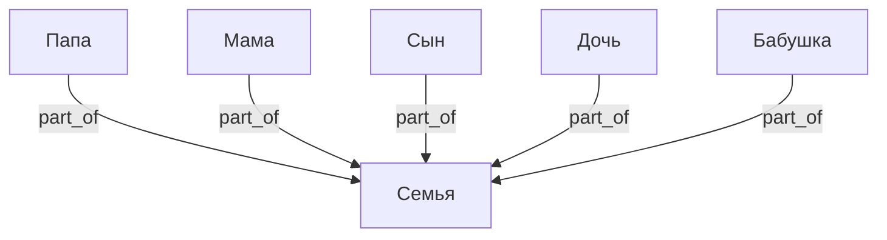

- `assigned_to` → конкретный человек: личная ответственность
- `assigned_to` → несколько людей: совместная
- `assigned_to` → Семья: открытая задача, берёт кто свободен

---

## Физическое и цифровое

Физическая вещь отвечает на вопрос **где находится** → `contains`.  
Цифровая вещь отвечает на вопрос **кто имеет доступ** → `can_access`.  
Связь между ними — `represents`.

Поле `kind`: `физическое` / `цифровое` / `смешанное`.

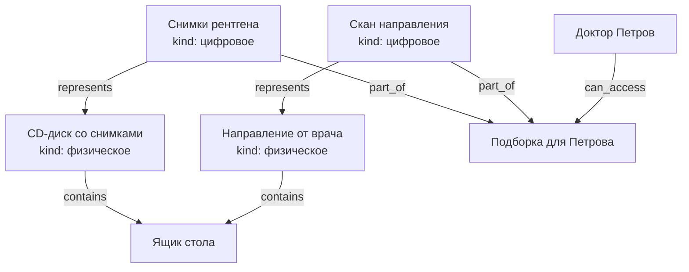

- Диск физически лежит в ящике, врач его не трогает
- Врач получает `can_access` только к цифровым копиям
- Один физический оригинал может иметь несколько цифровых представлений (скан, фото, PDF)

---

## Доступ и шаринг

`can_access` работает напрямую на конкретные вещи — без глобальных пространств.  
**Каскад:** доступ к вещи автоматически даёт доступ ко всему `part_of` неё вглубь.

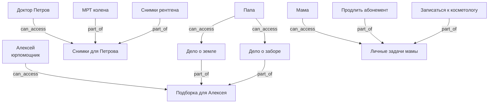

**Шаблон доступа** — заранее созданный контейнер с типовым набором.  
Пример: "Доступ врача" — контейнер с нужными цифровыми копиями,  
врачу выдаётся `can_access` к этому контейнеру и ничего лишнего.

---

## Сценарий: обсуждения

Сообщение — `thing` с полем `text` и `created_at`. Привязывается к любой вещи через `about`.
Автор — через `assigned_to`. Из сообщения через `produces` может вырасти задача или обещание.

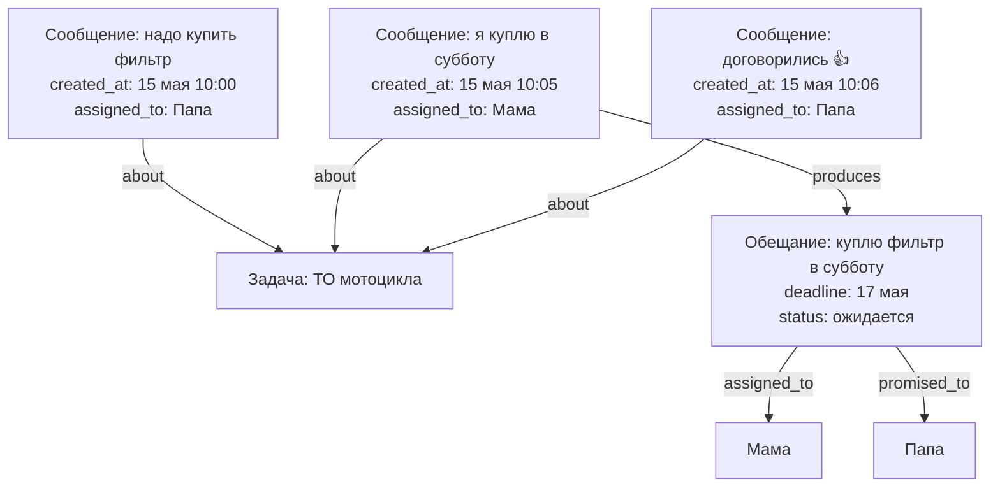

Обсуждение — просто поток сообщений `about` одной вещи, упорядоченных по `created_at`.
Отдельного контейнера не нужно.

---

## Сценарий: обещания и каскад

Обещание — `thing` с дедлайном и статусом. Когда выполняется — `produces` порождает
задачи, покупки, другие обещания. Дедлайн может быть через год.

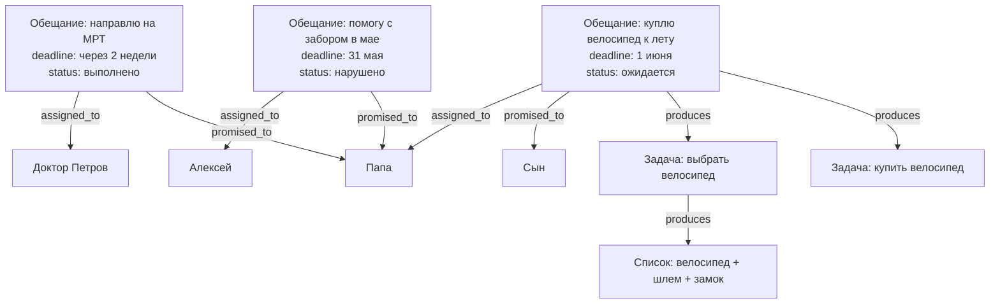

**Нарушенное обещание** (`status: нарушено`) не исчезает — остаётся в графе как факт,
на него можно ссылаться в новых обсуждениях или обращениях.

```surql
-- Все обещания данные нам (promised_to: папа), ещё не выполненные
SELECT * FROM thing WHERE ->promised_to->thing = thing:dad
  AND status = "ожидается";

-- Просроченные обещания
SELECT * FROM thing WHERE status = "ожидается"
  AND deadline < time::now()
  AND ->promised_to->thing != NONE;

-- Обсуждение под задачей (все сообщения, по времени)
SELECT * FROM thing WHERE ->about->thing = thing:task_motorcycle_service
  AND text != NONE
  ORDER BY created_at ASC;

-- Что выросло из обещания (каскад)
SELECT ->produces->thing.* FROM thing:promise_bicycle DEPTH 5;

-- Нарушенные обещания от конкретного человека
SELECT * FROM thing WHERE ->assigned_to->thing = thing:alex
  AND status = "нарушено";
```

---

## Сценарий: периодические задачи и напоминания

Периодическая задача — шаблон с расписанием. Каждое выполнение — `run` через `part_of`.
Напоминание — отдельный `thing` с `about` на конкретный запуск.

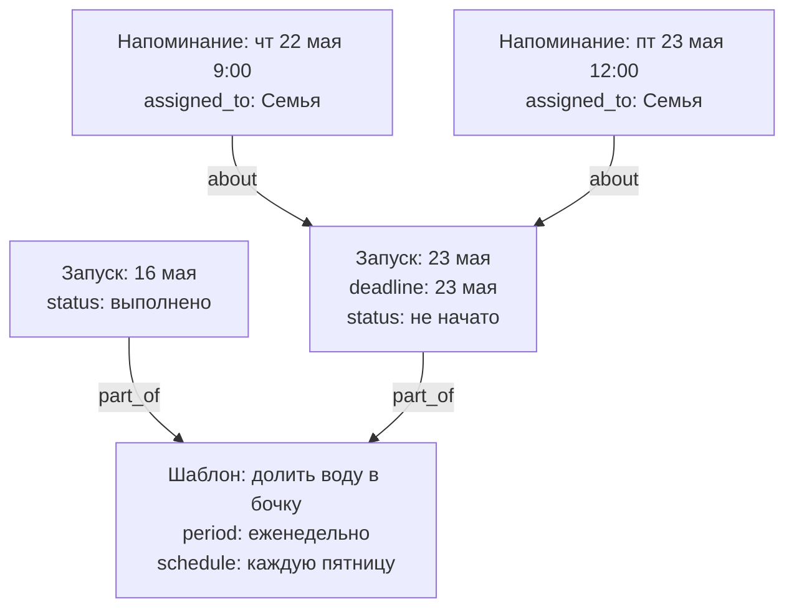

На одну задачу — сколько угодно напоминаний, каждому своё (`assigned_to`), в любое время.

---

## Перенос, пауза, история

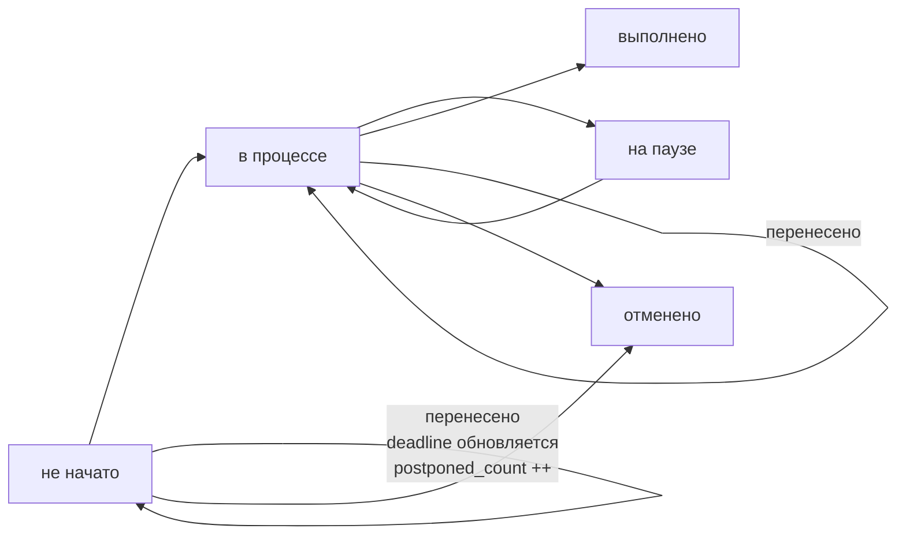

**Перенос задачи:**
- `deadline` обновляется на новую дату
- `original_deadline` сохраняет изначальный срок
- `postponed_count` увеличивается на 1
- Напоминания пересоздаются с новыми датами

**Пауза:**
- `status: на паузе` — задача видна, но не давит дедлайном
- Используется когда задача заблокирована внешними обстоятельствами,
  но `depends_on` формально не выражает причину

**Примеры расписаний:**

| Задача | `period` | `schedule` |
|--------|----------|------------|
| Долить воду в бочку | еженедельно | каждую пятницу |
| Оплатить электричество | ежемесячно | до 10-го числа |
| ТО мотоцикла | — | каждые 10000 км / раз в год |
| Проверить аптечку | ежеквартально | 1-е число квартала |
| Забрать ребёнка из секции | еженедельно | вт, чт 18:00 |

---

## Сценарий: периодические платежи

Каждый периодический платёж — шаблон (`thing`) с расписанием.
Каждая оплата — запуск (`run`), `part_of` шаблона.

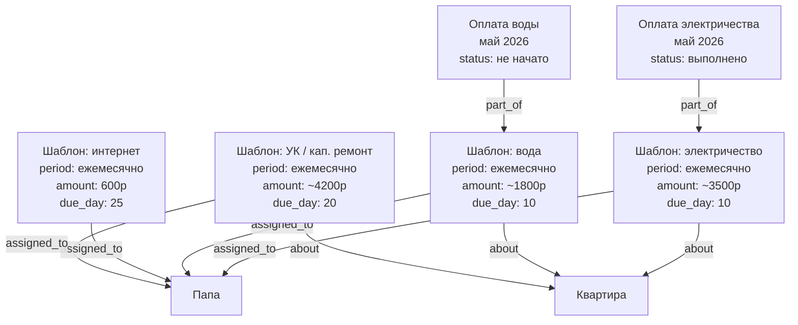

Просроченные платежи — обычный запрос: `paid_until < сегодня`.

---

## Сценарий: юридические обращения

Цепочка обжалований строится через `about` (это обращение обжалует то решение)
и `filed_with` (подано в эту инстанцию).

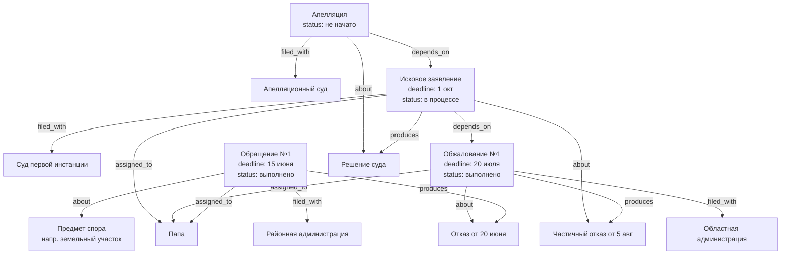

Вся цепочка читается как путь по `about` и `produces`:  
Обращение → решение → следующее обращение → решение → ...

---

## Сценарий: подзадачи

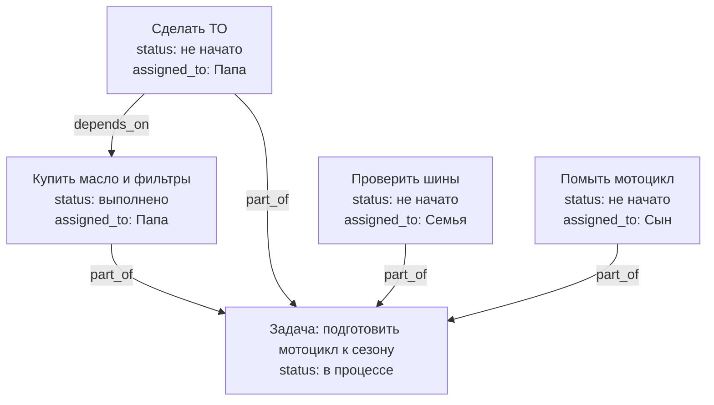

---

## Сценарий: открытые и личные задачи

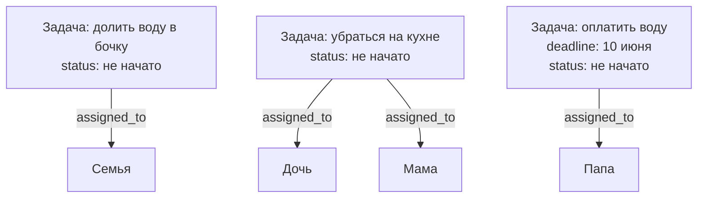

---

## Уведомления (логика приложения)

| Событие | Кто получает уведомление |
|---------|--------------------------|
| Новая задача `assigned_to` человек | Этот человек |
| Новая задача `assigned_to` Семья | Все члены семьи |
| Задача `depends_on` выполнена | Исполнитель следующей задачи |
| Дедлайн приближается (за 3 дня) | Исполнитель задачи |
| `quantity` = 0 | Все (или исполнитель задачи на покупку) |
| `paid_until` истекает | Исполнитель шаблона платежа |
| Решение по обращению получено (`produces`) | Исполнитель следующего обращения |

---

## SurrealDB: схема

```surql
DEFINE TABLE thing SCHEMALESS;

DEFINE TABLE contains TYPE RELATION FROM thing TO thing SCHEMAFULL;
DEFINE FIELD reason ON contains TYPE option<string>;
DEFINE FIELD since  ON contains TYPE option<datetime>;

DEFINE TABLE part_of    TYPE RELATION FROM thing TO thing;
DEFINE TABLE assigned_to TYPE RELATION FROM thing TO thing;
DEFINE TABLE depends_on  TYPE RELATION FROM thing TO thing;
DEFINE TABLE about       TYPE RELATION FROM thing TO thing;
DEFINE TABLE filed_with  TYPE RELATION FROM thing TO thing;
DEFINE TABLE produces    TYPE RELATION FROM thing TO thing;

DEFINE TABLE needs TYPE RELATION FROM thing TO thing SCHEMAFULL;
DEFINE FIELD quantity ON needs TYPE option<number>;
DEFINE FIELD unit     ON needs TYPE option<string>;

DEFINE TABLE requires TYPE RELATION FROM thing TO thing SCHEMAFULL;
DEFINE FIELD quantity ON requires TYPE option<number>;
DEFINE FIELD unit     ON requires TYPE option<string>;

DEFINE TABLE used TYPE RELATION FROM thing TO thing SCHEMAFULL;
DEFINE FIELD quantity ON used TYPE option<number>;
DEFINE FIELD unit     ON used TYPE option<string>;

DEFINE TABLE represents TYPE RELATION FROM thing TO thing;

DEFINE TABLE can_access TYPE RELATION FROM thing TO thing;

DEFINE TABLE related_to TYPE RELATION FROM thing TO thing SCHEMAFULL;
DEFINE FIELD label ON related_to TYPE string;
```

---

## SurrealQL: примеры запросов

```surql
-- Платежи которые нужно оплатить в этом месяце
SELECT * FROM thing WHERE paid_until < time::now() + 30d
  AND period != NONE;

-- Вся цепочка обжалований по делу (рекурсивно)
SELECT ->about->thing.* FROM thing:case_1 DEPTH 10;

-- Открытые задачи для любого члена семьи
SELECT * FROM thing WHERE status = "не начато"
  AND ->assigned_to->thing CONTAINS thing:family;

-- Мои задачи (личные + семейные, не выполненные)
SELECT * FROM thing WHERE status != "выполнено"
  AND (->assigned_to->thing CONTAINS thing:dad
    OR ->assigned_to->thing CONTAINS thing:family);

-- Задачи без невыполненных зависимостей (можно начать)
SELECT * FROM thing WHERE status = "не начато"
  AND ->depends_on->thing[WHERE status != "выполнено"] IS EMPTY;

-- Все документы/решения по юридическому делу
SELECT ->produces->thing.* FROM thing WHERE ->filed_with->thing != NONE;

-- Просроченные задачи и платежи
SELECT * FROM thing
  WHERE deadline < time::now() AND status NOT IN ["выполнено", "отменено"];

-- Задачи на паузе
SELECT * FROM thing WHERE status = "на паузе";

-- Напоминания на сегодня
SELECT * FROM thing WHERE deadline < time::now() + 1d
  AND ->about->thing.status NOT IN ["выполнено", "отменено"];

-- Следующий запуск периодической задачи
SELECT * FROM thing WHERE part_of = thing:template_barrel
  ORDER BY deadline DESC LIMIT 1;

-- Задачи которые переносили больше 2 раз
SELECT * FROM thing WHERE postponed_count > 2
  AND status NOT IN ["выполнено", "отменено"];
```

---

## YAML: описание схемы

```yaml
узел:
  тип: thing
  поля:
    обязательные:
      - название: текст
    необязательные:
      - описание: текст
      - количество: число
      - единица: текст
      - куплено: дата
      - цена: число
      - заметки: текст
      - статус: текст              # не начато / в процессе / выполнено / ожидает / на паузе / отменено
      - дедлайн: дата
      - изначальный_дедлайн: дата  # сохраняется при первом переносе
      - перенесено_раз: число      # сколько раз переносили
      - приоритет: текст           # низкий / средний / высокий
      - период: текст              # ежедневно / еженедельно / ежемесячно / ежеквартально / ежегодно
      - расписание: текст          # "каждую пятницу", "до 10-го числа", "каждые 10000 км"
      - повтор_напоминания: текст  # для напоминаний: "каждый день за 3 дня до"
      - роль: текст                # для людей: папа / мама / сын / дочь / бабушка
      - сумма: число               # для платежей
      - день_оплаты: число         # число месяца: 1–31
      - оплачено_до: дата
    дополнительные: любые

связи:
  contains:
    от: thing
    к: thing
    поля:
      - reason: текст         # хранение / транспорт / ремонт / покупка
      - since: дата
  part_of:
    описание: часть чего / подзадача / запуск шаблона
    от: thing
    к: thing
  assigned_to:
    описание: кто отвечает (человек, несколько людей или вся семья)
    от: thing
    к: thing
  depends_on:
    описание: задача ждёт выполнения другой
    от: thing
    к: thing
  about:
    описание: задача/обращение касается этой вещи или обжалует это решение
    от: thing
    к: thing
  filed_with:
    описание: обращение подано в эту инстанцию/организацию
    от: thing
    к: thing
  needs:
    описание: нужно купить
    от: thing
    к: thing
    поля:
      - quantity: число
      - unit: текст
  requires:
    описание: плановый расход (шаблон → ингредиент/деталь)
    от: thing
    к: thing
    поля:
      - quantity: число
      - unit: текст
  produces:
    описание: результат выполнения (решение, документ, блюдо, изделие)
    от: thing
    к: thing
  used:
    описание: фактический расход при запуске
    от: thing
    к: thing
    поля:
      - quantity: число
      - unit: текст
  promised_to:
    описание: кому дано обещание
    от: thing   # обещание
    к: thing    # человек или группа

  represents:
    описание: цифровая копия → физический оригинал
    от: thing   # цифровое
    к: thing    # физическое

  can_access:
    описание: кто имеет доступ к цифровой вещи или контейнеру
    от: thing   # человек или группа
    к: thing    # цифровая вещь или контейнер

  related_to:
    описание: произвольная связь
    от: thing
    к: thing
    поля:
      - label: текст
```

---

## Сценарий: жалоба с fan-out по инстанциям

Одна жалоба охватывает несколько объектов. Вышестоящая инстанция пересылает её вниз —
каждое подзадело живёт независимо, но остаётся связано с корнем через `part_of`.

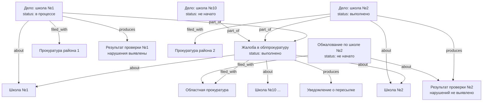

**Почему это работает без изменений схемы:**
- `part_of` связывает подзадела с корневой жалобой — всегда виден источник
- Каждое подзадело независимо: своя прокуратура (`filed_with`), свой результат (`produces`), своё обжалование (`about`)
- Fan-out естественен для графа — у одного узла может быть сколько угодно рёбер любого типа

```surql
-- Все подзадела и их статусы
SELECT name, status, ->filed_with->thing.name AS прокуратура
FROM thing WHERE ->part_of->thing = thing:root_complaint;

-- Результаты которые можно обжаловать (есть результат, нет обжалования)
SELECT * FROM thing WHERE ->part_of->thing = thing:root_complaint
  AND ->produces->thing != NONE
  AND NOT (SELECT * FROM thing WHERE ->about->thing = (->produces->thing));

-- Вся цепочка от корневой жалобы вглубь
SELECT ->part_of<-thing.* FROM thing:root_complaint DEPTH 5;
```

---

## Сценарий: медицина — приёмы, назначения, направления

Врач `part_of` больница. Приём — задача с дедлайном. Назначения и направления —
`produces` из приёма. Следующий приём `about` направление.

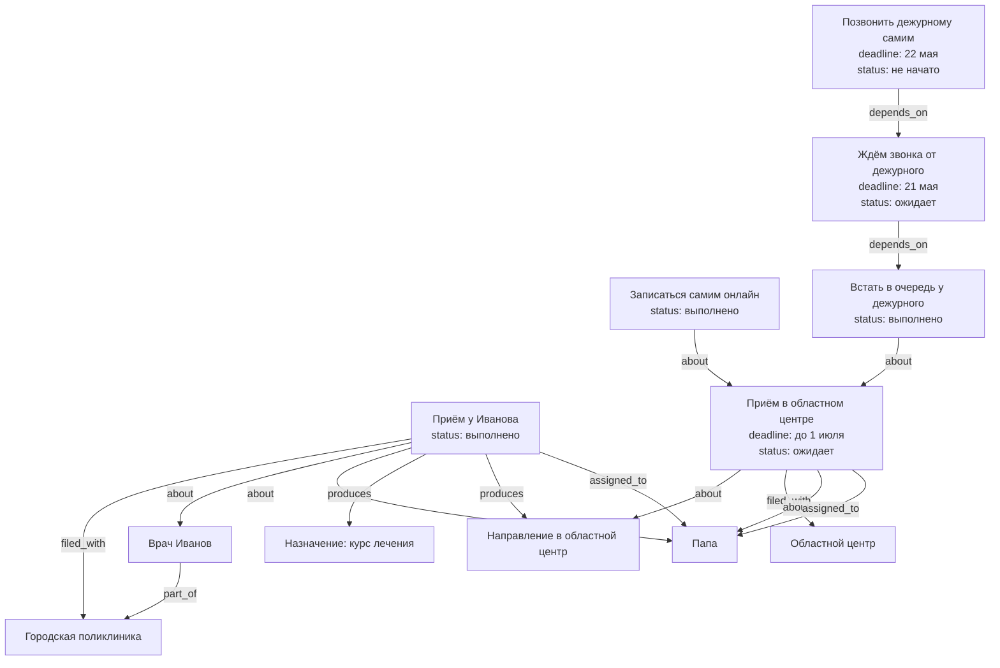

**Таймаут на звонок:** `Followup` с дедлайном на следующий день после `Callback` —
страховка от забывчивости. Уведомление сработает когда дедлайн `Callback` истечёт
без выполнения.

**OR-логика записи:** два пути к одному приёму (самостоятельно или через дежурного) —
это поведение приложения. Когда хотя бы один путь сработал, `Visit2` помечается
подтверждённым. В схеме не формализуется.

```surql
-- Все предстоящие приёмы у врачей
SELECT * FROM thing WHERE ->filed_with->thing.name CONTAINS "больниц"
  AND deadline > time::now() AND status != "выполнено";

-- Назначения и направления из последнего приёма
SELECT ->produces->thing.* FROM thing:visit_ivanov_may;

-- Незакрытые задачи по ожиданию обратного звонка
SELECT * FROM thing WHERE name CONTAINS "звонк" AND status = "ожидает"
  AND deadline < time::now() + 1d;

-- Все приёмы конкретного пациента
SELECT <-about<-thing[WHERE ->filed_with->thing != NONE].* FROM thing:dad;
```

---

## Открытые вопросы

- [ ] История перемещений вещей?
- [ ] Повторяющиеся задачи — шаблон с расписанием (каждую субботу, каждые 10000 км)?
- [ ] Уведомления — push или только в приложении?
- [ ] Фотографии вещей?
- [ ] Штрихкоды / QR-коды при добавлении?
- [ ] Документы по юридическим делам — хранить файлы или только ссылки?
