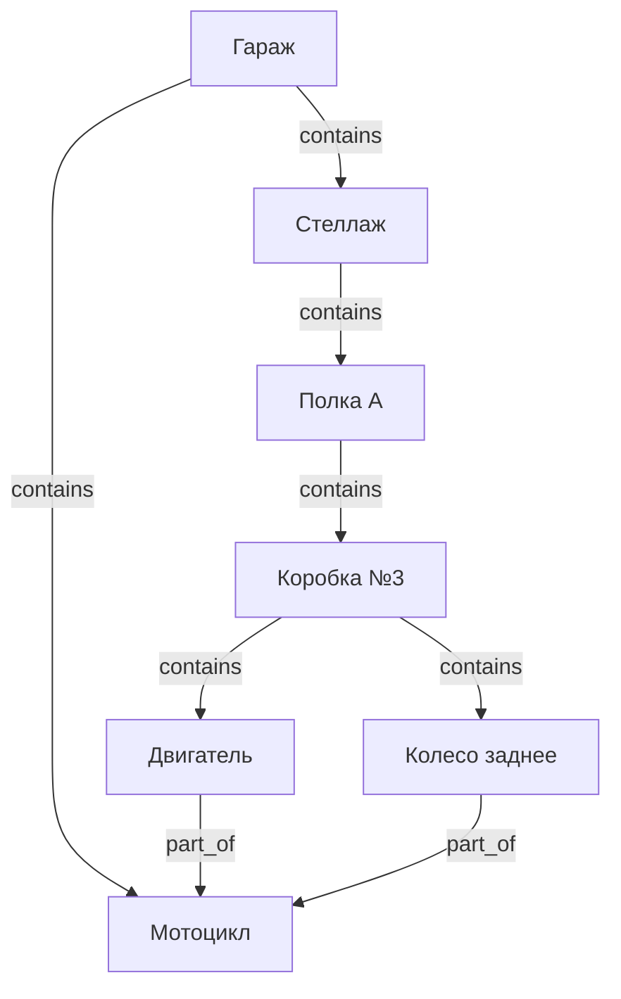
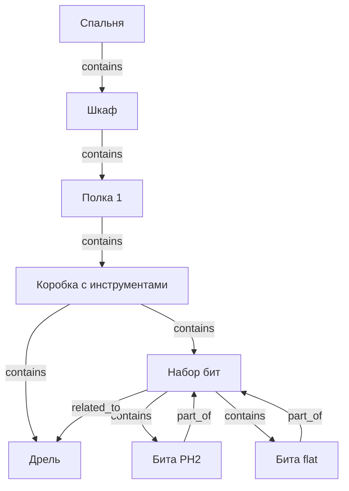

# Структура базы данных (SurrealDB)

## Концепция

Всё есть **вещь** (`thing`). Гараж, полка, коробка, мотоцикл, двигатель, батарейка — один тип узла.  
Смысл задаётся только рёбрами (связями) между вещами.

Один узел может одновременно:
- содержать другие вещи (быть контейнером)
- находиться внутри чего-то
- быть частью другой вещи
- иметь в себе части

---

## Узлы

| Таблица | Описание |
|---------|----------|
| `thing` | Любая вещь: предмет, место, контейнер, категория |

Поля у каждой вещи — произвольные. Никакой фиксированной схемы.

---

## Рёбра

| Связь | Описание |
|-------|----------|
| `contains` | Где физически находится вещь прямо сейчас |
| `part_of` | Частью чего является семантически (даже если физически разобрана) |
| `related_to` | Произвольная связь с меткой (совместимость, комплект, ссылка) |

---

## Пример: мотоцикл в гараже



`contains` — **где физически лежит** прямо сейчас  
`part_of` — **чему принадлежит** семантически, даже если разобрано и разложено по разным местам

---

## Пример: шкаф с инструментами



---

## Вопросы к графу

**Где сейчас двигатель?**
```
Двигатель ← contains ← Коробка №3 ← contains ← Полка A ← contains ← Стеллаж ← contains ← Гараж
```

**Какие части мотоцикла и где они находятся?**
```
Мотоцикл ← part_of ← [Двигатель, Колесо, ...]
для каждой части: идём вверх по contains → получаем путь до корня
```

**Что лежит в коробке №3 (включая вложенное)?**
```
Коробка №3 → contains → [Двигатель, Колесо] → contains → ...
```

---

## SurrealDB: схема

```surql
-- Единственный тип узла
DEFINE TABLE thing SCHEMALESS;

-- Физическое местонахождение
DEFINE TABLE contains TYPE RELATION FROM thing TO thing;

-- Семантическая принадлежность
DEFINE TABLE part_of TYPE RELATION FROM thing TO thing;

-- Произвольная связь с меткой
DEFINE TABLE related_to TYPE RELATION FROM thing TO thing SCHEMAFULL;
DEFINE FIELD label ON related_to TYPE string; -- "совместим", "комплект", "см. также"
```

---

## SurrealQL: примеры запросов

```surql
-- Где находится вещь (путь вверх)
SELECT <-contains<-thing.* FROM thing:engine;

-- Всё содержимое гаража рекурсивно (до 5 уровней вложенности)
SELECT ->contains->(thing AS item FETCH item) FROM thing:garage DEPTH 5;

-- Все части мотоцикла, где бы они ни находились
SELECT <-part_of<-thing.* FROM thing:motorcycle;

-- Части мотоцикла + где каждая из них лежит
SELECT name, <-contains<-thing.name AS location
FROM (SELECT * FROM <-part_of<-thing FROM thing:motorcycle);
```

---

## YAML: описание схемы

```yaml
узел:
  тип: thing
  поля:
    обязательные:
      - название: текст
    необязательные:
      - описание: текст
      - количество: число
      - единица: текст        # кг, шт, л, м
      - куплено: дата
      - цена: число
      - заметки: текст
    дополнительные: любые     # без ограничений

связи:
  contains:
    описание: физическое местонахождение прямо сейчас
    от: thing
    к: thing

  part_of:
    описание: семантическая принадлежность (часть чего)
    от: thing
    к: thing

  related_to:
    описание: произвольная связь
    от: thing
    к: thing
    поля:
      - label: текст          # "совместим", "комплект", "см. также"
```

---

## Открытые вопросы

- [ ] Нужна ли история перемещений (где вещь была раньше)?
- [ ] Учёт расхода — уменьшать количество (для еды, расходников)?
- [ ] Фотографии вещей?
- [ ] Штрихкоды / QR-коды при добавлении?
- [ ] Несколько пользователей / ответственный за вещь?
