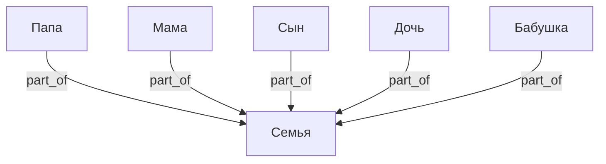
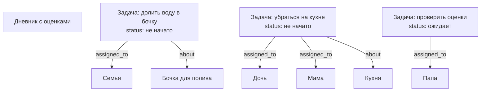
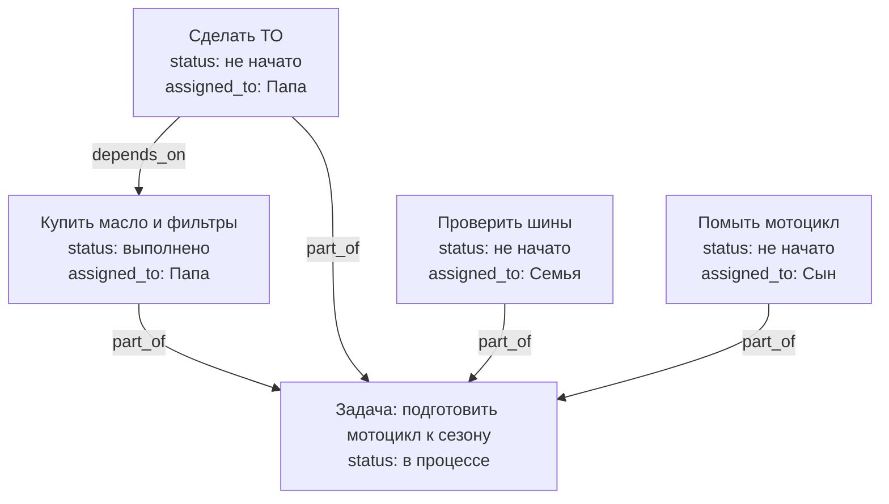
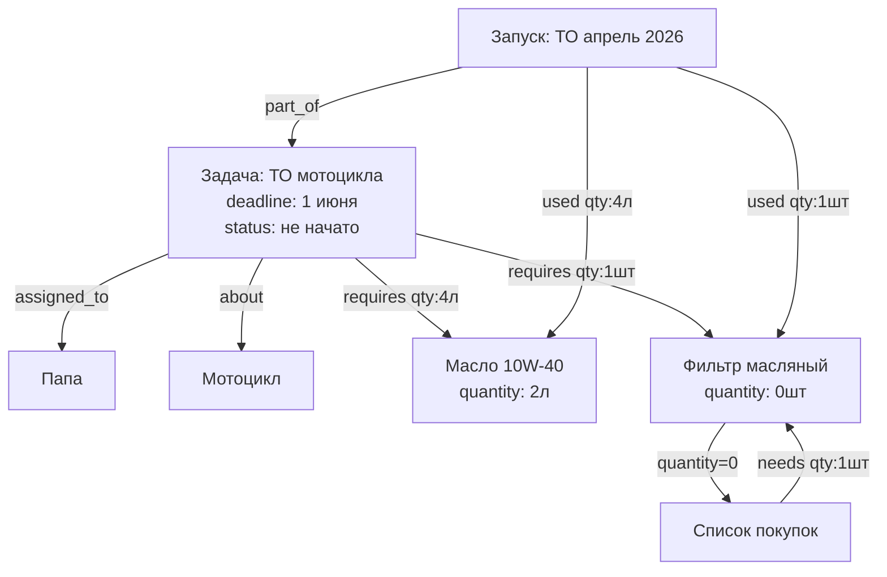
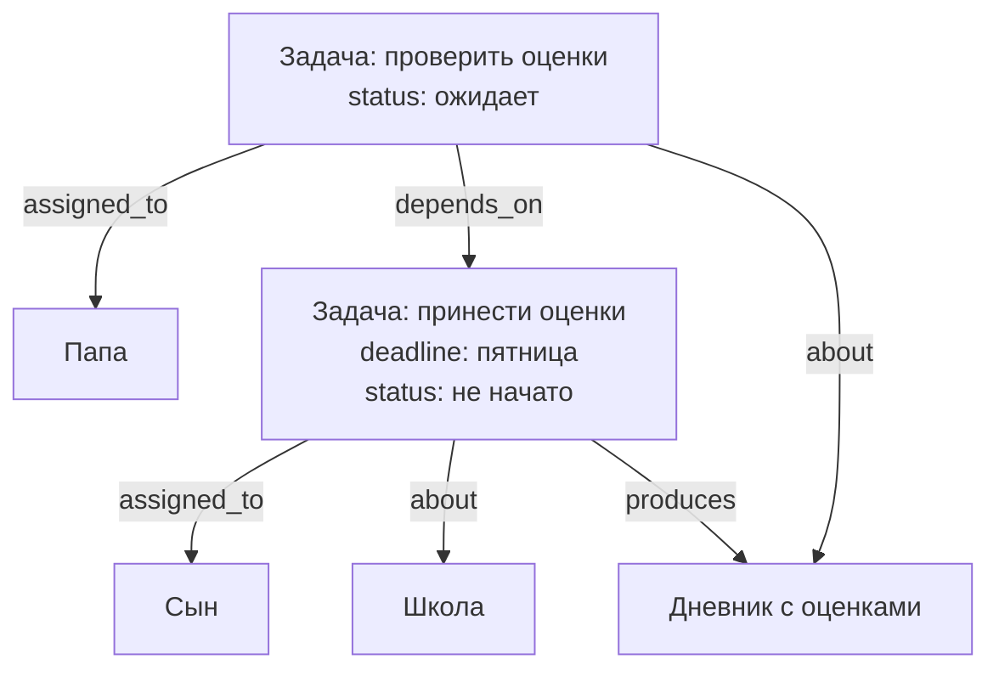
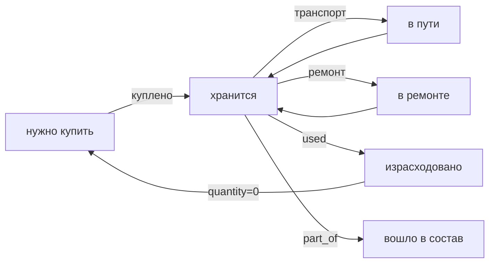
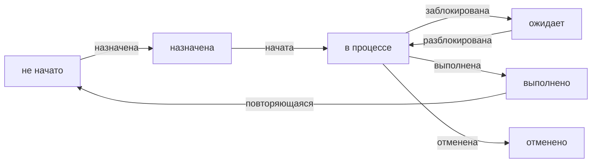

# Структура базы данных (SurrealDB)

## Концепция

Всё есть **вещь** (`thing`). Гараж, полка, мотоцикл, масло, рецепт, магазин, человек, семья,
задача, подзадача — один тип узла. Смысл задаётся только рёбрами (связями) между вещами.

---

## Узлы

| Таблица | Примеры |
|---------|---------|
| `thing` | предмет, место, контейнер, транспорт, человек, группа, задача, подзадача, рецепт, процедура, запуск, список |

Типичные поля по смыслу:

| Смысл | Поля |
|-------|------|
| Любая вещь | `name`, `description`, `notes` |
| Физический предмет | `quantity`, `unit`, `purchase_date`, `price` |
| Задача | `status`, `deadline`, `priority` |
| Человек | `role` (папа, мама, сын, дочь, бабушка) |

**`status` для задач:** `не начато` / `в процессе` / `выполнено` / `ожидает` / `отменено`

---

## Рёбра

| Связь | Описание | Поля на ребре |
|-------|----------|---------------|
| `contains` | Где физически находится вещь | `reason`, `since` |
| `part_of` | Часть чего / подзадача родительской задачи / запуск шаблона | — |
| `assigned_to` | Кто отвечает (человек или группа) | — |
| `depends_on` | Задача ждёт выполнения другой | — |
| `about` | Задача или событие касается этой вещи | — |
| `needs` | Что нужно купить (список → вещь) | `quantity`, `unit` |
| `requires` | Плановый расход (шаблон → ингредиент/деталь) | `quantity`, `unit` |
| `produces` | Результат выполнения шаблона | — |
| `used` | Фактический расход при запуске | `quantity`, `unit` |
| `related_to` | Произвольная связь с меткой | `label` |

**`reason` на ребре `contains`:** `хранение` / `транспорт` / `ремонт` / `покупка`

---

## Люди и группы

Семья — тоже `thing`. Люди `part_of` семьи. Задача может быть назначена как конкретному
человеку, так и всей семье (открытая задача — берёт кто свободен).



**Режим назначения:**
- `assigned_to` → конкретный человек: личная ответственность
- `assigned_to` → несколько людей: совместная ответственность
- `assigned_to` → Семья: открытая задача, берёт кто свободен

---

## Сценарий: открытые и личные задачи



---

## Сценарий: подзадачи

Подзадача — это `thing` с `part_of` к родительской задаче. Никакого процента выполнения —
только `status` на каждой подзадаче. Родительская задача выполнена когда все подзадачи выполнены.



---

## Сценарий: ТО мотоцикла (задача + инвентарь)



---

## Сценарий: оценки в школе



---

## Уведомления (логика приложения)

Схема не меняется — уведомления это поведение приложения поверх графа:

| Событие | Кто получает уведомление |
|---------|--------------------------|
| Новая задача `assigned_to` человек | Этот человек |
| Новая задача `assigned_to` Семья | Все члены семьи |
| Задача `depends_on` выполнена | Исполнитель следующей задачи |
| Дедлайн задачи приближается | Исполнитель задачи |
| `quantity` упало до нуля | Все (или `assigned_to` задачи на покупку) |

---

## Жизненный цикл вещи



## Жизненный цикл задачи



---

## SurrealDB: схема

```surql
DEFINE TABLE thing SCHEMALESS;

DEFINE TABLE contains TYPE RELATION FROM thing TO thing SCHEMAFULL;
DEFINE FIELD reason ON contains TYPE option<string>;
DEFINE FIELD since  ON contains TYPE option<datetime>;

DEFINE TABLE part_of TYPE RELATION FROM thing TO thing;

DEFINE TABLE assigned_to TYPE RELATION FROM thing TO thing;

DEFINE TABLE depends_on TYPE RELATION FROM thing TO thing;

DEFINE TABLE about TYPE RELATION FROM thing TO thing;

DEFINE TABLE needs TYPE RELATION FROM thing TO thing SCHEMAFULL;
DEFINE FIELD quantity ON needs TYPE option<number>;
DEFINE FIELD unit     ON needs TYPE option<string>;

DEFINE TABLE requires TYPE RELATION FROM thing TO thing SCHEMAFULL;
DEFINE FIELD quantity ON requires TYPE option<number>;
DEFINE FIELD unit     ON requires TYPE option<string>;

DEFINE TABLE produces TYPE RELATION FROM thing TO thing;

DEFINE TABLE used TYPE RELATION FROM thing TO thing SCHEMAFULL;
DEFINE FIELD quantity ON used TYPE option<number>;
DEFINE FIELD unit     ON used TYPE option<string>;

DEFINE TABLE related_to TYPE RELATION FROM thing TO thing SCHEMAFULL;
DEFINE FIELD label ON related_to TYPE string;
```

---

## SurrealQL: примеры запросов

```surql
-- Открытые задачи (assigned_to Семья) — что можно взять прямо сейчас
SELECT * FROM thing WHERE status = "не начато"
  AND ->assigned_to->thing CONTAINS thing:family;

-- Мои задачи (назначены лично мне или семье)
SELECT * FROM thing WHERE status != "выполнено"
  AND (->assigned_to->thing CONTAINS thing:dad
    OR ->assigned_to->thing CONTAINS thing:family);

-- Задачи которые разблокированы (все depends_on выполнены)
SELECT * FROM thing WHERE status = "не начато"
  AND ->depends_on->thing[WHERE status != "выполнено"] IS EMPTY;

-- Подзадачи родительской задачи
SELECT <-part_of<-thing.* FROM thing:task_motorcycle_season;

-- Что нужно купить для задачи (чего не хватает)
SELECT ->requires->thing.name AS item,
       ->requires.quantity AS needed,
       ->requires->thing.quantity AS have
FROM thing:task_motorcycle_service
WHERE ->requires->thing.quantity < ->requires.quantity;

-- Все просроченные задачи
SELECT * FROM thing WHERE deadline < time::now()
  AND status NOT IN ["выполнено", "отменено"];

-- Суммарный расход масла за все ТО
SELECT math::sum(quantity) AS total FROM used WHERE out = thing:oil_10w40;
```

---

## YAML: описание схемы

```yaml
узел:
  тип: thing
  поля:
    обязательные:
      - название: текст
    необязательные:
      - описание: текст
      - количество: число
      - единица: текст
      - куплено: дата
      - цена: число
      - заметки: текст
      - статус: текст         # не начато / в процессе / выполнено / ожидает / отменено
      - дедлайн: дата
      - приоритет: текст      # низкий / средний / высокий
      - роль: текст           # папа / мама / сын / дочь / бабушка
    дополнительные: любые

связи:
  contains:
    от: thing
    к: thing
    поля:
      - reason: текст         # хранение / транспорт / ремонт / покупка
      - since: дата

  part_of:
    описание: часть чего / подзадача / запуск шаблона
    от: thing
    к: thing

  assigned_to:
    описание: кто отвечает (человек, группа людей или вся семья)
    от: thing
    к: thing

  depends_on:
    описание: задача ждёт выполнения другой
    от: thing
    к: thing

  about:
    описание: задача касается этой вещи
    от: thing
    к: thing

  needs:
    описание: нужно купить
    от: thing
    к: thing
    поля:
      - quantity: число
      - unit: текст

  requires:
    описание: плановый расход (шаблон → ингредиент/деталь)
    от: thing
    к: thing
    поля:
      - quantity: число
      - unit: текст

  produces:
    описание: результат выполнения
    от: thing
    к: thing

  used:
    описание: фактический расход при запуске
    от: thing
    к: thing
    поля:
      - quantity: число
      - unit: текст

  related_to:
    описание: произвольная связь
    от: thing
    к: thing
    поля:
      - label: текст
```

---

## Открытые вопросы

- [ ] История перемещений вещей?
- [ ] Повторяющиеся задачи — шаблон с расписанием (каждую субботу, каждые 10000 км)?
- [ ] Уведомления — push или только в приложении?
- [ ] Фотографии вещей?
- [ ] Штрихкоды / QR-коды при добавлении?
