# Структура базы данных (SurrealDB)

## Концепция

Всё есть **вещь** (`thing`). Гараж, полка, мотоцикл, масло, рецепт, магазин, человек, семья,
задача, подзадача, платёж, обращение, инстанция — один тип узла.
Смысл задаётся только рёбрами (связями) между вещами.

---

## Узлы

| Таблица | Примеры |
|---------|---------|
| `thing` | предмет, место, контейнер, транспорт, человек, группа, задача, подзадача, рецепт, процедура, запуск, список, платёж, обращение, решение, инстанция |

Типичные поля по смыслу:

| Смысл | Поля |
|-------|------|
| Любая вещь | `name`, `description`, `notes` |
| Физический предмет | `quantity`, `unit`, `purchase_date`, `price` |
| Задача / обращение | `status`, `deadline`, `priority`, `original_deadline`, `postponed_count` |
| Периодическая задача / платёж | `period`, `schedule`, `amount`, `due_day`, `paid_until` |
| Напоминание | `deadline`, `repeat` |
| Человек | `role` (папа, мама, сын, дочь, бабушка) |
| Физическая/цифровая вещь | `kind` (физическое / цифровое / смешанное) |
| Сообщение | `text`, `created_at` |
| Событие / мероприятие | `date`, `duration` |
| Шаблон | `template` (true/false) |

**`status` задачи:** `не начато` / `в процессе` / `выполнено` / `ожидает` / `на паузе` / `отменено`  
**`status` обещания:** `ожидается` / `выполнено` / `нарушено`  
**`status` заказа:** `оформлен` / `в пути` / `на таможне` / `получено` / `не доставлено` / `возврат`

---

## Темпоральная природа узлов

Все узлы — `thing`, но у них разная природа во времени:

| Природа | Признак | Пример |
|---------|---------|--------|
| **Шаблон** | `template: true` | Процедура ТО, рецепт, план опыта |
| **План** | `template: false` + `status: не начато` + будущий `deadline` | Запланированное ТО в июне |
| **Текущее** | `status: в процессе` | ТО которое делается прямо сейчас |
| **Исторический факт** | `status: выполнено` + дата в прошлом | ТО от апреля 2026 |

Шаблоны хранятся в корневом контейнере `thing:templates` через `part_of`.
Запуски (экземпляры) — `part_of` своего шаблона.

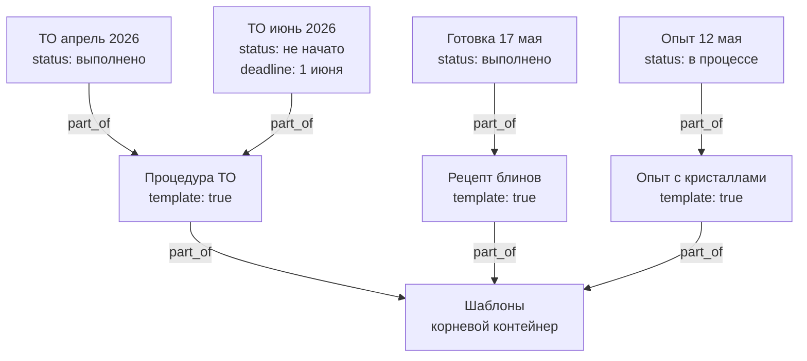

```surql
-- Все шаблоны
SELECT * FROM thing WHERE template = true;

-- Шаблоны в корневом контейнере
SELECT <-part_of<-thing FROM thing:templates;

-- Все запуски конкретного шаблона (история + планы)
SELECT <-part_of<-thing[WHERE template != true].* FROM thing:template_oil_service;

-- Только история (факты)
SELECT <-part_of<-thing[WHERE status = "выполнено"].* FROM thing:template_oil_service;

-- Только планы
SELECT <-part_of<-thing[WHERE status = "не начато"].* FROM thing:template_oil_service;

-- Что сейчас в процессе (не шаблоны)
SELECT * FROM thing WHERE status = "в процессе" AND template != true;
```  
**`period`:** `ежедневно` / `еженедельно` / `ежемесячно` / `ежеквартально` / `ежегодно`  
**`schedule`:** произвольная строка — `каждую пятницу`, `1-е число месяца`, `каждые 10000 км`

---

## Рёбра

| Связь | Описание | Поля на ребре |
|-------|----------|---------------|
| `contains` | Где физически находится вещь | `reason`, `since` |
| `part_of` | Часть чего / подзадача / запуск шаблона / членство в группе | `until` |
| `assigned_to` | Кто отвечает (человек, группа или вся семья) | — |
| `depends_on` | Задача ждёт выполнения другой | — |
| `about` | Задача/обращение касается этой вещи или решения | — |
| `filed_with` | Обращение подано в эту инстанцию/организацию | — |
| `needs` | Что нужно купить (список → вещь) | `quantity`, `unit` |
| `requires` | Плановый расход (шаблон → ингредиент/деталь) | `quantity`, `unit` |
| `produces` | Результат выполнения (решение, документ, блюдо) | — |
| `used` | Фактический расход при запуске | `quantity`, `unit` |
| `participant` | Участник с ролью (организатор, посредник, информирован…) | `role` |
| `located_at` | Где происходит событие или мероприятие | — |
| `lent_to` | Вещь отдана этому человеку во временное пользование | `since` |
| `borrowed_from` | Вещь взята у этого человека | `since` |
| `triggered_by` | Задача активируется при встрече с местом/человеком | — |
| `expert_in` | Человек — эксперт в этой теме/области | — |
| `answered` | Попытка → вопрос с результатом ответа | `chosen`, `correct`, `points_earned` |
| `promised_to` | Кому дано обещание | — |
| `represents` | Цифровая копия → физический оригинал | — |
| `can_access` | Кто имеет доступ к цифровой вещи | — |
| `related_to` | Произвольная связь с меткой | `label` |
| `references` | Блок ссылается на другой блок с режимом включения | `mode`, `snapshot_text`, `snapshot_at` |

**`reason` на ребре `contains`:** `хранение` / `транспорт` / `ремонт` / `покупка`  
**`until` на ребре `part_of`:** дата окончания временного членства; если отсутствует — постоянно  
**`role` на ребре `participant`:** `исполнитель` / `организатор` / `посредник` / `обещавший` / `информирован` / `свидетель`  
**`mode` на ребре `references`:** `live` — живая трансклюзия / `snapshot` — заморожено / `link` — ссылка для навигации

---

## Люди и группы

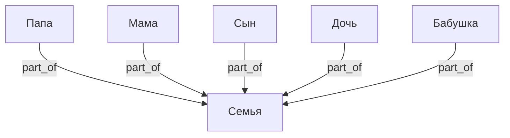

- `assigned_to` → конкретный человек: личная ответственность
- `assigned_to` → несколько людей: совместная
- `assigned_to` → Семья: открытая задача, берёт кто свободен

---

## Физическое и цифровое

Физическая вещь отвечает на вопрос **где находится** → `contains`.  
Цифровая вещь отвечает на вопрос **кто имеет доступ** → `can_access`.  
Связь между ними — `represents`.

Поле `kind`: `физическое` / `цифровое` / `смешанное`.

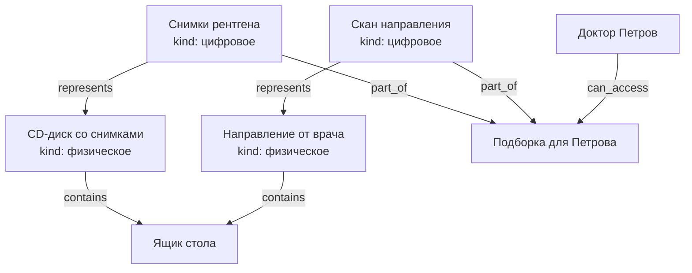

- Диск физически лежит в ящике, врач его не трогает
- Врач получает `can_access` только к цифровым копиям
- Один физический оригинал может иметь несколько цифровых представлений (скан, фото, PDF)

---

## Доступ и шаринг

`can_access` работает напрямую на конкретные вещи — без глобальных пространств.  
**Каскад:** доступ к вещи автоматически даёт доступ ко всему `part_of` неё вглубь.

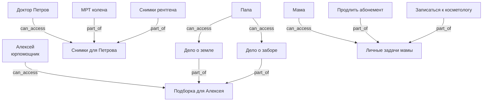

**Шаблон доступа** — заранее созданный контейнер с типовым набором.  
Пример: "Доступ врача" — контейнер с нужными цифровыми копиями,  
врачу выдаётся `can_access` к этому контейнеру и ничего лишнего.

---

## Сценарий: планирование мероприятий

Мероприятие — `thing` с датой. Место через `located_at`, участники через `participant`,
ресурсы через `requires`, подзадачи через `part_of`. Нехватка ресурсов → список покупок.

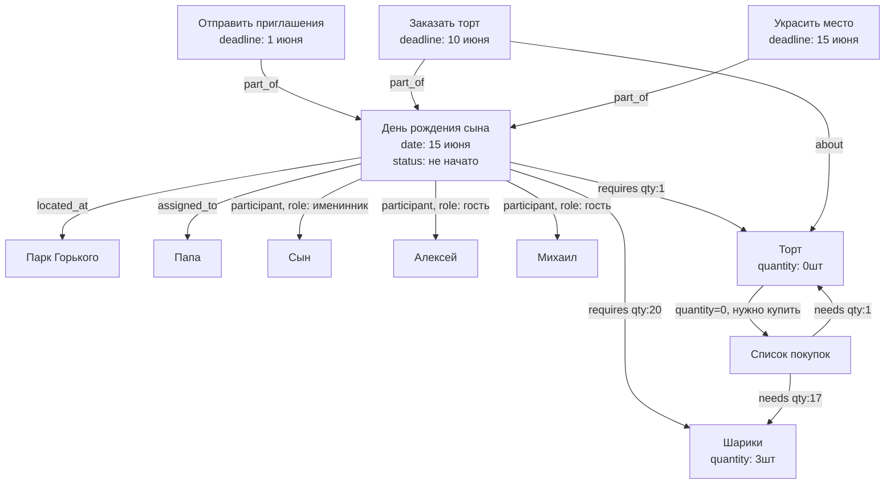

---

## Сценарий: журналистика и описание событий

Событие — `thing` с датой и местом. Статья/репортаж `about` событие, `produces` публикацию.
Источники — через `related_to, label: "источник"`. Свидетели — через `participant`.

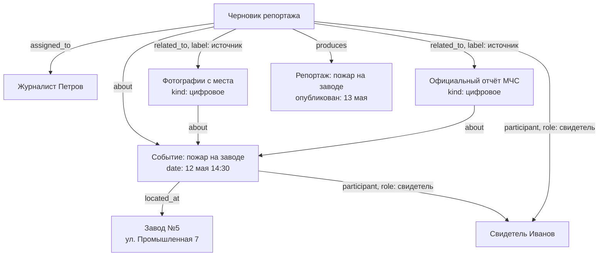

**Журналистский цикл:**
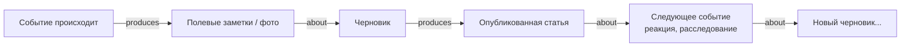

```surql
-- Все события в определённом месте
SELECT <-located_at<-thing.* FROM thing:factory_5;

-- Все материалы по событию (статьи, фото, заметки)
SELECT <-about<-thing.* FROM thing:event_fire_may12;

-- Участники мероприятия с их ролями
SELECT ->participant->thing.name AS person, ->participant.role AS role
FROM thing:party_birthday;

-- Что нужно купить для мероприятия
SELECT ->requires->thing.name AS item,
       ->requires.quantity AS нужно,
       ->requires->thing.quantity AS есть
FROM thing:party_birthday
WHERE ->requires->thing.quantity < ->requires.quantity;

-- Ближайшие мероприятия
SELECT * FROM thing WHERE date > time::now()
  AND date < time::now() + 30d
  AND ->located_at->thing != NONE
  ORDER BY date ASC;
```

---

## Сценарий: роли участников и временные группы

Врач — самостоятельная вещь со своими контактами. Постоянно `part_of` больница.
Временное участие в задаче — через `participant` напрямую или через временную группу.

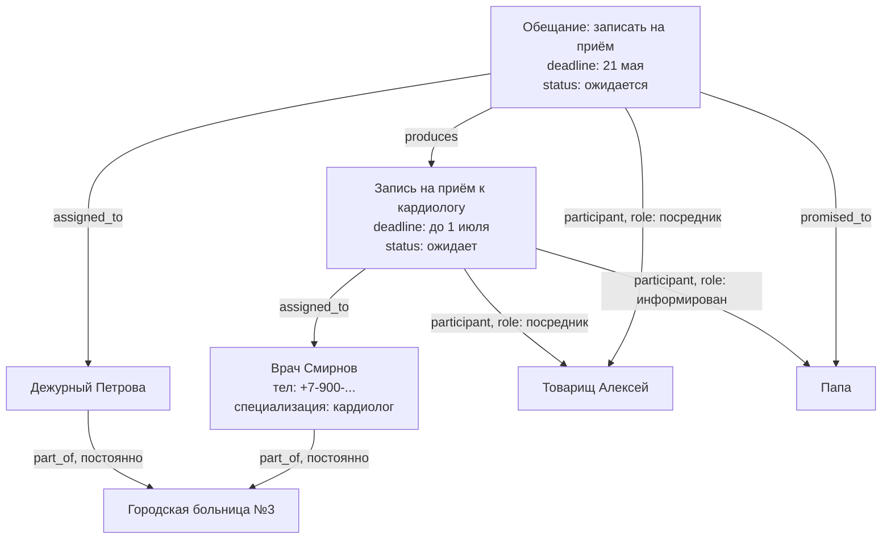

**Постоянное vs временное членство через `part_of`:**

| Ситуация | Ребро |
|----------|-------|
| Смирнов работает в больнице | `part_of` без `until` |
| Смирнов в рабочей группе по делу | `part_of, until: 1 июня` |
| Алексей помогает с юрделами | `participant, role: посредник` на конкретной задаче |

**Временная группа** нужна только когда один набор людей участвует сразу в нескольких
связанных задачах. Для одной задачи — проще `participant` напрямую.

```surql
-- Все задачи где участвует врач Смирнов (в любой роли)
SELECT <-assigned_to<-thing.*, <-participant<-thing.*
FROM thing:doctor_smirnov;

-- Контакты всех участников задачи
SELECT ->assigned_to->thing.name, ->assigned_to->thing.phone,
       ->participant->thing.name, ->participant->thing.phone
FROM thing:task_appointment;

-- Временные членства которые скоро истекают
SELECT * FROM part_of WHERE until < time::now() + 7d;
```

---

## Сценарий: обсуждения

Сообщение — `thing` с полем `text` и `created_at`. Привязывается к любой вещи через `about`.
Автор — через `assigned_to`. Из сообщения через `produces` может вырасти задача или обещание.

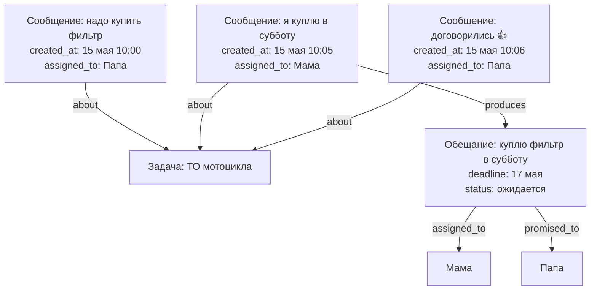

Обсуждение — просто поток сообщений `about` одной вещи, упорядоченных по `created_at`.
Отдельного контейнера не нужно.

---

## Сценарий: обещания и каскад

Обещание — `thing` с дедлайном и статусом. Когда выполняется — `produces` порождает
задачи, покупки, другие обещания. Дедлайн может быть через год.

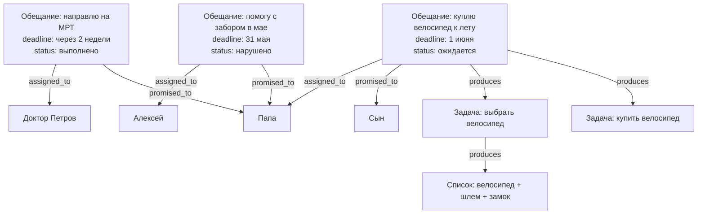

**Нарушенное обещание** (`status: нарушено`) не исчезает — остаётся в графе как факт,
на него можно ссылаться в новых обсуждениях или обращениях.

```surql
-- Все обещания данные нам (promised_to: папа), ещё не выполненные
SELECT * FROM thing WHERE ->promised_to->thing = thing:dad
  AND status = "ожидается";

-- Просроченные обещания
SELECT * FROM thing WHERE status = "ожидается"
  AND deadline < time::now()
  AND ->promised_to->thing != NONE;

-- Обсуждение под задачей (все сообщения, по времени)
SELECT * FROM thing WHERE ->about->thing = thing:task_motorcycle_service
  AND text != NONE
  ORDER BY created_at ASC;

-- Что выросло из обещания (каскад)
SELECT ->produces->thing.* FROM thing:promise_bicycle DEPTH 5;

-- Нарушенные обещания от конкретного человека
SELECT * FROM thing WHERE ->assigned_to->thing = thing:alex
  AND status = "нарушено";
```

---

## Сценарий: периодические задачи и напоминания

Периодическая задача — шаблон с расписанием. Каждое выполнение — `run` через `part_of`.
Напоминание — отдельный `thing` с `about` на конкретный запуск.

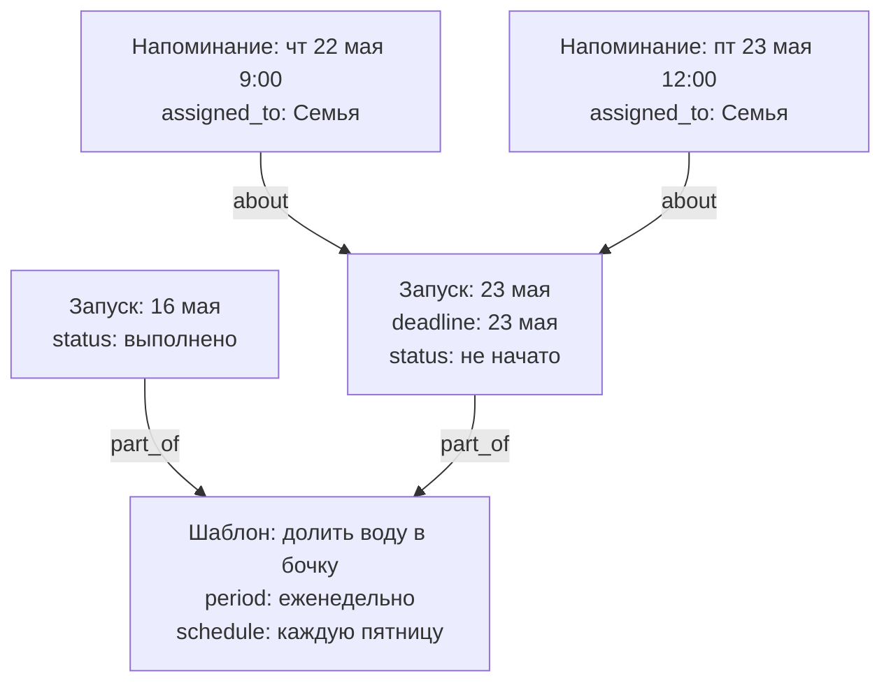

На одну задачу — сколько угодно напоминаний, каждому своё (`assigned_to`), в любое время.

---

## Перенос, пауза, история

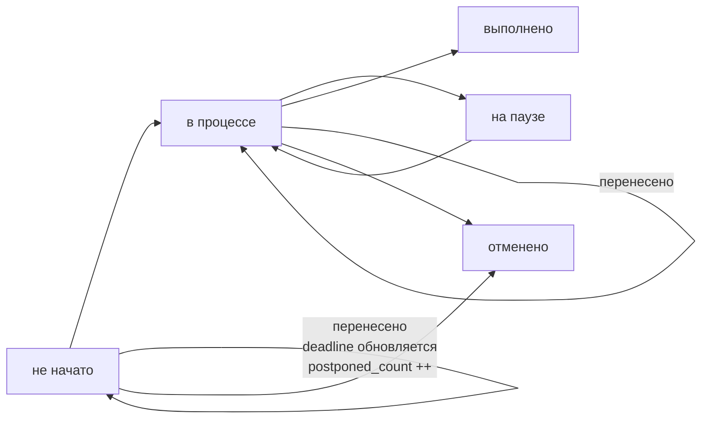

**Перенос задачи:**
- `deadline` обновляется на новую дату
- `original_deadline` сохраняет изначальный срок
- `postponed_count` увеличивается на 1
- Напоминания пересоздаются с новыми датами

**Пауза:**
- `status: на паузе` — задача видна, но не давит дедлайном
- Используется когда задача заблокирована внешними обстоятельствами,
  но `depends_on` формально не выражает причину

**Примеры расписаний:**

| Задача | `period` | `schedule` |
|--------|----------|------------|
| Долить воду в бочку | еженедельно | каждую пятницу |
| Оплатить электричество | ежемесячно | до 10-го числа |
| ТО мотоцикла | — | каждые 10000 км / раз в год |
| Проверить аптечку | ежеквартально | 1-е число квартала |
| Забрать ребёнка из секции | еженедельно | вт, чт 18:00 |

---

## Сценарий: периодические платежи

Каждый периодический платёж — шаблон (`thing`) с расписанием.
Каждая оплата — запуск (`run`), `part_of` шаблона.

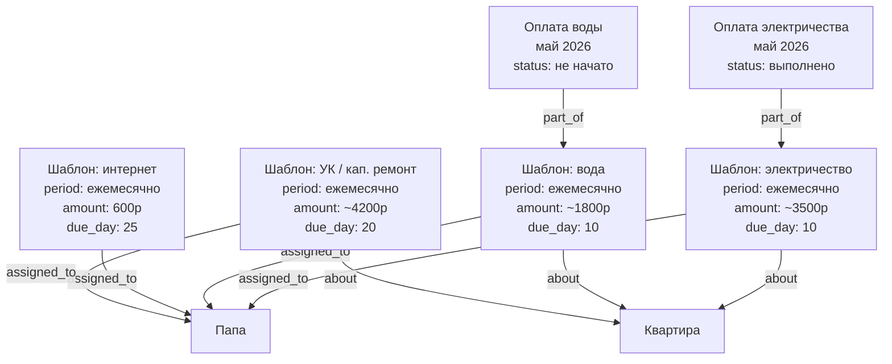

Просроченные платежи — обычный запрос: `paid_until < сегодня`.

---

## Сценарий: юридические обращения

Цепочка обжалований строится через `about` (это обращение обжалует то решение)
и `filed_with` (подано в эту инстанцию).

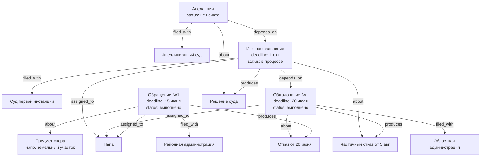

Вся цепочка читается как путь по `about` и `produces`:  
Обращение → решение → следующее обращение → решение → ...

---

## Сценарий: подзадачи

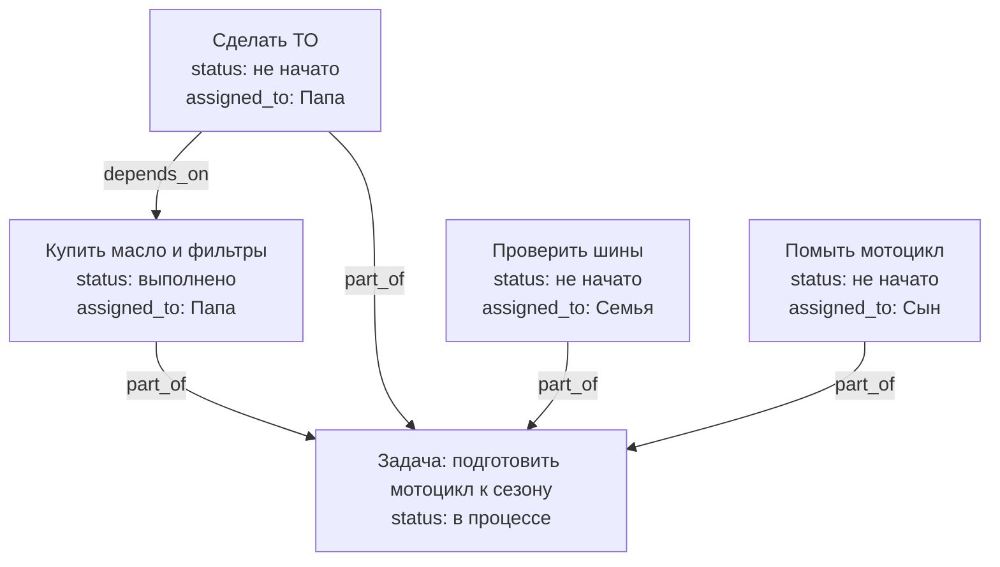

---

## Сценарий: открытые и личные задачи

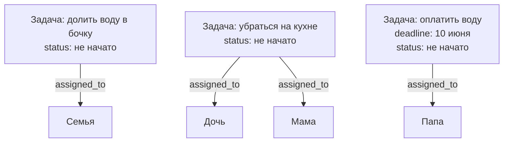

---

## Уведомления (логика приложения)

| Событие | Кто получает уведомление |
|---------|--------------------------|
| Новая задача `assigned_to` человек | Этот человек |
| Новая задача `assigned_to` Семья | Все члены семьи |
| Задача `depends_on` выполнена | Исполнитель следующей задачи |
| Дедлайн приближается (за 3 дня) | Исполнитель задачи |
| `quantity` = 0 | Все (или исполнитель задачи на покупку) |
| `paid_until` истекает | Исполнитель шаблона платежа |
| Решение по обращению получено (`produces`) | Исполнитель следующего обращения |

---

## SurrealDB: схема

```surql
DEFINE TABLE thing SCHEMALESS;

DEFINE TABLE contains TYPE RELATION FROM thing TO thing SCHEMAFULL;
DEFINE FIELD reason ON contains TYPE option<string>;
DEFINE FIELD since  ON contains TYPE option<datetime>;

DEFINE TABLE part_of TYPE RELATION FROM thing TO thing SCHEMAFULL;
DEFINE FIELD until ON part_of TYPE option<datetime>;

DEFINE TABLE participant TYPE RELATION FROM thing TO thing SCHEMAFULL;
DEFINE FIELD role ON participant TYPE string;

DEFINE TABLE located_at TYPE RELATION FROM thing TO thing;

DEFINE TABLE lent_to TYPE RELATION FROM thing TO thing SCHEMAFULL;
DEFINE FIELD since ON lent_to TYPE option<datetime>;

DEFINE TABLE borrowed_from TYPE RELATION FROM thing TO thing SCHEMAFULL;
DEFINE FIELD since ON borrowed_from TYPE option<datetime>;

DEFINE TABLE triggered_by TYPE RELATION FROM thing TO thing;

DEFINE TABLE expert_in TYPE RELATION FROM thing TO thing;

DEFINE TABLE answered TYPE RELATION FROM thing TO thing SCHEMAFULL;
DEFINE FIELD chosen        ON answered TYPE option<string>;
DEFINE FIELD correct       ON answered TYPE option<bool>;
DEFINE FIELD points_earned ON answered TYPE option<number>;
DEFINE TABLE assigned_to TYPE RELATION FROM thing TO thing;
DEFINE TABLE depends_on  TYPE RELATION FROM thing TO thing;
DEFINE TABLE about       TYPE RELATION FROM thing TO thing;
DEFINE TABLE filed_with  TYPE RELATION FROM thing TO thing;
DEFINE TABLE produces    TYPE RELATION FROM thing TO thing;

DEFINE TABLE needs TYPE RELATION FROM thing TO thing SCHEMAFULL;
DEFINE FIELD quantity ON needs TYPE option<number>;
DEFINE FIELD unit     ON needs TYPE option<string>;

DEFINE TABLE requires TYPE RELATION FROM thing TO thing SCHEMAFULL;
DEFINE FIELD quantity ON requires TYPE option<number>;
DEFINE FIELD unit     ON requires TYPE option<string>;

DEFINE TABLE used TYPE RELATION FROM thing TO thing SCHEMAFULL;
DEFINE FIELD quantity ON used TYPE option<number>;
DEFINE FIELD unit     ON used TYPE option<string>;

DEFINE TABLE represents TYPE RELATION FROM thing TO thing;

DEFINE TABLE can_access TYPE RELATION FROM thing TO thing;

DEFINE TABLE related_to TYPE RELATION FROM thing TO thing SCHEMAFULL;
DEFINE FIELD label ON related_to TYPE string;

DEFINE TABLE references TYPE RELATION FROM thing TO thing SCHEMAFULL;
DEFINE FIELD mode          ON references TYPE string;
DEFINE FIELD snapshot_text ON references TYPE option<string>;
DEFINE FIELD snapshot_at   ON references TYPE option<datetime>;
```

---

## SurrealQL: примеры запросов

```surql
-- Платежи которые нужно оплатить в этом месяце
SELECT * FROM thing WHERE paid_until < time::now() + 30d
  AND period != NONE;

-- Вся цепочка обжалований по делу (рекурсивно)
SELECT ->about->thing.* FROM thing:case_1 DEPTH 10;

-- Открытые задачи для любого члена семьи
SELECT * FROM thing WHERE status = "не начато"
  AND ->assigned_to->thing CONTAINS thing:family;

-- Мои задачи (личные + семейные, не выполненные)
SELECT * FROM thing WHERE status != "выполнено"
  AND (->assigned_to->thing CONTAINS thing:dad
    OR ->assigned_to->thing CONTAINS thing:family);

-- Задачи без невыполненных зависимостей (можно начать)
SELECT * FROM thing WHERE status = "не начато"
  AND ->depends_on->thing[WHERE status != "выполнено"] IS EMPTY;

-- Все документы/решения по юридическому делу
SELECT ->produces->thing.* FROM thing WHERE ->filed_with->thing != NONE;

-- Просроченные задачи и платежи
SELECT * FROM thing
  WHERE deadline < time::now() AND status NOT IN ["выполнено", "отменено"];

-- Задачи на паузе
SELECT * FROM thing WHERE status = "на паузе";

-- Напоминания на сегодня
SELECT * FROM thing WHERE deadline < time::now() + 1d
  AND ->about->thing.status NOT IN ["выполнено", "отменено"];

-- Следующий запуск периодической задачи
SELECT * FROM thing WHERE part_of = thing:template_barrel
  ORDER BY deadline DESC LIMIT 1;

-- Задачи которые переносили больше 2 раз
SELECT * FROM thing WHERE postponed_count > 2
  AND status NOT IN ["выполнено", "отменено"];
```

---

## YAML: описание схемы

```yaml
узел:
  тип: thing
  поля:
    обязательные:
      - название: текст
    необязательные:
      - описание: текст
      - количество: число
      - единица: текст
      - куплено: дата
      - цена: число
      - заметки: текст
      - шаблон: булево             # true = абстрактный шаблон; false/отсутствует = конкретный экземпляр
      - истекает: дата             # срок действия документа, подписки, страховки
      - энергия: текст             # для задач: низкая / средняя / высокая
      - стрик: число               # для привычек: выполнений подряд
      - желание: булево            # true = вишлист, ещё не куплено и не планируется
      - вопрос: текст              # текст вопроса в квизе
      - варианты: список           # варианты ответов для multiple_choice
      - ответ: текст               # правильный ответ
      - объяснение: текст          # почему именно так
      - тип_вопроса: текст         # multiple_choice / true_false / open_ended / fill_blank
      - сложность: текст           # лёгкий / средний / сложный
      - баллы: число               # результат попытки
      - макс_баллы: число          # максимум за попытку
      - тип: текст                 # для контактов: phone / email / messenger / address / website / social
      - значение: текст            # для контактов: сам номер, адрес, ник
      - платформа: текст           # для мессенджеров: Telegram / WhatsApp / Signal / ВКонтакте
      - метка: текст               # для контактов: личный / рабочий / домашний
      - предпочтительный: булево   # true = основной способ связи
      - filename: текст            # для файловых узлов: имя файла на диске ("scan.pdf")
      - mime_type: текст           # для файловых узлов: "image/jpeg", "application/pdf"
      - size: число                # размер файла в байтах
      - width: число               # для изображений: ширина в пикселях
      - height: число              # для изображений: высота в пикселях
      - duration: число            # для аудио/видео: длительность в секундах
      - трекинг: текст             # номер отслеживания (когда один простой номер)
      - перевозчик: текст          # carrier: Почта Китая / СДЭК / DHL
      - url: текст                 # ссылка: трекинг, товар, документ, госпортал
      - статус: текст              # не начато / в процессе / выполнено / ожидает / на паузе / отменено
      - дедлайн: дата
      - изначальный_дедлайн: дата  # сохраняется при первом переносе
      - перенесено_раз: число      # сколько раз переносили
      - приоритет: текст           # низкий / средний / высокий
      - период: текст              # ежедневно / еженедельно / ежемесячно / ежеквартально / ежегодно
      - расписание: текст          # "каждую пятницу", "до 10-го числа", "каждые 10000 км"
      - повтор_напоминания: текст  # для напоминаний: "каждый день за 3 дня до"
      - роль: текст                # для людей: папа / мама / сын / дочь / бабушка
      - сумма: число               # для платежей
      - день_оплаты: число         # число месяца: 1–31
      - оплачено_до: дата
    дополнительные: любые

связи:
  contains:
    от: thing
    к: thing
    поля:
      - reason: текст         # хранение / транспорт / ремонт / покупка
      - since: дата
  part_of:
    описание: часть чего / подзадача / запуск шаблона / членство в группе
    от: thing
    к: thing
    поля:
      - until: дата   # если указана — временное членство; если нет — постоянное
  assigned_to:
    описание: кто отвечает (человек, несколько людей или вся семья)
    от: thing
    к: thing
  depends_on:
    описание: задача ждёт выполнения другой
    от: thing
    к: thing
  about:
    описание: задача/обращение касается этой вещи или обжалует это решение
    от: thing
    к: thing
  filed_with:
    описание: обращение подано в эту инстанцию/организацию
    от: thing
    к: thing
  needs:
    описание: нужно купить
    от: thing
    к: thing
    поля:
      - quantity: число
      - unit: текст
  requires:
    описание: плановый расход (шаблон → ингредиент/деталь)
    от: thing
    к: thing
    поля:
      - quantity: число
      - unit: текст
  produces:
    описание: результат выполнения (решение, документ, блюдо, изделие)
    от: thing
    к: thing
  used:
    описание: фактический расход при запуске
    от: thing
    к: thing
    поля:
      - quantity: число
      - unit: текст
  located_at:
    описание: где происходит событие или мероприятие
    от: thing
    к: thing

  lent_to:
    описание: вещь отдана этому человеку во временное пользование
    от: thing   # вещь
    к: thing    # человек
    поля:
      - since: дата

  borrowed_from:
    описание: вещь взята у этого человека
    от: thing   # вещь
    к: thing    # владелец
    поля:
      - since: дата

  triggered_by:
    описание: задача активируется при встрече с местом, человеком или ситуацией
    от: thing   # задача
    к: thing    # место / человек / событие

  expert_in:
    описание: человек является экспертом в этой теме или области
    от: thing   # человек
    к: thing    # область / тема / навык

  answered:
    описание: попытка → вопрос с результатом ответа
    от: thing   # попытка (attempt)
    к: thing    # вопрос (question)
    поля:
      - chosen: текст         # что выбрал/написал ученик
      - correct: булево       # правильно или нет
      - points_earned: число  # баллы за этот вопрос

  participant:
    описание: участник с конкретной ролью (не основной ответственный)
    от: thing   # задача, обещание, событие
    к: thing    # человек или группа
    поля:
      - role: текст   # исполнитель / организатор / посредник / обещавший / информирован / свидетель

  promised_to:
    описание: кому дано обещание
    от: thing   # обещание
    к: thing    # человек или группа

  represents:
    описание: цифровая копия → физический оригинал
    от: thing   # цифровое
    к: thing    # физическое

  can_access:
    описание: кто имеет доступ к цифровой вещи или контейнеру
    от: thing   # человек или группа
    к: thing    # цифровая вещь или контейнер

  related_to:
    описание: произвольная связь
    от: thing
    к: thing
    поля:
      - label: текст

  references:
    описание: блок ссылается на другой блок с тремя режимами поведения
    от: thing   # блок-источник (документ, параграф, embed-контейнер)
    к: thing    # блок-цель (любой thing с text)
    поля:
      - mode: текст           # live / snapshot / link
      - snapshot_text: текст  # для mode=snapshot: замороженный текст цели на момент фиксации
      - snapshot_at: дата     # когда был сделан снапшот
```

---

## Сценарий: жалоба с fan-out по инстанциям

Одна жалоба охватывает несколько объектов. Вышестоящая инстанция пересылает её вниз —
каждое подзадело живёт независимо, но остаётся связано с корнем через `part_of`.

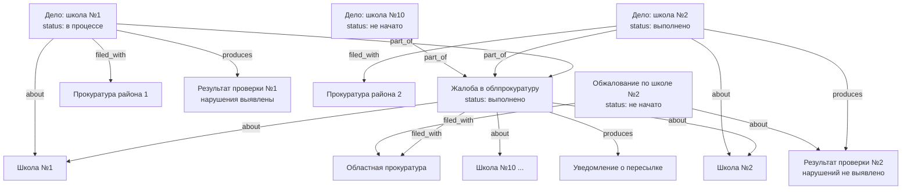

**Почему это работает без изменений схемы:**
- `part_of` связывает подзадела с корневой жалобой — всегда виден источник
- Каждое подзадело независимо: своя прокуратура (`filed_with`), свой результат (`produces`), своё обжалование (`about`)
- Fan-out естественен для графа — у одного узла может быть сколько угодно рёбер любого типа

```surql
-- Все подзадела и их статусы
SELECT name, status, ->filed_with->thing.name AS прокуратура
FROM thing WHERE ->part_of->thing = thing:root_complaint;

-- Результаты которые можно обжаловать (есть результат, нет обжалования)
SELECT * FROM thing WHERE ->part_of->thing = thing:root_complaint
  AND ->produces->thing != NONE
  AND NOT (SELECT * FROM thing WHERE ->about->thing = (->produces->thing));

-- Вся цепочка от корневой жалобы вглубь
SELECT ->part_of<-thing.* FROM thing:root_complaint DEPTH 5;
```

---

## Сценарий: медицина — приёмы, назначения, направления

Врач `part_of` больница. Приём — задача с дедлайном. Назначения и направления —
`produces` из приёма. Следующий приём `about` направление.

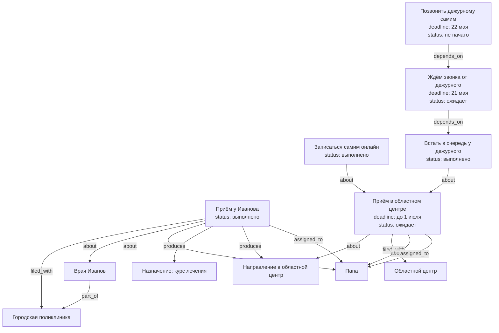

**Таймаут на звонок:** `Followup` с дедлайном на следующий день после `Callback` —
страховка от забывчивости. Уведомление сработает когда дедлайн `Callback` истечёт
без выполнения.

**OR-логика записи:** два пути к одному приёму (самостоятельно или через дежурного) —
это поведение приложения. Когда хотя бы один путь сработал, `Visit2` помечается
подтверждённым. В схеме не формализуется.

```surql
-- Все предстоящие приёмы у врачей
SELECT * FROM thing WHERE ->filed_with->thing.name CONTAINS "больниц"
  AND deadline > time::now() AND status != "выполнено";

-- Назначения и направления из последнего приёма
SELECT ->produces->thing.* FROM thing:visit_ivanov_may;

-- Незакрытые задачи по ожиданию обратного звонка
SELECT * FROM thing WHERE name CONTAINS "звонк" AND status = "ожидает"
  AND deadline < time::now() + 1d;

-- Все приёмы конкретного пациента
SELECT <-about<-thing[WHERE ->filed_with->thing != NONE].* FROM thing:dad;
```

---

## Сценарий: сложный трекинг доставки

Трекинг-номер — отдельный `thing` с `url` и `carrier`. Когда перевозчик меняется —
новый номер `about` старый (цепочка передачи). Контрольные точки — сообщения `about`
трекинг-номер. Если заказ разбивается — каждая посылка `part_of` заказа со своим трекингом.

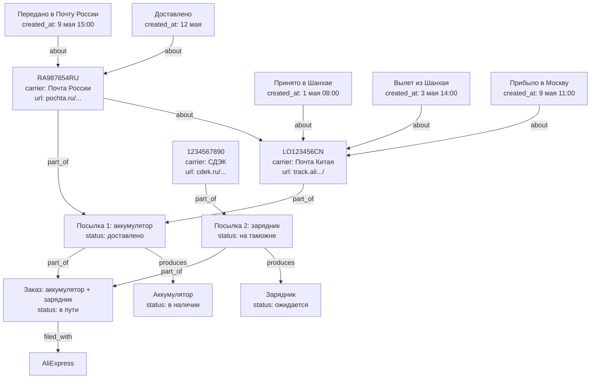

`T2 about T1` — передача от Почты Китая к Почте России: цепочка смены перевозчиков.  
Контрольные точки (события) — те же сообщения `about` трекинг-номер, упорядоченные по `created_at`.

**Поле `url`** полезно не только для трекинга: ссылки на товары, документы,
страницы в госпорталах, карточки во внешних системах.

```surql
-- Полная история пути посылки по всем перевозчикам
SELECT ->about->thing.name AS трекинг,
       ->about->thing.carrier AS перевозчик,
       text AS событие, created_at
FROM thing
WHERE ->about->thing->part_of->thing = thing:package_1
ORDER BY created_at ASC;

-- Текущий активный трекинг (последний в цепочке)
SELECT * FROM thing
  WHERE ->part_of->thing = thing:package_1
  AND carrier != NONE
  AND count(<-about<-thing) = 0;

-- Незакрытые посылки и сколько задач они блокируют
SELECT name, status,
  count(<-depends_on<-thing DEPTH 5) AS блокирует_задач
FROM thing
  WHERE ->part_of->thing->filed_with->thing != NONE
  AND status NOT IN ["доставлено", "возврат"]
ORDER BY блокирует_задач DESC;
```

---

## Сценарий: блокирующая зависимость и каскад ожидания

Один товар или событие держит весь каскад задач. Заказ — `thing` с `filed_with` поставщик,
`about` товар, `produces` товар при доставке. Каскад `depends_on` товар — не заказ.
Когда товар получен — всё разблокируется за один шаг.

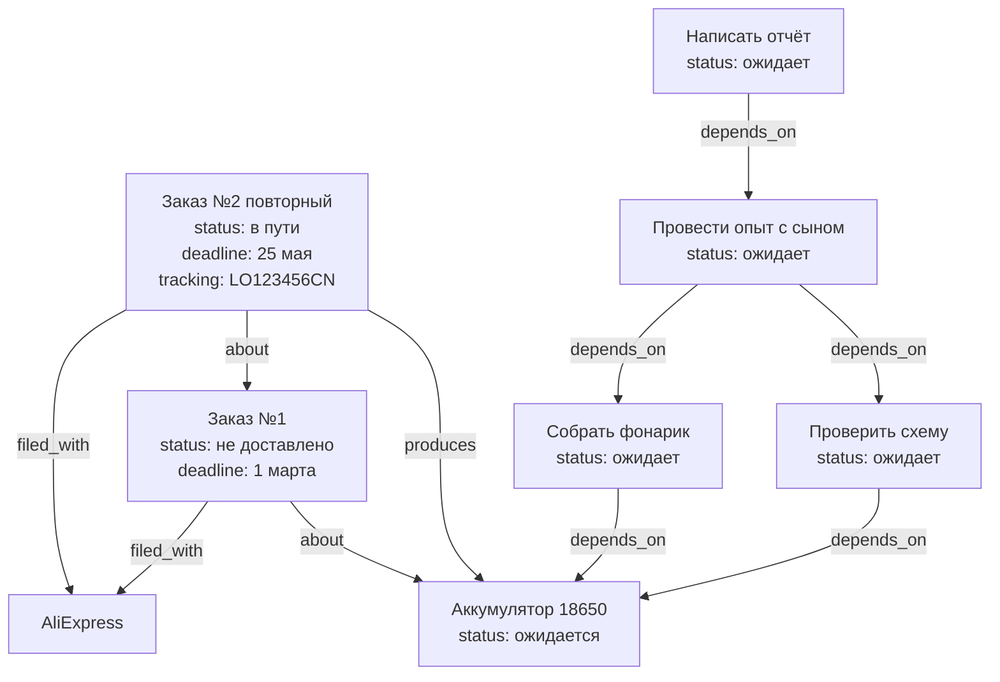

`Order2 about Order1` — история: повторный заказ взамен недоставленного.

**Когда товар приходит — три действия:**
1. `Order2 status` → `получено`
2. `Battery status` → `в наличии`, добавляется `contains` → место хранения
3. Все `depends_on battery` задачи уведомляют исполнителей

```surql
-- Весь каскад заблокированный одним товаром (любая глубина)
SELECT name, status FROM thing
  WHERE ->depends_on->thing CONTAINS thing:battery
  DEPTH 10;

-- Сколько задач разблокируется
SELECT count() AS разблокируется FROM thing
  WHERE ->depends_on->thing CONTAINS thing:battery DEPTH 10;

-- История заказов одного товара
SELECT name, status, deadline, tracking FROM thing
  WHERE ->about->thing = thing:battery
  AND ->filed_with->thing != NONE
  ORDER BY created_at ASC;

-- Все товары в ожидании доставки и их каскады
SELECT name,
  count(<-depends_on<-thing DEPTH 10) AS задач_ждёт
FROM thing WHERE status = "ожидается"
  AND ->produces->thing != NONE
ORDER BY задач_ждёт DESC;
```

---

## Сценарий: обучение и тестирование

### Структура курса

Курс → разделы → темы → занятия через `part_of`. Всё это шаблоны (`template: true`).
Запуски — конкретные занятия с датой и статусом. ОГЭ/ЕГЭ — `thing` с `deadline`.

```mermaid
graph TD
    Exam[ОГЭ по русскому\ndeadline: июнь 2025]
    Course[Курс: Русский ОГЭ\ntemplate: true\nassigned_to: Сын]
    S1[Раздел: Орфография\ntemplate: true]
    S2[Раздел: Пунктуация\ntemplate: true]
    S3[Раздел: Сочинение\ntemplate: true]
    T1[Тема: НН и Н\ntemplate: true]
    T2[Тема: Приставки\ntemplate: true]
    T3[Тема: Запятые в СПП\ntemplate: true]

    Session1[Занятие: орфография\ndate: 20 мая\nstatus: не начато\nassigned_to: Сын]

    S1 -->|part_of| Course
    S2 -->|part_of| Course
    S3 -->|part_of| Course
    T1 -->|part_of| S1
    T2 -->|part_of| S1
    T3 -->|part_of| S2
    Course -->|about| Exam
    Session1 -->|part_of| T1
```

---

### Структура квиза

Квиз — шаблон с вопросами. Попытка — запуск квиза. Ответы на вопросы — ребро `answered`.

```mermaid
graph TD
    Quiz[Квиз: тест по НН и Н\ntemplate: true]
    Q1[В каком слове НН?\ntype: multiple_choice\noptions: стеклянный,кожаный...\ncorrect: стеклянный\ndifficulty: средний]
    Q2[Вставьте букву: стекля__ый\ntype: fill_blank\ncorrect: НН\nexplanation: прил. на -янн- пишутся НН]
    Q3[НН пишется в отглагольных прил.?\ntype: true_false\ncorrect: false]

    Attempt[Попытка: Сын 19 мая\nscore: 7\nmax_score: 10\nstatus: выполнено]

    Q1 -->|part_of| Quiz
    Q2 -->|part_of| Quiz
    Q3 -->|part_of| Quiz
    Quiz -->|about| Topic1[Тема: НН и Н]

    Attempt -->|part_of| Quiz
    Attempt -->|answered, chosen: стеклянный, correct: true, points: 1| Q1
    Attempt -->|answered, chosen: Н, correct: false, points: 0| Q2
    Attempt -->|answered, chosen: true, correct: false, points: 0| Q3
```

---

### AI-интеграция: адаптивное обучение

AI смотрит на `answered` где `correct: false`, определяет слабые темы,
генерирует новые квизы и корректирует учебный план.

```mermaid
graph TD
    AI[AI-агент]
    Son[Сын]
    WeakTopic[Тема: Приставки\n70% ошибок]
    NewQuiz[Новый квиз по приставкам\nсгенерирован AI\ntemplate: true]
    NewPlan[Скорректированный план\nна следующую неделю]

    AI -->|produces| NewQuiz
    AI -->|produces| NewPlan
    NewQuiz -->|about| WeakTopic
    NewPlan -->|about| Son
    NewPlan -->|about| WeakTopic
```

```surql
-- Слабые темы сына (топ ошибок)
SELECT ->about->thing.name AS тема,
  count() AS всего_ответов,
  count(WHERE correct = false) AS ошибок,
  math::round(count(WHERE correct = false) / count() * 100) AS процент
FROM answered
WHERE <-part_of<-thing[WHERE assigned_to = thing:son] != NONE
GROUP BY ->about->thing.name
HAVING процент > 50
ORDER BY процент DESC;

-- Прогресс по курсу — динамика результатов
SELECT date, score, max_score,
  math::round(score / max_score * 100) AS процент
FROM thing WHERE ->part_of->thing = thing:quiz_nn
  AND assigned_to = thing:son
ORDER BY date ASC;

-- Все квизы по слабой теме (для AI-назначения)
SELECT * FROM thing WHERE template = true
  AND ->about->thing = thing:topic_pristavki;

-- Готовность к экзамену по разделам
SELECT ->part_of->thing.name AS раздел,
  math::round(count(WHERE correct = true) / count() * 100) AS готовность
FROM answered
WHERE <-part_of<-thing[WHERE assigned_to = thing:son] != NONE
GROUP BY ->part_of->thing[WHERE ->part_of->thing = thing:course_oge].name;
```

---

## Паттерны управления вниманием

### 1. Срок действия документов и подписок

Поле `expires_at` на любой вещи. Автоматическое напоминание за N дней.

```mermaid
graph TD
    Passport[Паспорт папы\nkind: физическое\nexpires_at: 2027-03-15]
    DL[Водительское удостоверение\nexpires_at: 2026-11-01]
    Insurance[Страховка ОСАГО\nexpires_at: 2026-06-30]
    Netflix[Подписка Netflix\nexpires_at: 2026-06-01\namount: 799р/мес]

    Passport -->|represents| PassportScan[Скан паспорта\nkind: цифровое]
```

```surql
-- Что истекает в ближайшие 30 дней
SELECT name, expires_at FROM thing
  WHERE expires_at > time::now()
  AND expires_at < time::now() + 30d
  ORDER BY expires_at ASC;
```

---

### 2. Одолжения — что у кого

```mermaid
graph TD
    Drill[Дрель Bosch\nkind: физическое]
    Ladder[Лестница соседа\nkind: физическое]
    Book[Книга Ильфа и Петрова]

    Alex[Алексей]
    Neighbor[Сосед Василий]
    Dad[Папа]

    Drill -->|lent_to, since: 15 марта| Alex
    Ladder -->|borrowed_from, since: 10 мая| Neighbor
    Book -->|lent_to, since: 1 апреля| Alex
```

```surql
-- Что я отдал и кому
SELECT ->lent_to->thing.name AS кому, name AS вещь, ->lent_to.since AS с
FROM thing WHERE ->lent_to->thing != NONE;

-- Что я взял у других
SELECT ->borrowed_from->thing.name AS у_кого, name AS вещь
FROM thing WHERE ->borrowed_from->thing != NONE;

-- Что давно не возвращают (больше 30 дней)
SELECT * FROM lent_to WHERE since < time::now() - 30d;
```

---

### 3. Контекстные задачи — сделать когда...

Задача активируется по контексту: место, человек, ситуация. Снижает нагрузку
на память — не нужно помнить когда, система подскажет.

```mermaid
graph TD
    T1[Купить саморезы\nstatus: не начато\nenergy: низкая]
    T2[Спросить про забор\nstatus: не начато]
    T3[Позвонить в страховую\nstatus: не начато\nenergy: высокая]
    T4[Забрать инструмент\nstatus: не начато]

    Store[Строительный магазин Леруа]
    Alex[Алексей]
    Car[В машине / в дороге]

    T1 -->|triggered_by| Store
    T2 -->|triggered_by| Alex
    T3 -->|triggered_by| Car
    T4 -->|triggered_by| Alex
```

```surql
-- Задачи которые можно сделать сейчас в магазине
SELECT <-triggered_by<-thing[WHERE status = "не начато"].*
FROM thing:store_lerua;

-- Задачи для встречи с Алексеем
SELECT <-triggered_by<-thing[WHERE status = "не начато"].*
FROM thing:alex;

-- Задачи с низкой энергией (можно делать уставшим)
SELECT * FROM thing WHERE energy = "низкая" AND status = "не начато";
```

---

### 4. Быстрая фиксация идей (braindump)

Мысль пришла — фиксируем мгновенно, разбираем потом. Сообщение `about` нужной
вещи или в общий inbox.

```mermaid
graph TD
    Inbox[Входящие\nкорневой контейнер]
    Idea1[Идея: сделать полку в гараже\ncreated_at: сегодня 8:32]
    Idea2[Идея: спросить у врача про прививки\ncreated_at: сегодня 9:15]
    Idea3[Наблюдение: кристаллы потемнели\ncreated_at: сегодня 14:00]
    Experiment[Опыт с кристаллами]

    Idea1 -->|part_of| Inbox
    Idea2 -->|part_of| Inbox
    Idea3 -->|about| Experiment
```

Периодический обзор Inbox → каждая идея превращается в задачу, вишлист, или удаляется.

---

### 5. Уровень энергии задач

Поле `energy` на задаче позволяет выбрать подходящую работу под текущее состояние.

| Энергия | Примеры задач |
|---------|--------------|
| `высокая` | Позвонить в налоговую, написать жалобу, разобрать сложную ситуацию |
| `средняя` | Съездить в магазин, приготовить ужин, сделать ТО |
| `низкая` | Долить воду в бочку, разобрать почту, навести порядок на полке |

---

### 6. Кто что умеет — к кому обращаться

```mermaid
graph TD
    Alex[Алексей]
    Neighbor[Василий сосед]
    Doctor[Доктор Смирнов]
    Lawyer[Юрист Петрова]

    Legal[Юриспруденция]
    Plumbing[Сантехника]
    Cardiology[Кардиология]
    Electronics[Электроника]

    Alex -->|expert_in| Legal
    Alex -->|expert_in| Electronics
    Neighbor -->|expert_in| Plumbing
    Doctor -->|expert_in| Cardiology
    Lawyer -->|expert_in| Legal
```

```surql
-- Кто может помочь с сантехникой
SELECT <-expert_in<-thing.* FROM thing:plumbing;

-- Все эксперты и их области
SELECT name, ->expert_in->thing.name AS области FROM thing
  WHERE ->expert_in->thing != NONE;
```

---

### 7. Вишлист — желания и мечты

Желания хранятся отдельно от реальных покупок. Флаг `wish: true`.
Когда желание становится реальным планом — флаг снимается, добавляется в список покупок.

```mermaid
graph TD
    Wishlist[Вишлист семьи\nконтейнер]
    W1[Nintendo Switch\nwish: true\nassigned_to: Сын]
    W2[Новый диван\nwish: true\nassigned_to: Мама]
    W3[Осциллограф\nwish: true\nassigned_to: Папа]

    W1 -->|part_of| Wishlist
    W2 -->|part_of| Wishlist
    W3 -->|part_of| Wishlist
```

---

### 8. Сезонные задачи

Шаблоны с `schedule: каждую осень / каждую весну`. Создаются один раз, работают годами.

| Шаблон | `schedule` |
|--------|------------|
| Поменять резину на зимнюю | каждый октябрь |
| Подготовить дачу к сезону | каждый апрель |
| Проверить аптечку | каждый январь |
| Слить воду из шлангов | перед первыми заморозками |
| Обработать сад от вредителей | каждый май |

---

### 9. Привычки и стрики

Привычка — периодическая задача с `streak` счётчиком. Каждый выполненный
запуск увеличивает стрик, пропуск сбрасывает.

```mermaid
graph TD
    H1[Привычка: поливать цветы\nperiod: каждые 3 дня\nstreak: 7\ntemplate: true]
    H2[Привычка: зарядка\nperiod: ежедневно\nstreak: 14\ntemplate: true]
    H3[Привычка: читать 20 минут\nperiod: ежедневно\nstreak: 0\ntemplate: true]

    R1[Полив 16 мая\nstatus: выполнено]
    R2[Полив 19 мая\nstatus: выполнено]

    R1 -->|part_of| H1
    R2 -->|part_of| H1
```

---

### Корневые контейнеры системы

```mermaid
graph TD
    Root[Домовой]
    Templates[Шаблоны]
    Wishlist[Вишлист]
    Inbox[Входящие]
    People[Люди]
    Family[Семья]
    Places[Места]

    Templates -->|part_of| Root
    Wishlist -->|part_of| Root
    Inbox -->|part_of| Root
    People -->|part_of| Root
    Family -->|part_of| People
    Places -->|part_of| Root
```

```surql
-- Полная сводка на сейчас: задачи + просроченные + истекающие + одолжения
LET $tasks = SELECT * FROM thing WHERE status = "не начато"
  AND template != true AND deadline < time::now() + 7d;
LET $expiring = SELECT name, expires_at FROM thing
  WHERE expires_at < time::now() + 30d;
LET $lent = SELECT name, ->lent_to->thing.name AS у FROM thing
  WHERE ->lent_to->thing != NONE;
RETURN { задачи: $tasks, истекает: $expiring, одолжено: $lent };
```

---

## Сценарий: контакты и социальный граф

Каждый человек — `thing`. Его контактные методы — тоже `thing`, связанные с человеком
через `part_of`. Социальные связи между людьми — `related_to` с понятной меткой.
Группы и сообщества — контейнеры, люди `part_of` них.

### Контактные методы

```mermaid
graph TD
    Alexey[Алексей\npart_of: Люди]
    Marina[Марина\nжена Алексея]
    Peter[Пётр\nдруг]

    Phone1[+7-900-123-45-67\ntype: phone\nlabel: личный]
    Phone2[+7-495-111-22-33\ntype: phone\nlabel: рабочий]
    Email1[alex@firm.ru\ntype: email\nlabel: рабочий]
    TG[alexey_iv\ntype: messenger\nplatform: Telegram]
    WA[+7-900-123-45-67\ntype: messenger\nplatform: WhatsApp]
    Addr[ул. Садовая 5 кв. 12\ntype: address\nlabel: домашний]

    Phone1 -->|part_of| Alexey
    Phone2 -->|part_of| Alexey
    Email1 -->|part_of| Alexey
    TG     -->|part_of| Alexey
    WA     -->|part_of| Alexey
    Addr   -->|part_of| Alexey

    Alexey -->|related_to, label: жена| Marina
    Alexey -->|related_to, label: друг| Peter
    Marina -->|related_to, label: муж| Alexey
```

Поля контактного метода:

| Поле | Примеры |
|------|---------|
| `type` | `phone` / `email` / `messenger` / `address` / `website` / `social` |
| `value` | `+79001234567`, `alex@firm.ru`, `@alexey_iv` |
| `platform` | для мессенджеров: `Telegram` / `WhatsApp` / `Signal` / `ВКонтакте` |
| `label` | `личный` / `рабочий` / `домашний` |
| `preferred` | `true` — предпочтительный способ связи |

Контакт устарел — `status: отменено`. Чужой контакт передан через задачу — отдельный `thing`
с `about` → нужная задача, `produces` → контакт в базе.

### Социальные связи

`related_to` с метками уже есть в модели — здесь он раскрывается полностью:

| `label` | Значение |
|---------|----------|
| `жена` / `муж` | Супруги |
| `партнёр` | Гражданский партнёр |
| `сын` / `дочь` / `родитель` | Родственники |
| `брат` / `сестра` | Братья и сёстры |
| `друг` | Дружеская связь |
| `коллега` | Общая работа |
| `сосед` | Живут рядом |
| `знакомый` | Слабая связь |
| `познакомил` | Кто свёл двух людей |

Связь двунаправленна в жизни, но ребро `related_to` — однонаправленное в SurrealDB.
Создавай оба направления сразу: Алексей → Марина и Марина → Алексей.

### Как Пётр вошёл в круг

Если важно сохранить контекст знакомства — событие-знакомство `thing` с `participant`:

```mermaid
graph TD
    Meet[Встреча на выставке\ndate: 2024-03-10\nstatus: выполнено]
    Dad[Папа]
    Alexey[Алексей]
    Peter[Пётр]

    Meet -->|participant, role: участник| Dad
    Meet -->|participant, role: участник| Alexey
    Meet -->|participant, role: участник| Peter
    Alexey -->|related_to, label: познакомил| Peter
```

Теперь можно ответить: "откуда я знаю Петра" — запросом по `related_to` и `participant`.

### Группы и сообщества

```mermaid
graph TD
    People[Люди\nкорневой контейнер]
    Family[Семья]
    WorkGroup[Рабочая группа по проекту]
    FriendsGroup[Компания друзей]

    Dad[Папа]
    Mom[Мама]
    Alexey[Алексей]
    Peter[Пётр]
    Marina[Марина]

    Dad -->|part_of| Family
    Mom -->|part_of| Family
    Family -->|part_of| People

    Alexey -->|part_of| People
    Peter  -->|part_of| People
    Marina -->|part_of| People

    Alexey -->|part_of| WorkGroup
    Dad    -->|part_of| WorkGroup

    Alexey -->|part_of| FriendsGroup
    Peter  -->|part_of| FriendsGroup
    Dad    -->|part_of| FriendsGroup
```

Временное членство в группе — `part_of` с `until`. Постоянное — без `until`.

### Общий доступ к контактам

Контакт — `thing`, к нему применяется та же логика доступа:

```mermaid
graph TD
    Alexey[Алексей]
    Phone1[Личный телефон\ntype: phone]
    Phone2[Рабочий телефон\ntype: phone]
    Email1[Рабочий email\ntype: email]

    Son[Сын]
    Dad[Папа]
    Lawyer[Юрист Петрова]

    Phone1 -->|part_of| Alexey
    Phone2 -->|part_of| Alexey
    Email1 -->|part_of| Alexey

    Son    -->|can_access| Phone1
    Dad    -->|can_access| Alexey
    Lawyer -->|can_access| Email1
```

Сын видит только личный номер. Юрист видит только рабочий email. Папа — все контакты
(доступ к человеку каскадно открывает всё `part_of` него).

```surql
-- Все контакты Алексея
SELECT * FROM thing WHERE ->part_of->thing = thing:alexey
  AND type IN ["phone", "email", "messenger", "address"];

-- Предпочтительный способ связи
SELECT * FROM thing WHERE ->part_of->thing = thing:alexey
  AND preferred = true;

-- С кем я связан и как
SELECT ->related_to->thing.name AS кто, ->related_to.label AS связь
FROM thing:dad;

-- Общие связи — через кого я знаю Петра
SELECT <-related_to<-thing[WHERE ->related_to->thing = thing:dad].*
FROM thing:peter;

-- Кто в рабочей группе и их контакты
LET $members = SELECT <-part_of<-thing.* FROM thing:work_group;
SELECT name, (SELECT * FROM thing WHERE ->part_of->thing = $parent.id
  AND type = "phone") AS телефоны
FROM $members AS $parent;

-- Все мессенджеры человека
SELECT value, platform FROM thing
  WHERE ->part_of->thing = thing:alexey AND type = "messenger";

-- Люди без контактов (только имя в базе)
SELECT * FROM thing WHERE ->part_of->thing = thing:people
  AND (SELECT * FROM thing WHERE ->part_of->thing = $parent.id
    AND type IN ["phone", "email"]) IS EMPTY;

-- Все люди связанные с юридическим делом (assigned + participant)
SELECT DISTINCT
  (SELECT ->assigned_to->thing.* FROM thing WHERE ->about->thing = thing:case_1),
  (SELECT ->participant->thing.* FROM thing WHERE ->about->thing = thing:case_1);
```

---

## Сценарий: блочные документы и трансклюзия

Документ — `thing`-контейнер. Блоки (параграфы, заголовки, рисунки) — `thing` с `part_of`
и полем `order` на ребре для порядка. Блок может включать другой блок тремя способами
через ребро `references`.

### Три режима включения

| Режим | Поведение при рендере | Что хранится |
|-------|----------------------|--------------|
| `live` | Показать актуальный `text` цели | Только ребро |
| `snapshot` | Показать `snapshot_text` с ребра | Ребро + копия текста + дата |
| `link` | Показать кликабельную ссылку | Только ребро |

### Структура документа

```mermaid
graph TD
    Article[Статья: Кристаллизация\nkind: document\nstatus: черновик]

    Abs[Абстракт\ntype: paragraph\norder: 1]
    S1[Раздел: Введение\ntype: heading\norder: 2]
    S2[Раздел: Методология\ntype: heading\norder: 3]
    S3[Раздел: Результаты\ntype: heading\norder: 4]

    P1[Параграф введения\ntype: paragraph\norder: 1]
    DefEmbed[Embed-блок\ntype: embed\norder: 2]
    Definition[Определение кристаллизации\ntype: paragraph]

    ProtoEmbed[Embed-блок\ntype: embed\norder: 1]
    Protocol[Протокол опыта №3\ntype: paragraph]

    ResultSnap[Снапшот таблицы\ntype: snapshot\norder: 1]
    Table[Таблица измерений\ntype: paragraph]

    Abs -->|part_of, order:1| Article
    S1  -->|part_of, order:2| Article
    S2  -->|part_of, order:3| Article
    S3  -->|part_of, order:4| Article

    P1      -->|part_of, order:1| S1
    DefEmbed -->|part_of, order:2| S1
    DefEmbed -->|references, mode:live| Definition

    ProtoEmbed -->|part_of, order:1| S2
    ProtoEmbed -->|references, mode:live| Protocol

    ResultSnap -->|part_of, order:1| S3
    ResultSnap -->|references, mode:snapshot\nsnapshot_at: 18 мая| Table

    Article -->|about| Topic[Тема: кристаллизация]
    Article -->|about| Experiment[Опыт №3]
    Article -->|produces| Publication[Публикация в журнале]
```

**Протокол** живёт в записи Опыта №3. Статья включает его через `live` — при редактировании
протокола статья обновляется автоматически везде.

**Таблица результатов** зафиксирована снапшотом на дату публикации. Если данные
в лабораторном журнале пересчитают — статья не изменится.

### Снапшот: обновление вручную

```mermaid
graph LR
    Snap[references\nmode: snapshot\nsnapshot_text: старый текст\nsnapshot_at: 1 мая]
    Original[Оригинальный блок\ntext: новый текст]

    Snap -->|к| Original
```

Пользователь видит предупреждение: "Источник изменился с момента снапшота".
Нажимает "обновить" → `snapshot_text` копируется из `original.text`, `snapshot_at` обновляется.

### Ссылка внутри текста

Блок может содержать разметку `[[thing:block_id]]` прямо в поле `text`.
Рендерер разбирает текст и создаёт кликабельные ссылки.
Для graph-запросов дублируется как ребро `references, mode: link`:

```
text: "Как показано в [[thing:table_results]], зависимость..."
→ references, mode:link → thing:table_results
```

Оба представления нужны: `text` — для редактора, ребро — для запросов "где используется блок".

### Тип блока

Поле `type` на блоках:

| `type` | Описание |
|--------|---------|
| `paragraph` | Обычный текст |
| `heading` | Заголовок раздела (+ поле `level`: 1/2/3) |
| `figure` | Рисунок или изображение |
| `formula` | Математическая формула |
| `code` | Блок кода |
| `embed` | Контейнер для live-трансклюзии |
| `snapshot` | Контейнер для зафиксированного снапшота |
| `citation` | Ссылка на источник |
| `callout` | Выноска / предупреждение |

### Источники и цитаты

Источник — `thing` с полями `author`, `year`, `doi`, `url`. Цитата — `references, mode: link`
из блока на источник. Статья агрегирует все источники через graph-запрос.

```mermaid
graph TD
    Article[Статья]
    P2[Параграф 2]
    Cite1[references\nmode: link]
    Cite2[references\nmode: link]
    Src1[Smith 2020\nauthor: Smith J.\nyear: 2020\ndoi: 10.1234/...]
    Src2[Jones 2019\nauthor: Jones A.\nyear: 2019\nurl: ...]

    P2 -->|part_of| Article
    P2 -->|references, mode:link| Src1
    P2 -->|references, mode:link| Src2
```

```surql
-- Все источники статьи
SELECT ->references->thing[WHERE year != NONE].*
FROM thing WHERE ->part_of->thing = thing:article_crystallization
  AND mode = "link";

-- Все места где используется блок (live + snapshot)
SELECT <-references<-thing[WHERE mode IN ["live","snapshot"]].*
FROM thing:block_protocol_3;

-- Снапшоты которые устарели (источник изменился после снапшота)
SELECT * FROM references
  WHERE mode = "snapshot"
  AND ->thing.updated_at > snapshot_at;

-- Все блоки статьи по порядку (только верхний уровень)
SELECT <-part_of<-thing[WHERE type != NONE].*,
       <-part_of.order AS порядок
FROM thing:article_crystallization
ORDER BY порядок ASC;

-- Рекурсивно весь документ с вложенными блоками
SELECT <-part_of<-thing.* FROM thing:article_crystallization DEPTH 10;

-- Обновить снапшот
UPDATE references SET
  snapshot_text = (SELECT text FROM thing WHERE id = ->thing)[0].text,
  snapshot_at = time::now()
WHERE id = references:snap_table_results;
```

---

## Файловое хранилище: vault-паттерн

SurrealDB хранит только метаданные. Бинарные файлы лежат на диске в предсказуемой
структуре — "vault". Путь к файлам любого узла выводится детерминированно из его ID,
без дополнительных полей в БД.

### Структура на диске

```
~/.domovoy/
├── domovoy.db                  ← SurrealDB
└── files/
    ├── drill_bosch/            ← ID узла thing:drill_bosch
    │   ├── front.jpg
    │   ├── side.jpg
    │   └── receipt.pdf
    ├── case_fence/             ← thing:case_fence
    │   ├── complaint.pdf
    │   └── court_decision.docx
    └── passport_dad/           ← thing:passport_dad
        └── scan.pdf
```

**Правило:** директория узла = `{vault}/files/{id}`, где `id` — часть record ID после `thing:`.

```ts
const filesDir = (recordId: string) =>
  path.join(VAULT_ROOT, "files", recordId.replace("thing:", ""));

// thing:drill_bosch  →  ~/.domovoy/files/drill_bosch/
// thing:01j3kxyz     →  ~/.domovoy/files/01j3kxyz/
```

Директория создаётся при добавлении первого файла. Если директории нет — файлов нет.
Приложение проверяет директорию без запроса к БД.

### Два уровня привязки файлов

**Простое вложение** — файл лежит в директории узла, отдельного `thing`-узла не нужно.
Приложение читает директорию напрямую. Подходит для большинства случаев:
фото инвентаря, документы к делу, вложения к событию.

```mermaid
graph TD
    Drill[Дрель Bosch\nthing:drill_bosch]
    Dir["~/.domovoy/files/drill_bosch/\nfront.jpg · side.jpg · receipt.pdf"]
    Drill --- Dir
```

**Файл с отношениями** — нужен собственный `thing`-узел, когда файл участвует в графе:
цитируется из статьи, расшарен конкретному человеку, сам является источником для других узлов.

```mermaid
graph TD
    FileNode[thing:file_passport_scan\nfilename: scan.pdf\nmime_type: application/pdf\nsize: 512000]
    Passport[Паспорт папы\nthing:passport_dad]
    Notary[Нотариус Петрова]
    Share[Подборка для нотариуса]

    FileNode -->|represents| Passport
    FileNode -->|part_of| Share
    Notary -->|can_access| Share
```

Реальный путь файла: `filesDir("passport_dad") + "/" + filename`  
= `~/.domovoy/files/passport_dad/scan.pdf`

### Какое ребро использовать

| Ситуация | Ребро |
|----------|-------|
| Фото физической вещи | `represents` → вещь |
| Скан документа | `represents` → физический документ |
| Вложение в сообщение чата | `part_of` → сообщение |
| Рисунок в блоке статьи | `part_of` → блок-фигуру |
| Фото события | `about` → событие |

### Версионирование файлов

Новая версия документа — новый файл в той же директории, старая версия получает `status: архив`.
Если важна связь между версиями — отдельные `thing`-узлы с `about` → предыдущая версия:

```
thing:file_contract_v2 → about → thing:file_contract_v1
                                    status: архив
```

### Синхронизация без облака

Весь Домовой переносится копированием одной директории `~/.domovoy/`.

| Способ | Как работает |
|--------|-------------|
| Syncthing | P2P между устройствами по локальной сети, без сервера |
| rsync + NAS | push на домашний сетевой диск по SSH |
| USB / внешний диск | скопировал папку — всё перенёс |
| Любой backup-инструмент | Time Machine, Borg, restic — это просто папка |

```surql
-- Файловые узлы конкретного thing (с отношениями)
SELECT <-represents<-thing[WHERE filename != NONE].*
FROM thing:passport_dad;

-- Все файлы расшаренные нотариусу (через контейнер доступа)
SELECT ->can_access->thing<-part_of<-thing[WHERE filename != NONE].*
FROM thing:notary_petrova;

-- Файлы отсутствующие на диске (рассинхронизация)
-- логика на стороне приложения: пройтись по thing WHERE filename != NONE,
-- проверить существование filesDir(parent_id) + "/" + filename
```

---

## Открытые вопросы

- [ ] История перемещений вещей?
- [ ] Повторяющиеся задачи — шаблон с расписанием (каждую субботу, каждые 10000 км)?
- [ ] Уведомления — push или только в приложении?
- [ ] Штрихкоды / QR-коды при добавлении?
