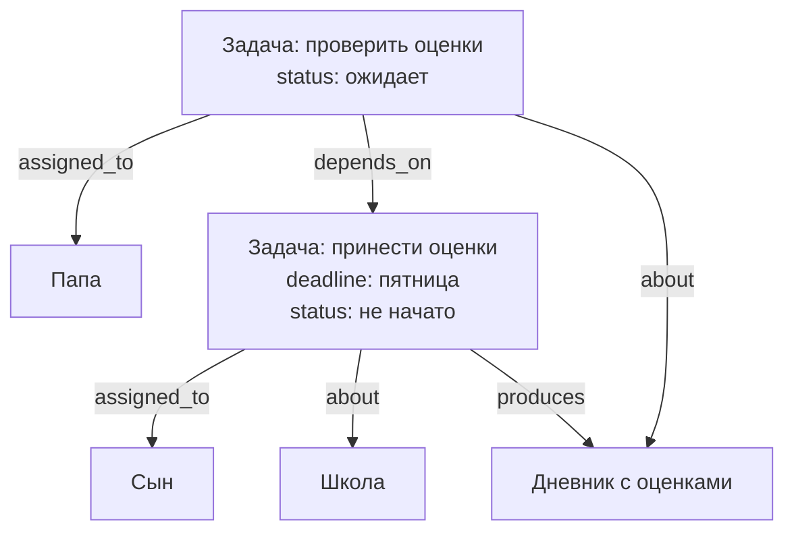
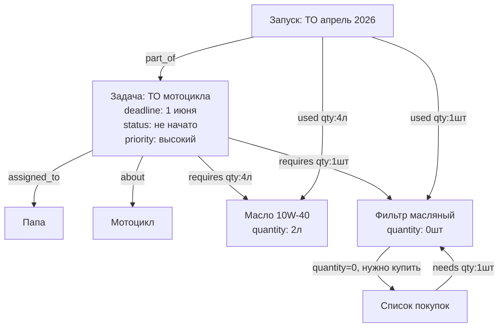
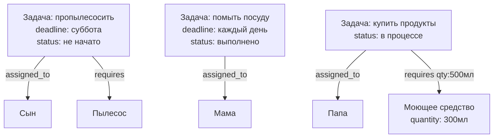
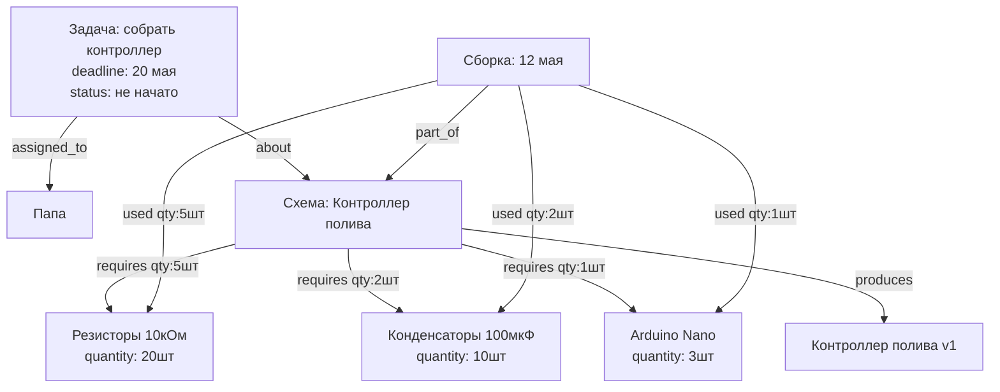
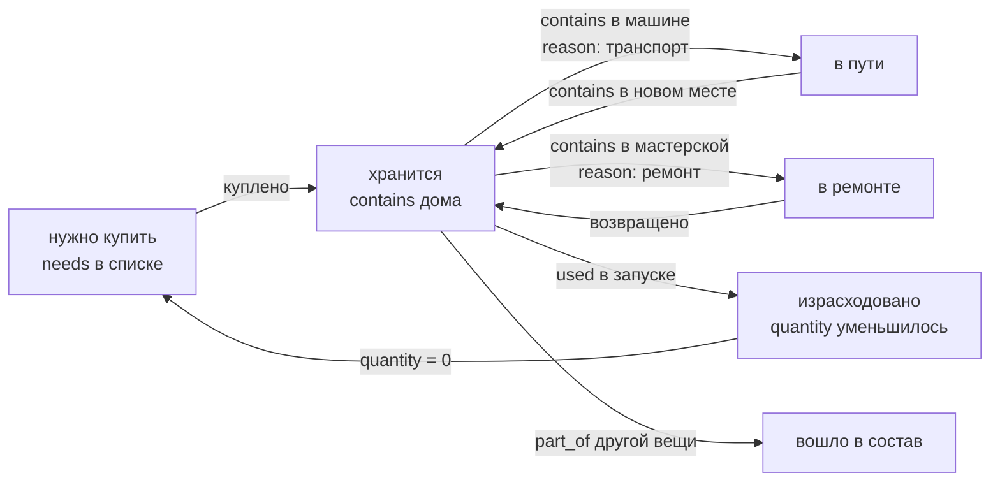
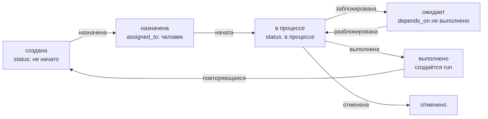

# Структура базы данных (SurrealDB)

## Концепция

Всё есть **вещь** (`thing`). Гараж, полка, мотоцикл, масло, рецепт, магазин, человек, задача —
один тип узла. Смысл задаётся только рёбрами (связями) между вещами.

---

## Узлы

| Таблица | Примеры |
|---------|---------|
| `thing` | предмет, место, контейнер, транспорт, человек, задача, рецепт, процедура, запуск, список |

Поля у каждой вещи — произвольные. Типичные поля по смыслу:

| Смысл | Поля |
|-------|------|
| Любая вещь | `name`, `description`, `notes` |
| Физический предмет | `quantity`, `unit`, `purchase_date`, `price` |
| Задача | `status`, `deadline`, `priority` |
| Человек | `role` (папа, мама, сын, дочь) |
| Рецепт/процедура | — (связи несут смысл) |

**`status` для задач:** `не начато` / `в процессе` / `выполнено` / `отменено` / `ожидает`

---

## Рёбра

| Связь | Описание | Поля на ребре |
|-------|----------|---------------|
| `contains` | Где физически находится вещь | `reason`, `since` |
| `part_of` | Частью чего является (деталь, запуск шаблона) | — |
| `assigned_to` | Кто отвечает за задачу | — |
| `depends_on` | Задача ждёт выполнения другой | — |
| `about` | Задача или событие касается этой вещи | — |
| `needs` | Что нужно купить (список → вещь) | `quantity`, `unit` |
| `requires` | Плановый расход (шаблон → ингредиент/деталь) | `quantity`, `unit` |
| `produces` | Результат выполнения шаблона | — |
| `used` | Фактический расход при запуске | `quantity`, `unit` |
| `related_to` | Произвольная связь с меткой | `label` |

**`reason` на ребре `contains`:** `хранение` / `транспорт` / `ремонт` / `покупка`

---

## Сценарий: оценки в школе



`depends_on` означает: задача "проверить оценки" не может начаться пока не выполнена "принести оценки".

---

## Сценарий: ТО мотоцикла (задача + инвентарь)

Задача объединяет людей и физический инвентарь в одном графе.



Когда `quantity` ингредиента меньше `requires` → автоматически в список покупок.  
Когда задача выполнена → создаётся `run`, который фиксирует фактический расход.

---

## Сценарий: домашние обязанности



---

## Сценарий: сборка электроники (BOM + задача)



---

## Жизненный цикл вещи



## Жизненный цикл задачи



---

## SurrealDB: схема

```surql
-- Единственный тип узла
DEFINE TABLE thing SCHEMALESS;

-- Физическое местонахождение
DEFINE TABLE contains TYPE RELATION FROM thing TO thing SCHEMAFULL;
DEFINE FIELD reason ON contains TYPE option<string>;
DEFINE FIELD since  ON contains TYPE option<datetime>;

-- Семантическая принадлежность / запуск принадлежит шаблону
DEFINE TABLE part_of TYPE RELATION FROM thing TO thing;

-- Задачи: ответственный
DEFINE TABLE assigned_to TYPE RELATION FROM thing TO thing;

-- Задачи: зависимость
DEFINE TABLE depends_on TYPE RELATION FROM thing TO thing;

-- Задача или событие касается этой вещи
DEFINE TABLE about TYPE RELATION FROM thing TO thing;

-- Список покупок
DEFINE TABLE needs TYPE RELATION FROM thing TO thing SCHEMAFULL;
DEFINE FIELD quantity ON needs TYPE option<number>;
DEFINE FIELD unit     ON needs TYPE option<string>;

-- Плановый расход
DEFINE TABLE requires TYPE RELATION FROM thing TO thing SCHEMAFULL;
DEFINE FIELD quantity ON requires TYPE option<number>;
DEFINE FIELD unit     ON requires TYPE option<string>;

-- Результат
DEFINE TABLE produces TYPE RELATION FROM thing TO thing;

-- Фактический расход
DEFINE TABLE used TYPE RELATION FROM thing TO thing SCHEMAFULL;
DEFINE FIELD quantity ON used TYPE option<number>;
DEFINE FIELD unit     ON used TYPE option<string>;

-- Произвольная связь
DEFINE TABLE related_to TYPE RELATION FROM thing TO thing SCHEMAFULL;
DEFINE FIELD label ON related_to TYPE string;
```

---

## SurrealQL: примеры запросов

```surql
-- Все задачи назначенные на сына
SELECT <-assigned_to<-thing[WHERE status != "выполнено"].* FROM thing:son;

-- Задачи которые можно начать прямо сейчас (нет невыполненных зависимостей)
SELECT * FROM thing WHERE status = "не начато"
  AND ->depends_on->thing[WHERE status != "выполнено"] IS EMPTY;

-- Что нужно купить для задачи (чего не хватает)
SELECT ->requires->thing.name AS item, ->requires.quantity AS needed,
       ->requires->thing.quantity AS have
FROM thing:task_motorcycle_service
WHERE ->requires->thing.quantity < ->requires.quantity;

-- Все задачи о мотоцикле
SELECT <-about<-thing.* FROM thing:motorcycle;

-- История выполнения процедуры ТО
SELECT <-part_of<-thing.* FROM thing:task_motorcycle_service;

-- Суммарный расход масла за все ТО
SELECT math::sum(quantity) AS total_used FROM used WHERE out = thing:oil_10w40;

-- Все просроченные задачи
SELECT * FROM thing WHERE deadline < time::now() AND status != "выполнено";
```

---

## YAML: описание схемы

```yaml
узел:
  тип: thing
  поля:
    обязательные:
      - название: текст
    необязательные:
      - описание: текст
      - количество: число
      - единица: текст
      - куплено: дата
      - цена: число
      - заметки: текст
      - статус: текст         # для задач: не начато / в процессе / выполнено / ожидает / отменено
      - дедлайн: дата         # для задач
      - приоритет: текст      # для задач: низкий / средний / высокий
      - роль: текст           # для людей: папа / мама / сын / дочь
    дополнительные: любые

связи:
  contains:
    описание: физическое местонахождение
    от: thing
    к: thing
    поля:
      - reason: текст         # хранение / транспорт / ремонт / покупка
      - since: дата

  part_of:
    описание: часть чего / запуск какого шаблона
    от: thing
    к: thing

  assigned_to:
    описание: кто отвечает за задачу
    от: thing                 # задача
    к: thing                  # человек

  depends_on:
    описание: задача ждёт выполнения другой
    от: thing                 # задача
    к: thing                  # другая задача

  about:
    описание: задача или событие касается этой вещи
    от: thing
    к: thing

  needs:
    описание: нужно купить
    от: thing                 # список покупок
    к: thing
    поля:
      - quantity: число
      - unit: текст

  requires:
    описание: плановый расход (шаблон → ингредиент/деталь)
    от: thing
    к: thing
    поля:
      - quantity: число
      - unit: текст

  produces:
    описание: результат выполнения
    от: thing
    к: thing

  used:
    описание: фактический расход при запуске
    от: thing                 # запуск
    к: thing                  # ингредиент/деталь
    поля:
      - quantity: число
      - unit: текст

  related_to:
    описание: произвольная связь
    от: thing
    к: thing
    поля:
      - label: текст
```

---

## Открытые вопросы

- [ ] История перемещений вещей?
- [ ] Повторяющиеся задачи — шаблон с расписанием (каждую субботу, каждые 10000 км)?
- [ ] Уведомления — дедлайн приближается, задача назначена?
- [ ] Фотографии вещей?
- [ ] Штрихкоды / QR-коды при добавлении?
