# Структура базы данных (SurrealDB)

## Концепция

Всё есть **вещь** (`thing`). Гараж, полка, мотоцикл, масло, рецепт, магазин, человек, семья,
задача, подзадача, платёж, обращение, инстанция — один тип узла.
Смысл задаётся только рёбрами (связями) между вещами.

---

## Узлы

| Таблица | Примеры |
|---------|---------|
| `thing` | предмет, место, контейнер, транспорт, человек, группа, задача, подзадача, рецепт, процедура, запуск, список, платёж, обращение, решение, инстанция |

Типичные поля по смыслу:

| Смысл | Поля |
|-------|------|
| Любая вещь | `name`, `description`, `notes` |
| Физический предмет | `quantity`, `unit`, `purchase_date`, `price` |
| Задача / обращение | `status`, `deadline`, `priority`, `original_deadline`, `postponed_count` |
| Периодическая задача / платёж | `period`, `schedule`, `amount`, `due_day`, `paid_until` |
| Напоминание | `deadline`, `repeat` |
| Человек | `role` (папа, мама, сын, дочь, бабушка) |
| Физическая/цифровая вещь | `kind` (физическое / цифровое / смешанное) |
| Сообщение | `text`, `created_at` |
| Событие / мероприятие | `date`, `duration` |
| Шаблон | `template` (true/false) |

**`status` задачи:** `не начато` / `в процессе` / `выполнено` / `ожидает` / `на паузе` / `отменено`  
**`status` обещания:** `ожидается` / `выполнено` / `нарушено`  
**`status` заказа:** `оформлен` / `в пути` / `на таможне` / `получено` / `не доставлено` / `возврат`

---

## Темпоральная природа узлов

Все узлы — `thing`, но у них разная природа во времени:

| Природа | Признак | Пример |
|---------|---------|--------|
| **Шаблон** | `template: true` | Процедура ТО, рецепт, план опыта |
| **План** | `template: false` + `status: не начато` + будущий `deadline` | Запланированное ТО в июне |
| **Текущее** | `status: в процессе` | ТО которое делается прямо сейчас |
| **Исторический факт** | `status: выполнено` + дата в прошлом | ТО от апреля 2026 |

Шаблоны хранятся в корневом контейнере `thing:templates` через `part_of`.
Запуски (экземпляры) — `part_of` своего шаблона.

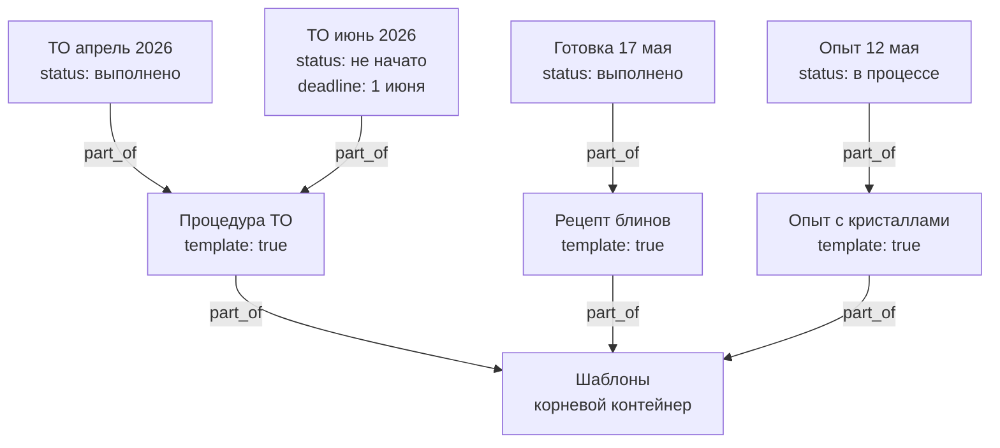

```surql
-- Все шаблоны
SELECT * FROM thing WHERE template = true;

-- Шаблоны в корневом контейнере
SELECT <-part_of<-thing FROM thing:templates;

-- Все запуски конкретного шаблона (история + планы)
SELECT <-part_of<-thing[WHERE template != true].* FROM thing:template_oil_service;

-- Только история (факты)
SELECT <-part_of<-thing[WHERE status = "выполнено"].* FROM thing:template_oil_service;

-- Только планы
SELECT <-part_of<-thing[WHERE status = "не начато"].* FROM thing:template_oil_service;

-- Что сейчас в процессе (не шаблоны)
SELECT * FROM thing WHERE status = "в процессе" AND template != true;
```  
**`period`:** `ежедневно` / `еженедельно` / `ежемесячно` / `ежеквартально` / `ежегодно`  
**`schedule`:** произвольная строка — `каждую пятницу`, `1-е число месяца`, `каждые 10000 км`

---

## Рёбра

| Связь | Описание | Поля на ребре |
|-------|----------|---------------|
| `contains` | Где физически находится вещь | `reason`, `since` |
| `part_of` | Часть чего / подзадача / запуск шаблона / членство в группе | `until` |
| `assigned_to` | Кто отвечает (человек, группа или вся семья) | — |
| `depends_on` | Задача ждёт выполнения другой | — |
| `about` | Задача/обращение касается этой вещи или решения | — |
| `filed_with` | Обращение подано в эту инстанцию/организацию | — |
| `needs` | Что нужно купить (список → вещь) | `quantity`, `unit` |
| `requires` | Плановый расход (шаблон → ингредиент/деталь) | `quantity`, `unit` |
| `produces` | Результат выполнения (решение, документ, блюдо) | — |
| `used` | Фактический расход при запуске | `quantity`, `unit` |
| `participant` | Участник с ролью (организатор, посредник, информирован…) | `role` |
| `located_at` | Где происходит событие или мероприятие | — |
| `lent_to` | Вещь отдана этому человеку во временное пользование | `since` |
| `borrowed_from` | Вещь взята у этого человека | `since` |
| `triggered_by` | Задача активируется при встрече с местом/человеком | — |
| `expert_in` | Человек — эксперт в этой теме/области | — |
| `answered` | Попытка → вопрос с результатом ответа | `chosen`, `correct`, `points_earned` |
| `promised_to` | Кому дано обещание | — |
| `represents` | Цифровая копия → физический оригинал | — |
| `can_access` | Кто имеет доступ к цифровой вещи | — |
| `related_to` | Произвольная связь с меткой | `label` |
| `references` | Блок ссылается на другой блок с режимом включения | `mode`, `snapshot_text`, `snapshot_at` |
| `identified_by` | Вещь идентифицируется этим кодом / маркировкой | `printed_at` |

**`reason` на ребре `contains`:** `хранение` / `транспорт` / `ремонт` / `покупка`  
**`until` на ребре `part_of`:** дата окончания временного членства; если отсутствует — постоянно  
**`role` на ребре `participant`:** `исполнитель` / `организатор` / `посредник` / `обещавший` / `информирован` / `свидетель` / `заказчик`  
**`mode` на ребре `references`:** `live` — живая трансклюзия / `snapshot` — заморожено / `link` — ссылка для навигации  
**`printed_at` на ребре `identified_by`:** дата когда физическая наклейка была распечатана и наклеена; если отсутствует — код известен, но наклейка не печаталась

---

## Люди и группы

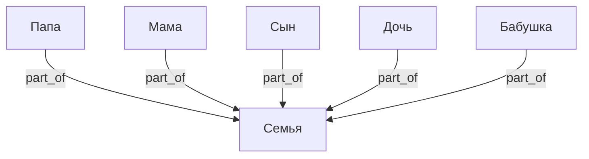

- `assigned_to` → конкретный человек: личная ответственность
- `assigned_to` → несколько людей: совместная
- `assigned_to` → Семья: открытая задача, берёт кто свободен

---

## Физическое и цифровое

Физическая вещь отвечает на вопрос **где находится** → `contains`.  
Цифровая вещь отвечает на вопрос **кто имеет доступ** → `can_access`.  
Связь между ними — `represents`.

Поле `kind`: `физическое` / `цифровое` / `смешанное`.

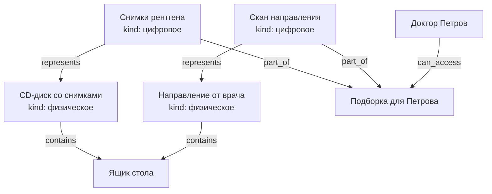

- Диск физически лежит в ящике, врач его не трогает
- Врач получает `can_access` только к цифровым копиям
- Один физический оригинал может иметь несколько цифровых представлений (скан, фото, PDF)

---

## Доступ и шаринг

`can_access` работает напрямую на конкретные вещи — без глобальных пространств.  
**Каскад:** доступ к вещи автоматически даёт доступ ко всему `part_of` неё вглубь.

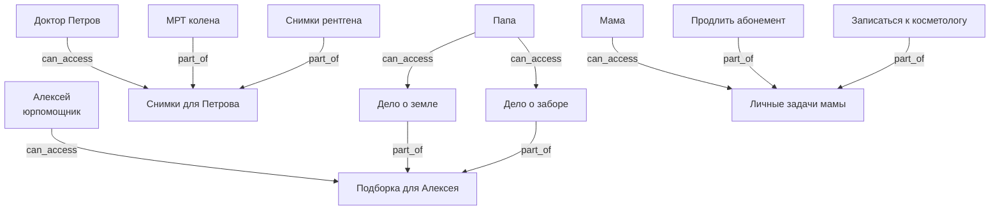

**Шаблон доступа** — заранее созданный контейнер с типовым набором.  
Пример: "Доступ врача" — контейнер с нужными цифровыми копиями,  
врачу выдаётся `can_access` к этому контейнеру и ничего лишнего.

---

## Сценарий: планирование мероприятий

Мероприятие — `thing` с датой. Место через `located_at`, участники через `participant`,
ресурсы через `requires`, подзадачи через `part_of`. Нехватка ресурсов → список покупок.

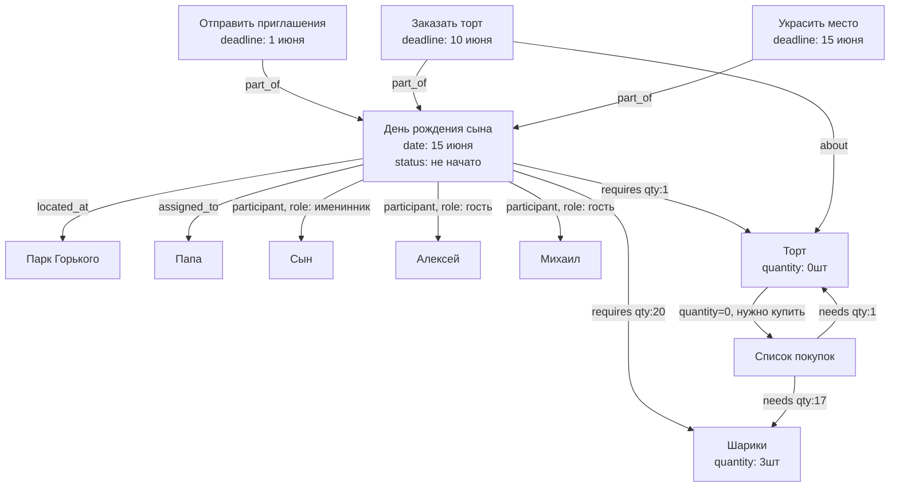

---

## Сценарий: журналистика и описание событий

Событие — `thing` с датой и местом. Статья/репортаж `about` событие, `produces` публикацию.
Источники — через `related_to, label: "источник"`. Свидетели — через `participant`.

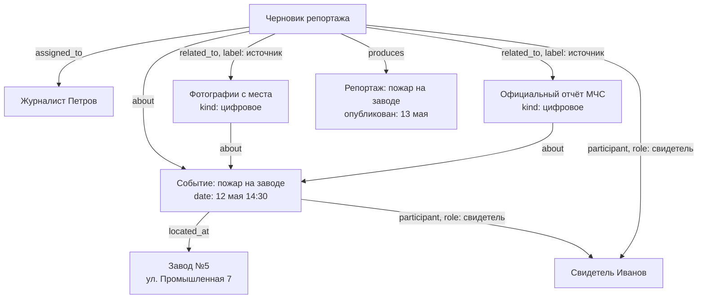

**Журналистский цикл:**
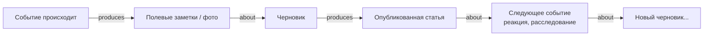

```surql
-- Все события в определённом месте
SELECT <-located_at<-thing.* FROM thing:factory_5;

-- Все материалы по событию (статьи, фото, заметки)
SELECT <-about<-thing.* FROM thing:event_fire_may12;

-- Участники мероприятия с их ролями
SELECT ->participant->thing.name AS person, ->participant.role AS role
FROM thing:party_birthday;

-- Что нужно купить для мероприятия
SELECT ->requires->thing.name AS item,
       ->requires.quantity AS нужно,
       ->requires->thing.quantity AS есть
FROM thing:party_birthday
WHERE ->requires->thing.quantity < ->requires.quantity;

-- Ближайшие мероприятия
SELECT * FROM thing WHERE date > time::now()
  AND date < time::now() + 30d
  AND ->located_at->thing != NONE
  ORDER BY date ASC;
```

---

## Сценарий: роли участников и временные группы

Врач — самостоятельная вещь со своими контактами. Постоянно `part_of` больница.
Временное участие в задаче — через `participant` напрямую или через временную группу.

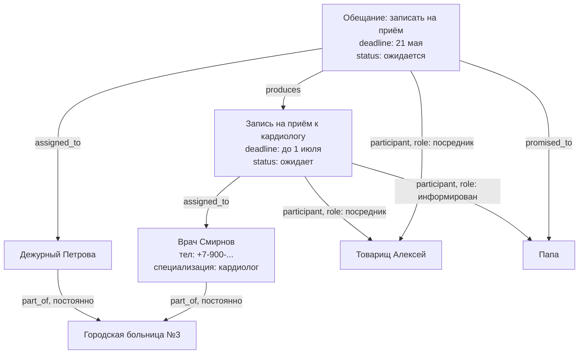

**Постоянное vs временное членство через `part_of`:**

| Ситуация | Ребро |
|----------|-------|
| Смирнов работает в больнице | `part_of` без `until` |
| Смирнов в рабочей группе по делу | `part_of, until: 1 июня` |
| Алексей помогает с юрделами | `participant, role: посредник` на конкретной задаче |

**Временная группа** нужна только когда один набор людей участвует сразу в нескольких
связанных задачах. Для одной задачи — проще `participant` напрямую.

```surql
-- Все задачи где участвует врач Смирнов (в любой роли)
SELECT <-assigned_to<-thing.*, <-participant<-thing.*
FROM thing:doctor_smirnov;

-- Контакты всех участников задачи
SELECT ->assigned_to->thing.name, ->assigned_to->thing.phone,
       ->participant->thing.name, ->participant->thing.phone
FROM thing:task_appointment;

-- Временные членства которые скоро истекают
SELECT * FROM part_of WHERE until < time::now() + 7d;
```

---

## Сценарий: обсуждения

Сообщение — `thing` с полем `text` и `created_at`. Привязывается к любой вещи через `about`.
Автор — через `assigned_to`. Из сообщения через `produces` может вырасти задача или обещание.

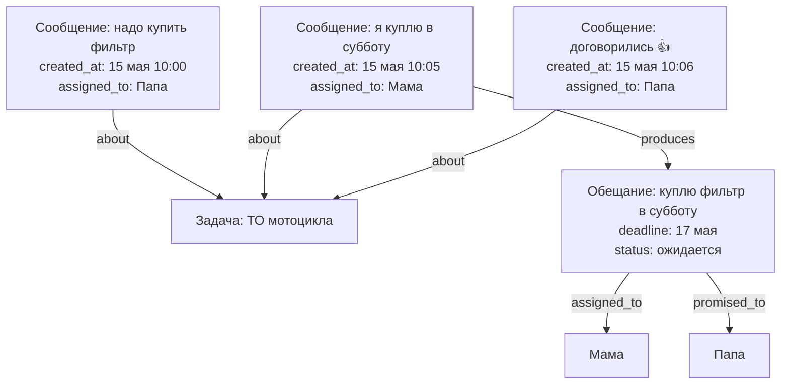

Обсуждение — просто поток сообщений `about` одной вещи, упорядоченных по `created_at`.
Отдельного контейнера не нужно.

---

## Сценарий: обещания и каскад

Обещание — `thing` с дедлайном и статусом. Когда выполняется — `produces` порождает
задачи, покупки, другие обещания. Дедлайн может быть через год.

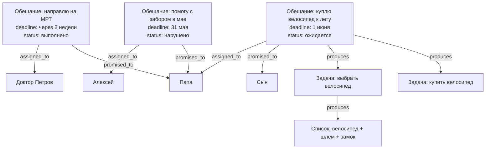

**Нарушенное обещание** (`status: нарушено`) не исчезает — остаётся в графе как факт,
на него можно ссылаться в новых обсуждениях или обращениях.

```surql
-- Все обещания данные нам (promised_to: папа), ещё не выполненные
SELECT * FROM thing WHERE ->promised_to->thing = thing:dad
  AND status = "ожидается";

-- Просроченные обещания
SELECT * FROM thing WHERE status = "ожидается"
  AND deadline < time::now()
  AND ->promised_to->thing != NONE;

-- Обсуждение под задачей (все сообщения, по времени)
SELECT * FROM thing WHERE ->about->thing = thing:task_motorcycle_service
  AND text != NONE
  ORDER BY created_at ASC;

-- Что выросло из обещания (каскад)
SELECT ->produces->thing.* FROM thing:promise_bicycle DEPTH 5;

-- Нарушенные обещания от конкретного человека
SELECT * FROM thing WHERE ->assigned_to->thing = thing:alex
  AND status = "нарушено";
```

---

## Сценарий: периодические задачи и напоминания

Периодическая задача — шаблон с расписанием. Каждое выполнение — `run` через `part_of`.
Напоминание — отдельный `thing` с `about` на конкретный запуск.

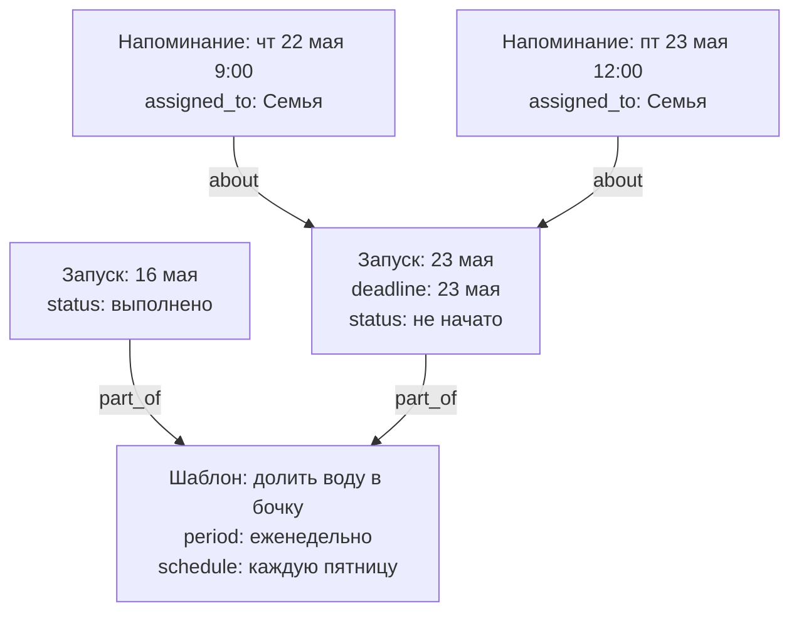

На одну задачу — сколько угодно напоминаний, каждому своё (`assigned_to`), в любое время.

---

## Перенос, пауза, история

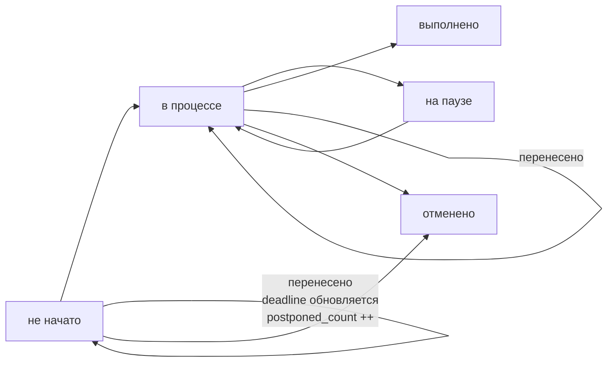

**Перенос задачи:**
- `deadline` обновляется на новую дату
- `original_deadline` сохраняет изначальный срок
- `postponed_count` увеличивается на 1
- Напоминания пересоздаются с новыми датами

**Пауза:**
- `status: на паузе` — задача видна, но не давит дедлайном
- Используется когда задача заблокирована внешними обстоятельствами,
  но `depends_on` формально не выражает причину

**Примеры расписаний:**

| Задача | `period` | `schedule` |
|--------|----------|------------|
| Долить воду в бочку | еженедельно | каждую пятницу |
| Оплатить электричество | ежемесячно | до 10-го числа |
| ТО мотоцикла | — | каждые 10000 км / раз в год |
| Проверить аптечку | ежеквартально | 1-е число квартала |
| Забрать ребёнка из секции | еженедельно | вт, чт 18:00 |

---

## Сценарий: периодические платежи

Каждый периодический платёж — шаблон (`thing`) с расписанием.
Каждая оплата — запуск (`run`), `part_of` шаблона.

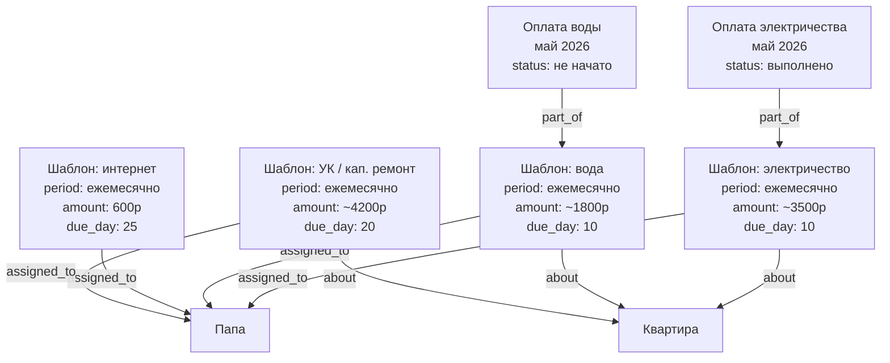

Просроченные платежи — обычный запрос: `paid_until < сегодня`.

---

## Сценарий: юридические обращения

Цепочка обжалований строится через `about` (это обращение обжалует то решение)
и `filed_with` (подано в эту инстанцию).

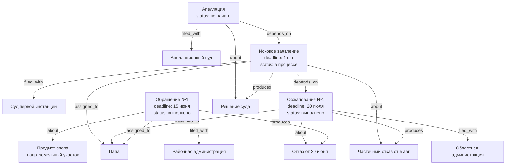

Вся цепочка читается как путь по `about` и `produces`:  
Обращение → решение → следующее обращение → решение → ...

---

## Сценарий: подзадачи

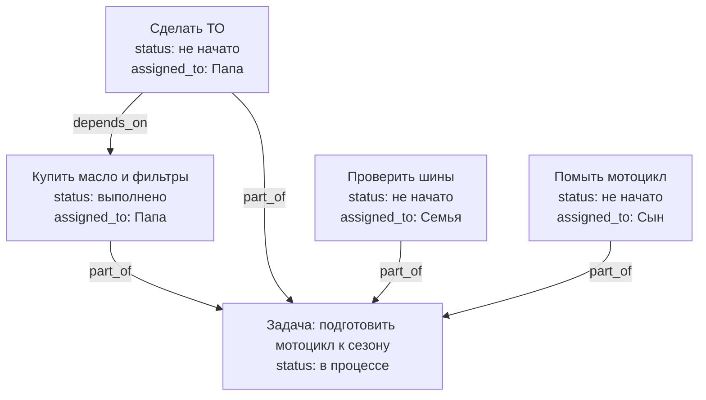

---

## Сценарий: открытые и личные задачи

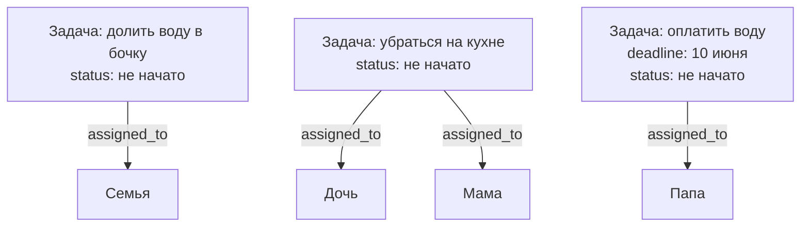

---

## Уведомления (логика приложения)

| Событие | Кто получает уведомление |
|---------|--------------------------|
| Новая задача `assigned_to` человек | Этот человек |
| Новая задача `assigned_to` Семья | Все члены семьи |
| Задача `depends_on` выполнена | Исполнитель следующей задачи |
| Дедлайн приближается (за 3 дня) | Исполнитель задачи |
| `quantity` = 0 | Все (или исполнитель задачи на покупку) |
| `paid_until` истекает | Исполнитель шаблона платежа |
| Решение по обращению получено (`produces`) | Исполнитель следующего обращения |

---

## SurrealDB: схема

```surql
DEFINE TABLE thing SCHEMALESS;

DEFINE TABLE contains TYPE RELATION FROM thing TO thing SCHEMAFULL;
DEFINE FIELD reason ON contains TYPE option<string>;
DEFINE FIELD since  ON contains TYPE option<datetime>;

DEFINE TABLE part_of TYPE RELATION FROM thing TO thing SCHEMAFULL;
DEFINE FIELD until ON part_of TYPE option<datetime>;

DEFINE TABLE participant TYPE RELATION FROM thing TO thing SCHEMAFULL;
DEFINE FIELD role ON participant TYPE string;

DEFINE TABLE located_at TYPE RELATION FROM thing TO thing;

DEFINE TABLE lent_to TYPE RELATION FROM thing TO thing SCHEMAFULL;
DEFINE FIELD since ON lent_to TYPE option<datetime>;

DEFINE TABLE borrowed_from TYPE RELATION FROM thing TO thing SCHEMAFULL;
DEFINE FIELD since ON borrowed_from TYPE option<datetime>;

DEFINE TABLE triggered_by TYPE RELATION FROM thing TO thing;

DEFINE TABLE expert_in TYPE RELATION FROM thing TO thing;

DEFINE TABLE answered TYPE RELATION FROM thing TO thing SCHEMAFULL;
DEFINE FIELD chosen        ON answered TYPE option<string>;
DEFINE FIELD correct       ON answered TYPE option<bool>;
DEFINE FIELD points_earned ON answered TYPE option<number>;
DEFINE TABLE assigned_to TYPE RELATION FROM thing TO thing;
DEFINE TABLE depends_on  TYPE RELATION FROM thing TO thing;
DEFINE TABLE about       TYPE RELATION FROM thing TO thing;
DEFINE TABLE filed_with  TYPE RELATION FROM thing TO thing;
DEFINE TABLE produces    TYPE RELATION FROM thing TO thing;

DEFINE TABLE needs TYPE RELATION FROM thing TO thing SCHEMAFULL;
DEFINE FIELD quantity ON needs TYPE option<number>;
DEFINE FIELD unit     ON needs TYPE option<string>;

DEFINE TABLE requires TYPE RELATION FROM thing TO thing SCHEMAFULL;
DEFINE FIELD quantity ON requires TYPE option<number>;
DEFINE FIELD unit     ON requires TYPE option<string>;

DEFINE TABLE used TYPE RELATION FROM thing TO thing SCHEMAFULL;
DEFINE FIELD quantity ON used TYPE option<number>;
DEFINE FIELD unit     ON used TYPE option<string>;

DEFINE TABLE represents TYPE RELATION FROM thing TO thing;

DEFINE TABLE can_access TYPE RELATION FROM thing TO thing;

DEFINE TABLE related_to TYPE RELATION FROM thing TO thing SCHEMAFULL;
DEFINE FIELD label ON related_to TYPE string;

DEFINE TABLE references TYPE RELATION FROM thing TO thing SCHEMAFULL;
DEFINE FIELD mode          ON references TYPE string;
DEFINE FIELD snapshot_text ON references TYPE option<string>;
DEFINE FIELD snapshot_at   ON references TYPE option<datetime>;

DEFINE TABLE identified_by TYPE RELATION FROM thing TO thing SCHEMAFULL;
DEFINE FIELD printed_at ON identified_by TYPE option<datetime>;

DEFINE TABLE promised_to TYPE RELATION FROM thing TO thing;

-- Поле params на requires: для передачи конфигурации модулю/рантайму
DEFINE FIELD params ON requires TYPE option<object>;
```

### Индексы

```surql
-- Основные фильтры по узлам
DEFINE INDEX idx_kind        ON thing FIELDS kind;
DEFINE INDEX idx_status      ON thing FIELDS status;
DEFINE INDEX idx_kind_status ON thing FIELDS kind, status;
DEFINE INDEX idx_template    ON thing FIELDS template;
DEFINE INDEX idx_language    ON thing FIELDS language;

-- Полнотекстовый поиск
DEFINE INDEX idx_name ON thing FIELDS name
  SEARCH ANALYZER ascii BM25;
DEFINE INDEX idx_text ON thing FIELDS text
  SEARCH ANALYZER ascii BM25;
DEFINE INDEX idx_description ON thing FIELDS description
  SEARCH ANALYZER ascii BM25;

-- Векторный поиск (изображения и текстовые эмбеддинги, 1536-мерный OpenAI / 768 local)
DEFINE INDEX idx_embedding ON thing FIELDS embedding
  MTREE DIMENSION 1536;

-- Очереди и задания (для оркестрации)
DEFINE INDEX idx_queue_status ON thing FIELDS kind, status, priority;
```

Единая таблица `thing` с индексами эффективна при типичном масштабе семейной системы
(десятки тысяч записей). Разбивать `thing` на отдельные таблицы по типу (`task`, `person`,
`document`) стоит только если один `kind` вырастет за ~100 000 записей.

---

## SurrealQL: примеры запросов

```surql
-- Платежи которые нужно оплатить в этом месяце
SELECT * FROM thing WHERE paid_until < time::now() + 30d
  AND period != NONE;

-- Вся цепочка обжалований по делу (рекурсивно)
SELECT ->about->thing.* FROM thing:case_1 DEPTH 10;

-- Открытые задачи для любого члена семьи
SELECT * FROM thing WHERE status = "не начато"
  AND ->assigned_to->thing CONTAINS thing:family;

-- Мои задачи (личные + семейные, не выполненные)
SELECT * FROM thing WHERE status != "выполнено"
  AND (->assigned_to->thing CONTAINS thing:dad
    OR ->assigned_to->thing CONTAINS thing:family);

-- Задачи без невыполненных зависимостей (можно начать)
SELECT * FROM thing WHERE status = "не начато"
  AND ->depends_on->thing[WHERE status != "выполнено"] IS EMPTY;

-- Все документы/решения по юридическому делу
SELECT ->produces->thing.* FROM thing WHERE ->filed_with->thing != NONE;

-- Просроченные задачи и платежи
SELECT * FROM thing
  WHERE deadline < time::now() AND status NOT IN ["выполнено", "отменено"];

-- Задачи на паузе
SELECT * FROM thing WHERE status = "на паузе";

-- Напоминания на сегодня
SELECT * FROM thing WHERE deadline < time::now() + 1d
  AND ->about->thing.status NOT IN ["выполнено", "отменено"];

-- Следующий запуск периодической задачи
SELECT * FROM thing WHERE part_of = thing:template_barrel
  ORDER BY deadline DESC LIMIT 1;

-- Задачи которые переносили больше 2 раз
SELECT * FROM thing WHERE postponed_count > 2
  AND status NOT IN ["выполнено", "отменено"];
```

---

## YAML: описание схемы

```yaml
узел:
  тип: thing
  поля:
    обязательные:
      - название: текст
    необязательные:
      - описание: текст
      - количество: число
      - единица: текст
      - куплено: дата
      - цена: число
      - заметки: текст
      - шаблон: булево             # true = абстрактный шаблон; false/отсутствует = конкретный экземпляр
      - истекает: дата             # срок действия документа, подписки, страховки
      - энергия: текст             # для задач: низкая / средняя / высокая
      - стрик: число               # для привычек: выполнений подряд
      - желание: булево            # true = вишлист, ещё не куплено и не планируется
      - вопрос: текст              # текст вопроса в квизе
      - варианты: список           # варианты ответов для multiple_choice
      - ответ: текст               # правильный ответ
      - объяснение: текст          # почему именно так
      - тип_вопроса: текст         # multiple_choice / true_false / open_ended / fill_blank
      - сложность: текст           # лёгкий / средний / сложный
      - баллы: число               # результат попытки
      - макс_баллы: число          # максимум за попытку
      - тип: текст                 # для контактов: phone / email / messenger / address / website / social
      - значение: текст            # для контактов: сам номер, адрес, ник
      - платформа: текст           # для мессенджеров: Telegram / WhatsApp / Signal / ВКонтакте
      - метка: текст               # для контактов: личный / рабочий / домашний
      - предпочтительный: булево   # true = основной способ связи
      - identified: булево         # false = stub-узел, ещё не идентифицирован (ожидает фото и AI)
      - code_type: текст           # тип кода: ean13 / ean8 / qr / datamatrix / честный_знак / serial / imei / vin / isbn / rfid / custom_qr / ozon / wb / артикул
      - code_value: текст          # значение кода: "4607082660271", "X1Y2Z3..."
      - code_system: текст         # кто выдал: производитель / ozon / wb / wildberries / честный_знак / домовой
      - filename: текст            # для файловых узлов: имя файла на диске ("scan.pdf")
      - mime_type: текст           # для файловых узлов: "image/jpeg", "application/pdf"
      - size: число                # размер файла в байтах
      - width: число               # для изображений: ширина в пикселях
      - height: число              # для изображений: высота в пикселях
      - duration: число            # для аудио/видео: длительность в секундах
      - трекинг: текст             # номер отслеживания (когда один простой номер)
      - перевозчик: текст          # carrier: Почта Китая / СДЭК / DHL
      - url: текст                 # ссылка: трекинг, товар, документ, госпортал
      - статус: текст              # не начато / в процессе / выполнено / ожидает / на паузе / отменено
      - дедлайн: дата
      - изначальный_дедлайн: дата  # сохраняется при первом переносе
      - перенесено_раз: число      # сколько раз переносили
      - приоритет: текст           # низкий / средний / высокий
      - период: текст              # ежедневно / еженедельно / ежемесячно / ежеквартально / ежегодно
      - расписание: текст          # "каждую пятницу", "до 10-го числа", "каждые 10000 км"
      - повтор_напоминания: текст  # для напоминаний: "каждый день за 3 дня до"
      - роль: текст                # для людей: папа / мама / сын / дочь / бабушка
      - сумма: число               # для платежей и смет: договорная цена
      - сумма_факт: число          # итоговая стоимость после выполнения (может отличаться от сметы)
      - день_оплаты: число         # число месяца: 1–31
      - оплачено_до: дата
    дополнительные: любые

связи:
  contains:
    от: thing
    к: thing
    поля:
      - reason: текст         # хранение / транспорт / ремонт / покупка
      - since: дата
  part_of:
    описание: часть чего / подзадача / запуск шаблона / членство в группе
    от: thing
    к: thing
    поля:
      - until: дата   # если указана — временное членство; если нет — постоянное
  assigned_to:
    описание: кто отвечает (человек, несколько людей или вся семья)
    от: thing
    к: thing
  depends_on:
    описание: задача ждёт выполнения другой
    от: thing
    к: thing
  about:
    описание: задача/обращение касается этой вещи или обжалует это решение
    от: thing
    к: thing
  filed_with:
    описание: обращение подано в эту инстанцию/организацию
    от: thing
    к: thing
  needs:
    описание: нужно купить
    от: thing
    к: thing
    поля:
      - quantity: число
      - unit: текст
  requires:
    описание: плановый расход (шаблон → ингредиент/деталь)
    от: thing
    к: thing
    поля:
      - quantity: число
      - unit: текст
  produces:
    описание: результат выполнения (решение, документ, блюдо, изделие)
    от: thing
    к: thing
  used:
    описание: фактический расход при запуске
    от: thing
    к: thing
    поля:
      - quantity: число
      - unit: текст
  located_at:
    описание: где происходит событие или мероприятие
    от: thing
    к: thing

  lent_to:
    описание: вещь отдана этому человеку во временное пользование
    от: thing   # вещь
    к: thing    # человек
    поля:
      - since: дата

  borrowed_from:
    описание: вещь взята у этого человека
    от: thing   # вещь
    к: thing    # владелец
    поля:
      - since: дата

  triggered_by:
    описание: задача активируется при встрече с местом, человеком или ситуацией
    от: thing   # задача
    к: thing    # место / человек / событие

  expert_in:
    описание: человек является экспертом в этой теме или области
    от: thing   # человек
    к: thing    # область / тема / навык

  answered:
    описание: попытка → вопрос с результатом ответа
    от: thing   # попытка (attempt)
    к: thing    # вопрос (question)
    поля:
      - chosen: текст         # что выбрал/написал ученик
      - correct: булево       # правильно или нет
      - points_earned: число  # баллы за этот вопрос

  participant:
    описание: участник с конкретной ролью (не основной ответственный)
    от: thing   # задача, обещание, событие
    к: thing    # человек или группа
    поля:
      - role: текст   # исполнитель / организатор / посредник / обещавший / информирован / свидетель

  promised_to:
    описание: кому дано обещание
    от: thing   # обещание
    к: thing    # человек или группа

  represents:
    описание: цифровая копия → физический оригинал
    от: thing   # цифровое
    к: thing    # физическое

  can_access:
    описание: кто имеет доступ к цифровой вещи или контейнеру
    от: thing   # человек или группа
    к: thing    # цифровая вещь или контейнер

  related_to:
    описание: произвольная связь
    от: thing
    к: thing
    поля:
      - label: текст

  references:
    описание: блок ссылается на другой блок с тремя режимами поведения
    от: thing   # блок-источник (в документе)
    к: thing    # блок-цель (любой thing с text)
    поля:
      - mode: текст           # live / snapshot / link
      - snapshot_text: текст  # для mode=snapshot: замороженный текст цели на момент фиксации
      - snapshot_at: дата     # когда был сделан снапшот

  identified_by:
    описание: вещь идентифицируется этим кодом или маркировкой
    от: thing   # физическая вещь
    к: thing    # код / маркировка
    поля:
      - printed_at: дата   # когда наклейка физически распечатана; null = код известен, наклейки нет
```

---

## Сценарий: жалоба с fan-out по инстанциям

Одна жалоба охватывает несколько объектов. Вышестоящая инстанция пересылает её вниз —
каждое подзадело живёт независимо, но остаётся связано с корнем через `part_of`.

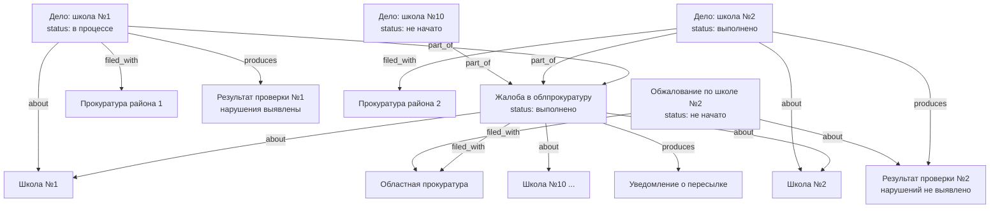

**Почему это работает без изменений схемы:**
- `part_of` связывает подзадела с корневой жалобой — всегда виден источник
- Каждое подзадело независимо: своя прокуратура (`filed_with`), свой результат (`produces`), своё обжалование (`about`)
- Fan-out естественен для графа — у одного узла может быть сколько угодно рёбер любого типа

```surql
-- Все подзадела и их статусы
SELECT name, status, ->filed_with->thing.name AS прокуратура
FROM thing WHERE ->part_of->thing = thing:root_complaint;

-- Результаты которые можно обжаловать (есть результат, нет обжалования)
SELECT * FROM thing WHERE ->part_of->thing = thing:root_complaint
  AND ->produces->thing != NONE
  AND NOT (SELECT * FROM thing WHERE ->about->thing = (->produces->thing));

-- Вся цепочка от корневой жалобы вглубь
SELECT ->part_of<-thing.* FROM thing:root_complaint DEPTH 5;
```

---

## Сценарий: медицина — приёмы, назначения, направления

Врач `part_of` больница. Приём — задача с дедлайном. Назначения и направления —
`produces` из приёма. Следующий приём `about` направление.

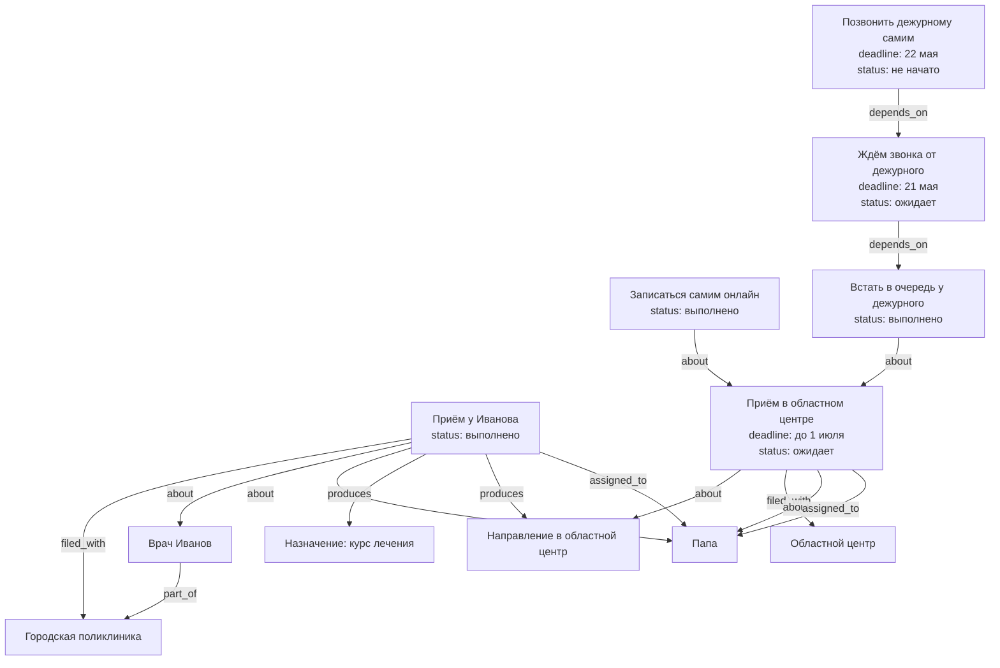

**Таймаут на звонок:** `Followup` с дедлайном на следующий день после `Callback` —
страховка от забывчивости. Уведомление сработает когда дедлайн `Callback` истечёт
без выполнения.

**OR-логика записи:** два пути к одному приёму (самостоятельно или через дежурного) —
это поведение приложения. Когда хотя бы один путь сработал, `Visit2` помечается
подтверждённым. В схеме не формализуется.

```surql
-- Все предстоящие приёмы у врачей
SELECT * FROM thing WHERE ->filed_with->thing.name CONTAINS "больниц"
  AND deadline > time::now() AND status != "выполнено";

-- Назначения и направления из последнего приёма
SELECT ->produces->thing.* FROM thing:visit_ivanov_may;

-- Незакрытые задачи по ожиданию обратного звонка
SELECT * FROM thing WHERE name CONTAINS "звонк" AND status = "ожидает"
  AND deadline < time::now() + 1d;

-- Все приёмы конкретного пациента
SELECT <-about<-thing[WHERE ->filed_with->thing != NONE].* FROM thing:dad;
```

---

## Сценарий: сложный трекинг доставки

Трекинг-номер — отдельный `thing` с `url` и `carrier`. Когда перевозчик меняется —
новый номер `about` старый (цепочка передачи). Контрольные точки — сообщения `about`
трекинг-номер. Если заказ разбивается — каждая посылка `part_of` заказа со своим трекингом.

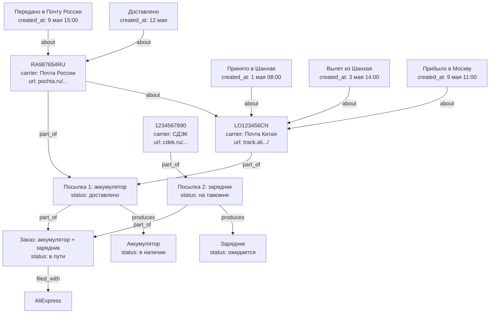

`T2 about T1` — передача от Почты Китая к Почте России: цепочка смены перевозчиков.  
Контрольные точки (события) — те же сообщения `about` трекинг-номер, упорядоченные по `created_at`.

**Поле `url`** полезно не только для трекинга: ссылки на товары, документы,
страницы в госпорталах, карточки во внешних системах.

```surql
-- Полная история пути посылки по всем перевозчикам
SELECT ->about->thing.name AS трекинг,
       ->about->thing.carrier AS перевозчик,
       text AS событие, created_at
FROM thing
WHERE ->about->thing->part_of->thing = thing:package_1
ORDER BY created_at ASC;

-- Текущий активный трекинг (последний в цепочке)
SELECT * FROM thing
  WHERE ->part_of->thing = thing:package_1
  AND carrier != NONE
  AND count(<-about<-thing) = 0;

-- Незакрытые посылки и сколько задач они блокируют
SELECT name, status,
  count(<-depends_on<-thing DEPTH 5) AS блокирует_задач
FROM thing
  WHERE ->part_of->thing->filed_with->thing != NONE
  AND status NOT IN ["доставлено", "возврат"]
ORDER BY блокирует_задач DESC;
```

---

## Сценарий: блокирующая зависимость и каскад ожидания

Один товар или событие держит весь каскад задач. Заказ — `thing` с `filed_with` поставщик,
`about` товар, `produces` товар при доставке. Каскад `depends_on` товар — не заказ.
Когда товар получен — всё разблокируется за один шаг.

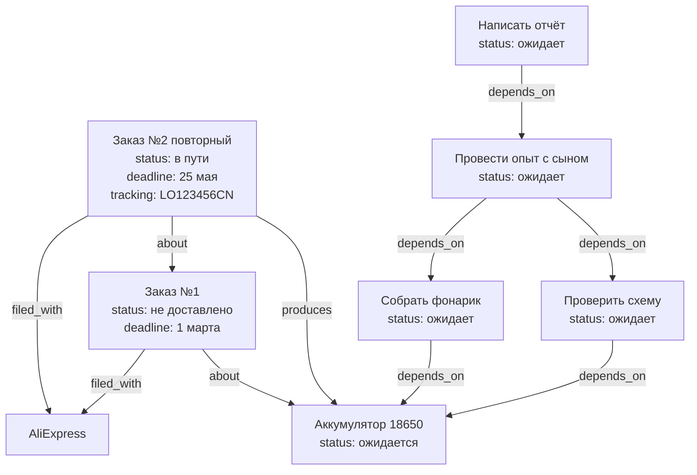

`Order2 about Order1` — история: повторный заказ взамен недоставленного.

**Когда товар приходит — три действия:**
1. `Order2 status` → `получено`
2. `Battery status` → `в наличии`, добавляется `contains` → место хранения
3. Все `depends_on battery` задачи уведомляют исполнителей

```surql
-- Весь каскад заблокированный одним товаром (любая глубина)
SELECT name, status FROM thing
  WHERE ->depends_on->thing CONTAINS thing:battery
  DEPTH 10;

-- Сколько задач разблокируется
SELECT count() AS разблокируется FROM thing
  WHERE ->depends_on->thing CONTAINS thing:battery DEPTH 10;

-- История заказов одного товара
SELECT name, status, deadline, tracking FROM thing
  WHERE ->about->thing = thing:battery
  AND ->filed_with->thing != NONE
  ORDER BY created_at ASC;

-- Все товары в ожидании доставки и их каскады
SELECT name,
  count(<-depends_on<-thing DEPTH 10) AS задач_ждёт
FROM thing WHERE status = "ожидается"
  AND ->produces->thing != NONE
ORDER BY задач_ждёт DESC;
```

---

## Сценарий: обучение и тестирование

### Структура курса

Курс → разделы → темы → занятия через `part_of`. Всё это шаблоны (`template: true`).
Запуски — конкретные занятия с датой и статусом. ОГЭ/ЕГЭ — `thing` с `deadline`.

```mermaid
graph TD
    Exam[ОГЭ по русскому\ndeadline: июнь 2025]
    Course[Курс: Русский ОГЭ\ntemplate: true\nassigned_to: Сын]
    S1[Раздел: Орфография\ntemplate: true]
    S2[Раздел: Пунктуация\ntemplate: true]
    S3[Раздел: Сочинение\ntemplate: true]
    T1[Тема: НН и Н\ntemplate: true]
    T2[Тема: Приставки\ntemplate: true]
    T3[Тема: Запятые в СПП\ntemplate: true]

    Session1[Занятие: орфография\ndate: 20 мая\nstatus: не начато\nassigned_to: Сын]

    S1 -->|part_of| Course
    S2 -->|part_of| Course
    S3 -->|part_of| Course
    T1 -->|part_of| S1
    T2 -->|part_of| S1
    T3 -->|part_of| S2
    Course -->|about| Exam
    Session1 -->|part_of| T1
```

---

### Структура квиза

Квиз — шаблон с вопросами. Попытка — запуск квиза. Ответы на вопросы — ребро `answered`.

```mermaid
graph TD
    Quiz[Квиз: тест по НН и Н\ntemplate: true]
    Q1[В каком слове НН?\ntype: multiple_choice\noptions: стеклянный,кожаный...\ncorrect: стеклянный\ndifficulty: средний]
    Q2[Вставьте букву: стекля__ый\ntype: fill_blank\ncorrect: НН\nexplanation: прил. на -янн- пишутся НН]
    Q3[НН пишется в отглагольных прил.?\ntype: true_false\ncorrect: false]

    Attempt[Попытка: Сын 19 мая\nscore: 7\nmax_score: 10\nstatus: выполнено]

    Q1 -->|part_of| Quiz
    Q2 -->|part_of| Quiz
    Q3 -->|part_of| Quiz
    Quiz -->|about| Topic1[Тема: НН и Н]

    Attempt -->|part_of| Quiz
    Attempt -->|answered, chosen: стеклянный, correct: true, points: 1| Q1
    Attempt -->|answered, chosen: Н, correct: false, points: 0| Q2
    Attempt -->|answered, chosen: true, correct: false, points: 0| Q3
```

---

### AI-интеграция: адаптивное обучение

AI смотрит на `answered` где `correct: false`, определяет слабые темы,
генерирует новые квизы и корректирует учебный план.

```mermaid
graph TD
    AI[AI-агент]
    Son[Сын]
    WeakTopic[Тема: Приставки\n70% ошибок]
    NewQuiz[Новый квиз по приставкам\nсгенерирован AI\ntemplate: true]
    NewPlan[Скорректированный план\nна следующую неделю]

    AI -->|produces| NewQuiz
    AI -->|produces| NewPlan
    NewQuiz -->|about| WeakTopic
    NewPlan -->|about| Son
    NewPlan -->|about| WeakTopic
```

```surql
-- Слабые темы сына (топ ошибок)
SELECT ->about->thing.name AS тема,
  count() AS всего_ответов,
  count(WHERE correct = false) AS ошибок,
  math::round(count(WHERE correct = false) / count() * 100) AS процент
FROM answered
WHERE <-part_of<-thing[WHERE assigned_to = thing:son] != NONE
GROUP BY ->about->thing.name
HAVING процент > 50
ORDER BY процент DESC;

-- Прогресс по курсу — динамика результатов
SELECT date, score, max_score,
  math::round(score / max_score * 100) AS процент
FROM thing WHERE ->part_of->thing = thing:quiz_nn
  AND assigned_to = thing:son
ORDER BY date ASC;

-- Все квизы по слабой теме (для AI-назначения)
SELECT * FROM thing WHERE template = true
  AND ->about->thing = thing:topic_pristavki;

-- Готовность к экзамену по разделам
SELECT ->part_of->thing.name AS раздел,
  math::round(count(WHERE correct = true) / count() * 100) AS готовность
FROM answered
WHERE <-part_of<-thing[WHERE assigned_to = thing:son] != NONE
GROUP BY ->part_of->thing[WHERE ->part_of->thing = thing:course_oge].name;
```

---

## Паттерны управления вниманием

### 1. Срок действия документов и подписок

Поле `expires_at` на любой вещи. Автоматическое напоминание за N дней.

```mermaid
graph TD
    Passport[Паспорт папы\nkind: физическое\nexpires_at: 2027-03-15]
    DL[Водительское удостоверение\nexpires_at: 2026-11-01]
    Insurance[Страховка ОСАГО\nexpires_at: 2026-06-30]
    Netflix[Подписка Netflix\nexpires_at: 2026-06-01\namount: 799р/мес]

    Passport -->|represents| PassportScan[Скан паспорта\nkind: цифровое]
```

```surql
-- Что истекает в ближайшие 30 дней
SELECT name, expires_at FROM thing
  WHERE expires_at > time::now()
  AND expires_at < time::now() + 30d
  ORDER BY expires_at ASC;
```

---

### 2. Одолжения — что у кого

```mermaid
graph TD
    Drill[Дрель Bosch\nkind: физическое]
    Ladder[Лестница соседа\nkind: физическое]
    Book[Книга Ильфа и Петрова]

    Alex[Алексей]
    Neighbor[Сосед Василий]
    Dad[Папа]

    Drill -->|lent_to, since: 15 марта| Alex
    Ladder -->|borrowed_from, since: 10 мая| Neighbor
    Book -->|lent_to, since: 1 апреля| Alex
```

```surql
-- Что я отдал и кому
SELECT ->lent_to->thing.name AS кому, name AS вещь, ->lent_to.since AS с
FROM thing WHERE ->lent_to->thing != NONE;

-- Что я взял у других
SELECT ->borrowed_from->thing.name AS у_кого, name AS вещь
FROM thing WHERE ->borrowed_from->thing != NONE;

-- Что давно не возвращают (больше 30 дней)
SELECT * FROM lent_to WHERE since < time::now() - 30d;
```

---

### 3. Контекстные задачи — сделать когда...

Задача активируется по контексту: место, человек, ситуация. Снижает нагрузку
на память — не нужно помнить когда, система подскажет.

```mermaid
graph TD
    T1[Купить саморезы\nstatus: не начато\nenergy: низкая]
    T2[Спросить про забор\nstatus: не начато]
    T3[Позвонить в страховую\nstatus: не начато\nenergy: высокая]
    T4[Забрать инструмент\nstatus: не начато]

    Store[Строительный магазин Леруа]
    Alex[Алексей]
    Car[В машине / в дороге]

    T1 -->|triggered_by| Store
    T2 -->|triggered_by| Alex
    T3 -->|triggered_by| Car
    T4 -->|triggered_by| Alex
```

```surql
-- Задачи которые можно сделать сейчас в магазине
SELECT <-triggered_by<-thing[WHERE status = "не начато"].*
FROM thing:store_lerua;

-- Задачи для встречи с Алексеем
SELECT <-triggered_by<-thing[WHERE status = "не начато"].*
FROM thing:alex;

-- Задачи с низкой энергией (можно делать уставшим)
SELECT * FROM thing WHERE energy = "низкая" AND status = "не начато";
```

---

### 4. Быстрая фиксация идей (braindump)

Мысль пришла — фиксируем мгновенно, разбираем потом. Сообщение `about` нужной
вещи или в общий inbox.

```mermaid
graph TD
    Inbox[Входящие\nкорневой контейнер]
    Idea1[Идея: сделать полку в гараже\ncreated_at: сегодня 8:32]
    Idea2[Идея: спросить у врача про прививки\ncreated_at: сегодня 9:15]
    Idea3[Наблюдение: кристаллы потемнели\ncreated_at: сегодня 14:00]
    Experiment[Опыт с кристаллами]

    Idea1 -->|part_of| Inbox
    Idea2 -->|part_of| Inbox
    Idea3 -->|about| Experiment
```

Периодический обзор Inbox → каждая идея превращается в задачу, вишлист, или удаляется.

---

### 5. Уровень энергии задач

Поле `energy` на задаче позволяет выбрать подходящую работу под текущее состояние.

| Энергия | Примеры задач |
|---------|--------------|
| `высокая` | Позвонить в налоговую, написать жалобу, разобрать сложную ситуацию |
| `средняя` | Съездить в магазин, приготовить ужин, сделать ТО |
| `низкая` | Долить воду в бочку, разобрать почту, навести порядок на полке |

---

### 6. Кто что умеет — к кому обращаться

```mermaid
graph TD
    Alex[Алексей]
    Neighbor[Василий сосед]
    Doctor[Доктор Смирнов]
    Lawyer[Юрист Петрова]

    Legal[Юриспруденция]
    Plumbing[Сантехника]
    Cardiology[Кардиология]
    Electronics[Электроника]

    Alex -->|expert_in| Legal
    Alex -->|expert_in| Electronics
    Neighbor -->|expert_in| Plumbing
    Doctor -->|expert_in| Cardiology
    Lawyer -->|expert_in| Legal
```

```surql
-- Кто может помочь с сантехникой
SELECT <-expert_in<-thing.* FROM thing:plumbing;

-- Все эксперты и их области
SELECT name, ->expert_in->thing.name AS области FROM thing
  WHERE ->expert_in->thing != NONE;
```

---

### 7. Вишлист — желания и мечты

Желания хранятся отдельно от реальных покупок. Флаг `wish: true`.
Когда желание становится реальным планом — флаг снимается, добавляется в список покупок.

```mermaid
graph TD
    Wishlist[Вишлист семьи\nконтейнер]
    W1[Nintendo Switch\nwish: true\nassigned_to: Сын]
    W2[Новый диван\nwish: true\nassigned_to: Мама]
    W3[Осциллограф\nwish: true\nassigned_to: Папа]

    W1 -->|part_of| Wishlist
    W2 -->|part_of| Wishlist
    W3 -->|part_of| Wishlist
```

---

### 8. Сезонные задачи

Шаблоны с `schedule: каждую осень / каждую весну`. Создаются один раз, работают годами.

| Шаблон | `schedule` |
|--------|------------|
| Поменять резину на зимнюю | каждый октябрь |
| Подготовить дачу к сезону | каждый апрель |
| Проверить аптечку | каждый январь |
| Слить воду из шлангов | перед первыми заморозками |
| Обработать сад от вредителей | каждый май |

---

### 9. Привычки и стрики

Привычка — периодическая задача с `streak` счётчиком. Каждый выполненный
запуск увеличивает стрик, пропуск сбрасывает.

```mermaid
graph TD
    H1[Привычка: поливать цветы\nperiod: каждые 3 дня\nstreak: 7\ntemplate: true]
    H2[Привычка: зарядка\nperiod: ежедневно\nstreak: 14\ntemplate: true]
    H3[Привычка: читать 20 минут\nperiod: ежедневно\nstreak: 0\ntemplate: true]

    R1[Полив 16 мая\nstatus: выполнено]
    R2[Полив 19 мая\nstatus: выполнено]

    R1 -->|part_of| H1
    R2 -->|part_of| H1
```

---

### Корневые контейнеры системы

```mermaid
graph TD
    Root[Домовой]
    Templates[Шаблоны]
    Wishlist[Вишлист]
    Inbox[Входящие]
    People[Люди]
    Family[Семья]
    Places[Места]

    Templates -->|part_of| Root
    Wishlist -->|part_of| Root
    Inbox -->|part_of| Root
    People -->|part_of| Root
    Family -->|part_of| People
    Places -->|part_of| Root
```

```surql
-- Полная сводка на сейчас: задачи + просроченные + истекающие + одолжения
LET $tasks = SELECT * FROM thing WHERE status = "не начато"
  AND template != true AND deadline < time::now() + 7d;
LET $expiring = SELECT name, expires_at FROM thing
  WHERE expires_at < time::now() + 30d;
LET $lent = SELECT name, ->lent_to->thing.name AS у FROM thing
  WHERE ->lent_to->thing != NONE;
RETURN { задачи: $tasks, истекает: $expiring, одолжено: $lent };
```

---

## Сценарий: контакты и социальный граф

Каждый человек — `thing`. Его контактные методы — тоже `thing`, связанные с человеком
через `part_of`. Социальные связи между людьми — `related_to` с понятной меткой.
Группы и сообщества — контейнеры, люди `part_of` них.

### Контактные методы

```mermaid
graph TD
    Alexey[Алексей\npart_of: Люди]
    Marina[Марина\nжена Алексея]
    Peter[Пётр\nдруг]

    Phone1[+7-900-123-45-67\ntype: phone\nlabel: личный]
    Phone2[+7-495-111-22-33\ntype: phone\nlabel: рабочий]
    Email1[alex@firm.ru\ntype: email\nlabel: рабочий]
    TG[alexey_iv\ntype: messenger\nplatform: Telegram]
    WA[+7-900-123-45-67\ntype: messenger\nplatform: WhatsApp]
    Addr[ул. Садовая 5 кв. 12\ntype: address\nlabel: домашний]

    Phone1 -->|part_of| Alexey
    Phone2 -->|part_of| Alexey
    Email1 -->|part_of| Alexey
    TG     -->|part_of| Alexey
    WA     -->|part_of| Alexey
    Addr   -->|part_of| Alexey

    Alexey -->|related_to, label: жена| Marina
    Alexey -->|related_to, label: друг| Peter
    Marina -->|related_to, label: муж| Alexey
```

Поля контактного метода:

| Поле | Примеры |
|------|---------|
| `type` | `phone` / `email` / `messenger` / `address` / `website` / `social` |
| `value` | `+79001234567`, `alex@firm.ru`, `@alexey_iv` |
| `platform` | для мессенджеров: `Telegram` / `WhatsApp` / `Signal` / `ВКонтакте` |
| `label` | `личный` / `рабочий` / `домашний` |
| `preferred` | `true` — предпочтительный способ связи |

Контакт устарел — `status: отменено`. Чужой контакт передан через задачу — отдельный `thing`
с `about` → нужная задача, `produces` → контакт в базе.

### Социальные связи

`related_to` с метками уже есть в модели — здесь он раскрывается полностью:

| `label` | Значение |
|---------|----------|
| `жена` / `муж` | Супруги |
| `партнёр` | Гражданский партнёр |
| `сын` / `дочь` / `родитель` | Родственники |
| `брат` / `сестра` | Братья и сёстры |
| `друг` | Дружеская связь |
| `коллега` | Общая работа |
| `сосед` | Живут рядом |
| `знакомый` | Слабая связь |
| `познакомил` | Кто свёл двух людей |

Связь двунаправленна в жизни, но ребро `related_to` — однонаправленное в SurrealDB.
Создавай оба направления сразу: Алексей → Марина и Марина → Алексей.

### Как Пётр вошёл в круг

Если важно сохранить контекст знакомства — событие-знакомство `thing` с `participant`:

```mermaid
graph TD
    Meet[Встреча на выставке\ndate: 2024-03-10\nstatus: выполнено]
    Dad[Папа]
    Alexey[Алексей]
    Peter[Пётр]

    Meet -->|participant, role: участник| Dad
    Meet -->|participant, role: участник| Alexey
    Meet -->|participant, role: участник| Peter
    Alexey -->|related_to, label: познакомил| Peter
```

Теперь можно ответить: "откуда я знаю Петра" — запросом по `related_to` и `participant`.

### Группы и сообщества

```mermaid
graph TD
    People[Люди\nкорневой контейнер]
    Family[Семья]
    WorkGroup[Рабочая группа по проекту]
    FriendsGroup[Компания друзей]

    Dad[Папа]
    Mom[Мама]
    Alexey[Алексей]
    Peter[Пётр]
    Marina[Марина]

    Dad -->|part_of| Family
    Mom -->|part_of| Family
    Family -->|part_of| People

    Alexey -->|part_of| People
    Peter  -->|part_of| People
    Marina -->|part_of| People

    Alexey -->|part_of| WorkGroup
    Dad    -->|part_of| WorkGroup

    Alexey -->|part_of| FriendsGroup
    Peter  -->|part_of| FriendsGroup
    Dad    -->|part_of| FriendsGroup
```

Временное членство в группе — `part_of` с `until`. Постоянное — без `until`.

### Общий доступ к контактам

Контакт — `thing`, к нему применяется та же логика доступа:

```mermaid
graph TD
    Alexey[Алексей]
    Phone1[Личный телефон\ntype: phone]
    Phone2[Рабочий телефон\ntype: phone]
    Email1[Рабочий email\ntype: email]

    Son[Сын]
    Dad[Папа]
    Lawyer[Юрист Петрова]

    Phone1 -->|part_of| Alexey
    Phone2 -->|part_of| Alexey
    Email1 -->|part_of| Alexey

    Son    -->|can_access| Phone1
    Dad    -->|can_access| Alexey
    Lawyer -->|can_access| Email1
```

Сын видит только личный номер. Юрист видит только рабочий email. Папа — все контакты
(доступ к человеку каскадно открывает всё `part_of` него).

```surql
-- Все контакты Алексея
SELECT * FROM thing WHERE ->part_of->thing = thing:alexey
  AND type IN ["phone", "email", "messenger", "address"];

-- Предпочтительный способ связи
SELECT * FROM thing WHERE ->part_of->thing = thing:alexey
  AND preferred = true;

-- С кем я связан и как
SELECT ->related_to->thing.name AS кто, ->related_to.label AS связь
FROM thing:dad;

-- Общие связи — через кого я знаю Петра
SELECT <-related_to<-thing[WHERE ->related_to->thing = thing:dad].*
FROM thing:peter;

-- Кто в рабочей группе и их контакты
LET $members = SELECT <-part_of<-thing.* FROM thing:work_group;
SELECT name, (SELECT * FROM thing WHERE ->part_of->thing = $parent.id
  AND type = "phone") AS телефоны
FROM $members AS $parent;

-- Все мессенджеры человека
SELECT value, platform FROM thing
  WHERE ->part_of->thing = thing:alexey AND type = "messenger";

-- Люди без контактов (только имя в базе)
SELECT * FROM thing WHERE ->part_of->thing = thing:people
  AND (SELECT * FROM thing WHERE ->part_of->thing = $parent.id
    AND type IN ["phone", "email"]) IS EMPTY;

-- Все люди связанные с юридическим делом (assigned + participant)
SELECT DISTINCT
  (SELECT ->assigned_to->thing.* FROM thing WHERE ->about->thing = thing:case_1),
  (SELECT ->participant->thing.* FROM thing WHERE ->about->thing = thing:case_1);
```

---

## Сценарий: блочные документы и трансклюзия

Весь контент хранится в БД. Блоки — `thing`-узлы с `text`. Документ — `thing`-контейнер,
блоки упорядочены через `order` на ребре `part_of`. Vault-директория — только для
бинарных файлов (изображения, PDF, видео). Редактирование — только во внутреннем редакторе.

### Типы блоков

Поле `type` на блоке:

| `type` | Описание |
|--------|---------|
| `paragraph` | Обычный текст |
| `heading` | Заголовок (+ поле `level`: 1/2/3) |
| `figure` | Изображение из vault (`filename` + `caption`) |
| `formula` | Математическая формула |
| `code` | Блок кода (+ поле `language`) |
| `callout` | Выноска / предупреждение |
| `citation` | Ссылка на источник |

### Структура документа

```mermaid
graph TD
    Article[Статья: Кристаллизация\nkind: document\nstatus: черновик]

    Abs[Абстракт\ntype: paragraph\ntext: Данная работа...\norder: 1]
    S1[Введение\ntype: heading\nlevel: 1\norder: 2]
    P1[Параграф введения\ntype: paragraph\norder: 1]
    S2[Методология\ntype: heading\nlevel: 1\norder: 3]
    ProtoBlock[Протокол\ntype: paragraph\ntext: Растворить 50г...\norder: 1]
    S3[Результаты\ntype: heading\nlevel: 1\norder: 4]
    Fig1[Рис. 1\ntype: figure\nfilename: figure1.png\ncaption: График зависимости\norder: 1]
    ResultBlock[Таблица измерений\ntype: paragraph\norder: 2]

    Abs  -->|part_of, order:1| Article
    S1   -->|part_of, order:2| Article
    S2   -->|part_of, order:3| Article
    S3   -->|part_of, order:4| Article

    P1         -->|part_of, order:1| S1
    ProtoBlock -->|part_of, order:1| S2
    Fig1       -->|part_of, order:1| S3
    ResultBlock -->|part_of, order:2| S3

    Article -->|about| Experiment[Опыт №3]
    Article -->|produces| Publication[Публикация в журнале]
    ProtoBlock -->|part_of| Experiment
```

Протокол — один узел. В статье он `part_of` раздела "Методология". Он же `part_of` Опыта №3.
Один блок — несколько родителей через `part_of`. Изменился в одном месте — изменился везде.

### Три режима ребра `references`

`references` нужен когда блок включается **только для чтения** — не редактируется на месте,
а отображается как вставка из другого контекста.

| `mode` | Поведение | Когда использовать |
|--------|-----------|-------------------|
| `live` | Рендерить актуальный `text` цели | Блок из другого документа — всегда актуален |
| `snapshot` | Рендерить `snapshot_text` с ребра | Данные зафиксированы на дату публикации |
| `link` | Кликабельная ссылка | Ссылка на источник, навигация |

**Разница `part_of` vs `references`:**  
`part_of` — блок полноправно принадлежит документу, редактируется там.  
`references` — блок отображается, но редактируется в другом месте.

### Изображения

Файл лежит в vault-директории документа-владельца. Блок типа `figure` хранит `filename`:

```
thing:block_fig1
  type: figure
  filename: "figure1.png"     ← ~/domovoy/files/article_crystallization/figure1.png
  caption: "График зависимости температуры"
  → part_of → thing:section_results, order: 1
```

Рендерер строит путь: `filesDir(document_id) + "/" + filename`.

### Источники и цитаты

Источник — `thing` с полями `author`, `year`, `doi`, `url`.
Цитата в тексте — `references, mode: link` из блока на источник.

```mermaid
graph TD
    Article[Статья]
    P2[Параграф 2\ntype: paragraph]
    Src1[Smith 2020\nauthor: Smith J.\nyear: 2020\ndoi: 10.1234/...]
    Src2[Jones 2019\nauthor: Jones A.\nyear: 2019\nurl: ...]

    P2 -->|part_of| Article
    P2 -->|references, mode:link| Src1
    P2 -->|references, mode:link| Src2
```

### Снапшот: обновление вручную

Когда источник изменился после фиксации — приложение показывает предупреждение.
Пользователь нажимает "обновить": `snapshot_text` копируется из текущего `text` источника.

```surql
UPDATE references SET
  snapshot_text = (SELECT text FROM thing WHERE id = ->thing)[0].text,
  snapshot_at   = time::now()
WHERE id = references:snap_results_table;
```

```surql
-- Весь документ одним запросом (блоки + встроенные трансклюзии)
SELECT id, type, text, filename, caption, level,
  ->part_of.order AS pos,
  ->references[WHERE mode = "live"]->thing.text AS embed_live,
  ->references[WHERE mode = "snapshot"].snapshot_text AS embed_snap
FROM thing
WHERE ->part_of->thing = thing:article_crystallization
ORDER BY pos ASC;

-- Все места где используется блок
SELECT <-references<-thing[WHERE mode IN ["live","snapshot"]].*
FROM thing:block_protocol_3;

-- Снапшоты с устаревшим содержимым
SELECT * FROM references
  WHERE mode = "snapshot"
  AND ->thing.updated_at > snapshot_at;

-- Все источники статьи
SELECT ->references->thing[WHERE year != NONE].*
FROM thing WHERE ->part_of->thing = thing:article_crystallization;

-- Блоки одного уровня по порядку (для рендера раздела)
SELECT *, ->part_of.order AS pos
FROM thing WHERE ->part_of->thing = thing:section_methodology
ORDER BY pos ASC;
```

---

## Файловое хранилище: vault-паттерн

SurrealDB хранит только метаданные. Бинарные файлы лежат на диске в предсказуемой
структуре — "vault". Путь к файлам любого узла выводится детерминированно из его ID,
без дополнительных полей в БД.

### Структура на диске

```
~/.domovoy/
├── domovoy.db                  ← SurrealDB
└── files/
    ├── drill_bosch/            ← ID узла thing:drill_bosch
    │   ├── front.jpg
    │   ├── side.jpg
    │   └── receipt.pdf
    ├── case_fence/             ← thing:case_fence
    │   ├── complaint.pdf
    │   └── court_decision.docx
    └── passport_dad/           ← thing:passport_dad
        └── scan.pdf
```

**Правило:** директория узла = `{vault}/files/{id}`, где `id` — часть record ID после `thing:`.

```ts
const filesDir = (recordId: string) =>
  path.join(VAULT_ROOT, "files", recordId.replace("thing:", ""));

// thing:drill_bosch  →  ~/.domovoy/files/drill_bosch/
// thing:01j3kxyz     →  ~/.domovoy/files/01j3kxyz/
```

Директория создаётся при добавлении первого файла. Если директории нет — файлов нет.
Приложение проверяет директорию без запроса к БД.

### Два уровня привязки файлов

**Простое вложение** — файл лежит в директории узла, отдельного `thing`-узла не нужно.
Приложение читает директорию напрямую. Подходит для большинства случаев:
фото инвентаря, документы к делу, вложения к событию.

```mermaid
graph TD
    Drill[Дрель Bosch\nthing:drill_bosch]
    Dir["~/.domovoy/files/drill_bosch/\nfront.jpg · side.jpg · receipt.pdf"]
    Drill --- Dir
```

**Файл с отношениями** — нужен собственный `thing`-узел, когда файл участвует в графе:
цитируется из статьи, расшарен конкретному человеку, сам является источником для других узлов.

```mermaid
graph TD
    FileNode[thing:file_passport_scan\nfilename: scan.pdf\nmime_type: application/pdf\nsize: 512000]
    Passport[Паспорт папы\nthing:passport_dad]
    Notary[Нотариус Петрова]
    Share[Подборка для нотариуса]

    FileNode -->|represents| Passport
    FileNode -->|part_of| Share
    Notary -->|can_access| Share
```

Реальный путь файла: `filesDir("passport_dad") + "/" + filename`  
= `~/.domovoy/files/passport_dad/scan.pdf`

### Какое ребро использовать

| Ситуация | Ребро |
|----------|-------|
| Фото физической вещи | `represents` → вещь |
| Скан документа | `represents` → физический документ |
| Вложение в сообщение чата | `part_of` → сообщение |
| Рисунок в блоке статьи | `part_of` → блок-фигуру |
| Фото события | `about` → событие |

### Версионирование файлов

Новая версия документа — новый файл в той же директории, старая версия получает `status: архив`.
Если важна связь между версиями — отдельные `thing`-узлы с `about` → предыдущая версия:

```
thing:file_contract_v2 → about → thing:file_contract_v1
                                    status: архив
```

### Синхронизация без облака

Весь Домовой переносится копированием одной директории `~/.domovoy/`.

| Способ | Как работает |
|--------|-------------|
| Syncthing | P2P между устройствами по локальной сети, без сервера |
| rsync + NAS | push на домашний сетевой диск по SSH |
| USB / внешний диск | скопировал папку — всё перенёс |
| Любой backup-инструмент | Time Machine, Borg, restic — это просто папка |

```surql
-- Файловые узлы конкретного thing (с отношениями)
SELECT <-represents<-thing[WHERE filename != NONE].*
FROM thing:passport_dad;

-- Все файлы расшаренные нотариусу (через контейнер доступа)
SELECT ->can_access->thing<-part_of<-thing[WHERE filename != NONE].*
FROM thing:notary_petrova;

-- Файлы отсутствующие на диске (рассинхронизация)
-- логика на стороне приложения: пройтись по thing WHERE filename != NONE,
-- проверить существование filesDir(parent_id) + "/" + filename
```

---

## Сценарий: серверные AI-пайплайны

Общий паттерн: медиа-вход с телефона → очередь → сервер обрабатывает → результат
в граф. Телефон не тратит ресурсы на AI — только записывает и отправляет.

### Общая структура

```
thing:input (type: voice_note / photo / scan / document)
  filename: "..."           ← бинарник в vault целевого узла
  status: не начато         ← сервер мониторит это поле
  → about       → thing:target   ← куда прикрепить результат
  → assigned_to → Мама

↓ сервер забирает

thing:task_process
  → depends_on  → input
  → assigned_to → thing:ai_*     ← AI-инструмент как thing-узел
  → produces    → структурированный результат
```

`status` на входящем медиа: `не начато` → `в процессе` → `выполнено` / `ошибка`

### AI-инструменты как узлы

| Узел | Роль |
|------|------|
| `thing:ai_whisper` | Speech-to-text |
| `thing:ai_claude` | Разбор текста, структурирование, перевод |
| `thing:ai_vision` | Распознавание изображений, OCR |
| `thing:ai_tts` | Text-to-speech (ElevenLabs и др.) |
| `thing:service_barcode` | Lookup по штрихкоду / ISBN |

---

### 1. Голосовой ввод в список покупок

Жена диктует список — телефон только пишет аудио, сервер транскрибирует и парсит.

```mermaid
graph TD
    Mom[Мама]
    Voice[Голосовая заметка\ntype: voice_note\nstatus: не начато\nfilename: dictation.m4a]
    List[Список покупок\nмай 2026]
    Transcription[Расшифровка\ntext: молоко 2л хлеб яйца десяток]

    Milk[Молоко\nneeds qty:2 unit:л]
    Bread[Хлеб]
    Eggs[Яйца\nneeds qty:10]

    Mom -->|assigned_to| Voice
    Voice -->|about| List
    Voice -->|produces| Transcription
    Transcription -->|about| Voice
    List -->|needs| Milk
    List -->|needs| Bread
    List -->|needs| Eggs
```

---

### 2. Голосовая команда → задача

"Напомни купить масло для мотоцикла до пятницы" — AI разбирает намерение и создаёт задачу.

```
Voice command → ai_whisper → text
             → ai_claude  → thing:task
                              name: "Купить масло для мотоцикла"
                              deadline: 2026-05-22
                              → about → thing:motorcycle
                              → assigned_to → Папа
```

AI определяет: объект (`мотоцикл`), действие (`купить масло`), срок (`пятница`).
Если объект найден в графе — ставит `about`. Если нет — создаёт или оставляет в Inbox.

---

### 3. Голосовое в обсуждении → транскрипция

Голосовое сообщение в чате под задачей — транскрибируется на сервере, отображается
как обычное текстовое сообщение рядом с кнопкой воспроизведения.

```
thing:voice_msg
  type: voice_note
  filename: "msg_14-32.m4a"
  text: null                 ← до обработки
  → about → thing:task_motorcycle_service
  → assigned_to → Папа

после обработки:
  text: "фильтр уже купил, завтра сделаю ТО"
  status: выполнено
```

Сообщение становится частью обсуждения — поток `about` задачи, упорядоченный по `created_at`.

---

### 4. Фото чека → расходы

Сфотографировал чек в магазине — AI распознаёт позиции и цены, создаёт записи расходов.

```mermaid
graph TD
    Photo[Фото чека\ntype: photo\nfilename: receipt.jpg\nstatus: не начато]
    Vision[ai_vision: OCR чека]
    Claude[ai_claude: структурирование]

    Expense[Расход: Пятёрочка\ndate: 18 мая\ntotal: 1840р]
    I1[Молоко 2л — 98р]
    I2[Хлеб — 45р]
    I3[Яйца 10шт — 120р]

    Photo -->|produces| Expense
    Expense -->|part_of| I1
    Expense -->|part_of| I2
    Expense -->|part_of| I3
    Photo -->|about| Expense
```

Если позиция уже есть в инвентаре — `about` связывает расход с вещью. История трат
по любому продукту — запрос по `about` цепочке.

---

### 5. Скан документа / письма → задача

Пришло письмо из налоговой — сфотографировал, AI читает, выделяет срок и действие.

```
Photo → ai_vision (OCR) → text
      → ai_claude (разбор) → thing:task
                               name: "Подать декларацию 3-НДФЛ"
                               deadline: 2026-07-31
                               priority: высокий
                               → about → thing:file_letter_scan
                               → filed_with → thing:nalog_service
```

Скан письма остаётся в vault — `about` связывает задачу с источником.
Если в письме упомянута инстанция из графа — `filed_with` проставляется автоматически.

---

### 6. Штрихкод / QR → инвентарь

Отсканировал штрихкод на упаковке — приложение ищет товар в базе или через внешний API.

```
Scan event
  → thing:service_barcode (lookup by EAN-13)
  → produces → thing:item
                 name: "Масло моторное Castrol 5W-40"
                 quantity: 1
                 unit: л
                 price: 890
                 url: "https://..."
                 → contains → thing:garage   ← куда добавить
```

Если товар уже есть в базе — увеличивает `quantity`. Если нет — создаёт новый узел.
QR-код документа — открывает соответствующий `thing`-узел напрямую по ID.

---

### 7. Локализация видео (полный пайплайн)

Скачать иноязычное видео → субтитры (AI) → перевод (AI) → ручная правка → TTS → монтаж.

```mermaid
graph LR
    V[Исходное видео\nfilename: tutorial.mp4]
    S[Субтитры EN\ntype: paragraph\ntext: SRT-контент]
    R[Перевод RU draft\ntype: paragraph]
    F[Перевод RU final\ntype: paragraph]
    A[Аудиодорожка RU\nfilename: audio_ru.mp3]
    Out[Финальное видео\nfilename: tutorial_ru.mp4]
    Lesson[Урок: FreeCAD Эскизы\n→ about → Сын]

    V -->|produces| S
    S -->|produces| R
    R -->|produces| F
    F -->|produces| A
    V -->|produces| Out
    A -->|produces| Out
    Out -->|produces| Lesson
```

Каждый `produces` — задача с `depends_on` на предыдущий и `assigned_to` нужному AI-инструменту
или человеку (ручная правка → Папа).

---

```surql
-- Все необработанные медиа-входы (очередь для сервера)
SELECT * FROM thing
  WHERE type IN ["voice_note", "photo", "scan"]
  AND status = "не начато"
  ORDER BY created_at ASC;

-- Результаты конкретного пайплайна (что породил вход)
SELECT ->produces->thing.* FROM thing:voice_note_may18 DEPTH 5;

-- Расходы по конкретному продукту за последние 3 месяца
SELECT ->about<-thing[WHERE ->part_of->thing != NONE].* FROM thing:milk
  WHERE created_at > time::now() - 90d;

-- Задачи созданные из писем / сканов
SELECT * FROM thing WHERE status != "выполнено"
  AND ->about->thing[WHERE type IN ["photo","scan"]] != NONE;
```

---

### 8. QR-наклейка → фото → AI-идентификация

Наклеил QR на незнакомый компонент — приложение создаёт stub-узел. Фотографируешь —
AI заполняет имя, описание, находит производственные коды если они попали в кадр.

**Три стадии одного узла:**

```mermaid
graph LR
    S1[Стадия 1: stub\nname: null\nidentified: false\n→ identified_by → custom_qr]
    S2[Стадия 2: фото загружены\n5 фото → about → узел\nstatus: в процессе]
    S3[Стадия 3: идентифицирован\nname: STM32F103C8T6\ndescription: ...\nidentified: true]

    S1 -->|загрузил фото| S2
    S2 -->|AI обработал| S3
```

**Пайплайн:**

```
thing:stm32_stub
  name: null
  identified: false
  → identified_by, printed_at: 18 мая → thing:code_qr_001

Photos 1-6:
  type: photo, filename: "stm32_1.jpg" ... "stm32_6.jpg"
  → about → thing:stm32_stub           ← в vault stm32_stub/

thing:task_identify
  → depends_on → photos
  → assigned_to → thing:ai_vision
  → about → thing:stm32_stub
  → produces → identification

После обработки thing:stm32_stub:
  name: "STM32F103C8T6 Blue Pill"
  description: "ARM Cortex-M3, 72MHz, 64KB Flash, 20KB SRAM"
  quantity: 3
  unit: шт
  identified: true
  → identified_by → thing:code_ean_stm32   ← AI заметил на фото
```

AI видит все фото одновременно — определяет тип компонента, количество штук,
замечает маркировку производителя если она попала в кадр и добавляет её как
ещё один `identified_by` автоматически.

```surql
-- Все неидентифицированные вещи (нужно сфотографировать)
SELECT * FROM thing WHERE identified = false;

-- Stub-узлы без фото (наклейка есть, фото ещё нет)
SELECT * FROM thing WHERE identified = false
  AND (SELECT * FROM thing WHERE ->about->thing = $parent.id
    AND type = "photo") IS EMPTY;

-- Что AI нашёл при идентификации (все produced из задач идентификации)
SELECT ->produces->thing.* FROM thing
  WHERE ->assigned_to->thing = thing:ai_vision
  AND ->about->thing = thing:stm32_stub;
```

---

## Сценарий: маркировка физических вещей

Каждый код — отдельный `thing`-узел с `code_type`, `code_value`, `code_system`.
Физическая вещь связана со своими кодами через `identified_by`.
Одна вещь — сколько угодно кодов разных систем.

### Типы кодов

| `code_type` | Описание | Пример `code_value` |
|-------------|----------|---------------------|
| `ean13` | Штрихкод производителя | `4607082660271` |
| `ean8` | Короткий штрихкод | `12345678` |
| `qr` | QR-код производителя или магазина | URL или строка |
| `datamatrix` | 2D код (часто на лекарствах) | строка |
| `честный_знак` | Российская маркировка | `010460...` |
| `serial` | Серийный номер | `SN-2024-A1B2C3` |
| `imei` | Идентификатор телефона | `359876543210001` |
| `vin` | Идентификатор автомобиля | `XTA21099063185829` |
| `isbn` | Книжный идентификатор | `978-5-17-090965-3` |
| `rfid` | Радио-метка | hex-строка |
| `ozon` | Штрихкод посылки Ozon | строка |
| `wb` | Штрихкод посылки WB | строка |
| `артикул` | Артикул магазина / поставщика | `BOX-2024-BLK-L` |
| `custom_qr` | Собственная наклейка Домового | `domovoy://thing/drill_bosch` |

### Пример: дрель с несколькими кодами

```mermaid
graph TD
    Drill[Дрель Bosch GSB 21-2 RE\nkind: физическое]

    EAN[EAN-13: 3165140462037\ncode_system: производитель]
    Serial[Серийный: 2024-EU-447821\ncode_system: производитель]
    OzonBox[Ozon посылка: 84291043\ncode_system: ozon]
    Custom[custom_qr: domovoy://thing/drill_bosch\ncode_system: домовой\nprinted_at: 18 мая 2026]

    Drill -->|identified_by| EAN
    Drill -->|identified_by| Serial
    Drill -->|identified_by, printed_at: null| OzonBox
    Drill -->|identified_by, printed_at: 18 мая| Custom
```

`OzonBox` — код с коробки заказа. `printed_at: null` — наклейка не печаталась, код просто
занесён в систему при получении посылки. `Custom` — собственная наклейка распечатана
и наклеена на дрель.

### Ozon / WB: от кода коробки до заказа

Код на коробке Ozon идентифицирует **посылку**, не товар. Посылка `part_of` заказа.

```mermaid
graph TD
    Box[Ozon посылка 84291043\ncode_system: ozon]
    Order[Заказ Ozon #89234\nstatus: получено\ndate: 15 мая]
    Drill[Дрель Bosch GSB 21-2 RE]
    Receipt[Чек / накладная Ozon]

    Drill -->|identified_by| Box
    Order -->|produces| Drill
    Order -->|produces| Receipt
    Box -->|about| Order
```

Сканируешь штрихкод с коробки → находишь `Box` в графе → через `about` выходишь
на заказ → там накладная, дата, цена, гарантийный период.

### Собственная маркировка Домового

Custom QR кодирует ID узла напрямую: `domovoy://thing/{id}`.
При сканировании приложение открывает узел без запроса к БД — схема распознаётся немедленно.

`printed_at` на ребре `identified_by` фиксирует дату печати наклейки. По этому полю
можно найти все вещи у которых наклейка уже есть, и те которые ещё нужно промаркировать.

### DataMatrix и Честный знак дома

Дома верификация подлинности не нужна — достаточно уникального кода конкретной единицы
из DataMatrix для поштучного учёта. `url` не заполняется:

```
thing:code_dm_amoxicillin_unit1
  code_type: datamatrix
  code_value: "010460082100018921VmrTPVX92306"   ← уникален для каждой пачки
  code_system: честный_знак
  url: null   ← верификация опциональна, дома не нужна
```

Два пакета одного лекарства → два кода с разными `code_value`. Поштучный учёт:
списал одну пачку — удалил её код. Сколько кодов `datamatrix` у `thing:amoxicillin` — столько единиц в наличии.

```
thing:medicine_amoxicillin
  → identified_by → thing:code_dm_unit1   (пачка 1)
  → identified_by → thing:code_dm_unit2   (пачка 2)
  → identified_by → thing:code_ean_amox   (общий EAN на упаковке)
```

```surql
-- Найти вещь по любому коду (сканирование)
SELECT <-identified_by<-thing
FROM thing WHERE code_value = $scanned_value;

-- Все коды конкретной вещи
SELECT ->identified_by->thing.*
FROM thing:drill_bosch;

-- Вещи без собственной наклейки (custom_qr не наклеен)
SELECT * FROM thing WHERE kind = "физическое"
  AND ->identified_by->thing[WHERE code_type = "custom_qr"
    AND <-identified_by.printed_at != NONE] IS EMPTY;

-- Вещи которые нужно промаркировать (есть в системе, наклейки нет)
SELECT name FROM thing WHERE kind = "физическое"
  AND NOT (->identified_by->thing[WHERE code_type = "custom_qr"] != NONE);

-- От штрихкода посылки до заказа и чека
SELECT ->about->thing AS заказ,
       ->about->thing->produces->thing[WHERE filename != NONE] AS документы
FROM thing WHERE code_value = "84291043" AND code_system = "ozon";

-- Все лекарства с Честным знаком (для проверки сроков)
SELECT <-identified_by<-thing.*
FROM thing WHERE code_type = "честный_знак";
```

---

## Сценарий: ремонт, подряд, субподряд

Внешний заказ — `thing` с `filed_with` → исполнитель, `about` → объект работ.
Субподряд — такой же `thing`, но `part_of` родительского контракта. Глубина не ограничена.

### Ремонт вещи в мастерской

```mermaid
graph TD
    Dad[Папа]
    Shop[Мотосервис Иванова]
    Mechanic[Механик Сергей]
    Moto[Мотоцикл]

    Repair[Заказ: ТО + сцепление\nstatus: в процессе\ndeadline: 25 мая\namount: 8500\namount_actual: 9200]
    Invoice[Акт выполненных работ]
    Warranty[Гарантия на сцепление\nexpires_at: 25 ноя 2026]

    Repair -->|filed_with| Shop
    Repair -->|assigned_to| Mechanic
    Repair -->|about| Moto
    Repair -->|assigned_to| Dad
    Moto -->|contains, reason: ремонт| Shop
    Repair -->|produces| Invoice
    Repair -->|produces| Warranty
```

Когда мотоцикл забрали — `contains` переключается обратно на гараж.
`amount` — смета при сдаче. `amount_actual` — итог после выполнения.

### Подряд с этапами

```mermaid
graph TD
    Dad[Папа]
    Vasya[ИП Васильев\nподрядчик]

    Contract[Договор: забор 45 пог.м\namount: 45000\ndeadline: 1 июля]

    S1[Этап 1: фундамент\ndeadline: 10 июня\namount: 15000]
    S2[Этап 2: столбы\ndeadline: 20 июня\namount: 18000]
    S3[Этап 3: секции\ndeadline: 1 июля\namount: 12000]

    P1[Оплата этапа 1]
    P2[Оплата этапа 2]
    P3[Оплата этапа 3]

    Contract -->|filed_with| Vasya
    Contract -->|assigned_to| Vasya
    S1 -->|part_of| Contract
    S2 -->|part_of| Contract
    S3 -->|part_of| Contract
    S1 -->|produces| P1
    S2 -->|produces| P2
    S3 -->|produces| P3
    P1 -->|depends_on| S1
    P2 -->|depends_on| S2
    P3 -->|depends_on| S3
```

### Субподряд: произвольная глубина

Вася нанимает субподрядчиков — их контракты `part_of` основного. Папа видит
всю цепочку запросом, хотя напрямую работает только с Васей.

```mermaid
graph TD
    Dad[Папа]
    Vasya[Вася — подрядчик]
    Kolya[Коля — субподряд\nфундамент]
    Beton[БетонСтрой — субподряд\nзаливка]

    Contract[Договор: забор\nПапа ↔ Вася]
    Sub1[Субподряд: фундамент\nВася ↔ Коля\namount: 12000]
    Sub2[Субподряд: заливка\nКоля ↔ БетонСтрой\namount: 7000]

    Contract -->|filed_with| Vasya
    Sub1 -->|part_of| Contract
    Sub1 -->|filed_with| Kolya
    Sub1 -->|assigned_to| Kolya
    Sub1 -->|participant, role: заказчик| Vasya
    Sub2 -->|part_of| Sub1
    Sub2 -->|filed_with| Beton
    Sub2 -->|assigned_to| Beton
    Sub2 -->|participant, role: заказчик| Kolya
```

`participant, role: заказчик` явно указывает кто заказал у кого на каждом уровне.
Оплата — отдельные цепочки: Папа → Вася, Вася → Коля, Коля → БетонСтрой.

### Простое поручение

Разовое задание знакомому или мастеру без формального договора:

```
thing:commission_sink
  name: "Починить кран на кухне"
  amount: 1500
  deadline: 20 мая
  → assigned_to  → thing:plumber_nikolay
  → about        → thing:kitchen_sink
  → promised_to  → Папа                  ← если было устное обещание
  → produces     → thing:invoice_sink
```

### Ответственность при срыве субподряда

Если Коля срывает срок — `Sub1 status: задержка`. Это `part_of` основного контракта,
поэтому Вася видит проблему и несёт ответственность перед Папой:

```surql
-- Все просроченные субподряды по основному контракту
SELECT name, status, deadline, ->assigned_to->thing.name AS исполнитель
FROM thing WHERE ->part_of->thing = thing:contract_fence
  OR ->part_of->thing->part_of->thing = thing:contract_fence
  AND deadline < time::now() AND status != "выполнено";
```

```surql
-- Все исполнители по проекту на любой глубине
SELECT name AS контракт,
       ->assigned_to->thing.name AS исполнитель,
       amount AS сумма, amount_actual AS факт
FROM thing WHERE ->part_of->thing = thing:contract_fence DEPTH 5;

-- Суммарная стоимость всех субподрядов (риск Васи)
SELECT math::sum(amount) AS итого_субподряды
FROM thing WHERE ->part_of->thing = thing:contract_fence
  AND filed_with != thing:vasya;

-- Все активные внешние заказы и их статус
SELECT name, status, deadline, amount, amount_actual,
       ->filed_with->thing.name AS исполнитель,
       ->about->thing.name AS объект
FROM thing WHERE filed_with != NONE
  AND status NOT IN ["выполнено", "отменено"]
ORDER BY deadline ASC;

-- Вещи сейчас в ремонте
SELECT <-contains<-thing[WHERE reason = "ремонт"].*
FROM thing WHERE kind = "физическое";
```

### Перерасход и допсоглашения

Изначальная смета редко совпадает с финалом. Каждое допсоглашение — отдельный `thing part_of` контракта:

```
thing:change_order_1
  name: "Допсоглашение №1: грунтовка рамы"
  amount: 5000
  status: согласовано
  → part_of → thing:contract_fence
  → about   → thing:stage_painting
```

Итоговый бюджет проекта — сумма основного контракта и всех допсоглашений:

```surql
-- Актуальный бюджет с учётом перерасходов
SELECT
    ->part_of->thing[WHERE name = "Договор: забор"].amount AS смета_базовая,
    math::sum(amount) AS сумма_допсоглашений,
    ->part_of->thing[WHERE name = "Договор: забор"].amount
        + math::sum(amount) AS бюджет_итого
FROM thing
WHERE ->part_of->thing = thing:contract_fence
  AND name ~ "Допсоглашение";

-- Все изменения по контракту: что, почему, сколько
SELECT name, amount, status, ->about->thing.name AS касается
FROM thing
WHERE ->part_of->thing = thing:contract_fence
  AND name ~ "Допсоглашение"
ORDER BY created_at ASC;
```

### История счетов

Каждый счёт — отдельный `thing`. Один `about` контракт или конкретный этап,
`produces` — задачу на оплату.

```mermaid
graph TD
    Contract[Договор: забор]
    S1[Этап 1: фундамент\nstatus: выполнено]
    S2[Этап 2: столбы\nstatus: выполнено]

    Inv1[Счёт №1: аванс\namount: 13 500]
    Inv2[Счёт №2: этап 2\namount: 15 000]
    Inv3[Счёт №3: итоговый\namount: 21 500]

    Pay1[Оплата аванса]
    Pay2[Оплата этапа 2]
    Pay3[Финальная оплата]

    Inv1 -->|about| Contract
    Inv2 -->|about| S2
    Inv3 -->|about| Contract
    Inv1 -->|produces| Pay1
    Inv2 -->|produces| Pay2
    Inv3 -->|produces| Pay3
    S1 -->|part_of| Contract
    S2 -->|part_of| Contract
```

```surql
-- Все счета по контракту и их статус оплаты
SELECT name, amount,
       ->about->thing.name AS касается,
       ->produces->thing.name AS задача_оплаты,
       ->produces->thing.status AS статус_оплаты
FROM thing
WHERE ->about->thing = thing:contract_fence
  AND name ~ "Счёт"
ORDER BY created_at ASC;

-- Сколько уже оплачено, сколько осталось
SELECT
    math::sum(amount) AS выставлено_всего,
    math::sum(IF ->produces->thing.status = "выполнено" THEN amount ELSE 0 END) AS оплачено,
    math::sum(IF ->produces->thing.status != "выполнено" THEN amount ELSE 0 END) AS к_оплате
FROM thing
WHERE ->about->thing = thing:contract_fence AND name ~ "Счёт";
```

### Параллельные этапы

`depends_on` образует направленный ациклический граф (DAG).
Несколько `depends_on` у одного узла — AND-логика: этап стартует только когда выполнены **все** предшественники.

```mermaid
graph LR
    Geo[Геодезия]
    Found[Фундамент]
    Mat[Закупка материалов]
    Posts[Монтаж столбов]
    Weld[Сварка секций]
    Paint[Грунтовка / покраска]
    Final[Финальная сборка]

    Posts -->|depends_on| Found
    Posts -->|depends_on| Mat
    Weld -->|depends_on| Posts
    Paint -->|depends_on| Posts
    Final -->|depends_on| Weld
    Final -->|depends_on| Paint
```

`Фундамент` и `Закупка материалов` выполняются параллельно после `Геодезии`.
`Монтаж столбов` ждёт обоих. После него параллельно идут `Сварка` и `Покраска`.
`Финальная сборка` ждёт обоих.

```surql
-- Создать зависимости параллельных этапов
RELATE thing:stage_posts->depends_on->thing:stage_foundation;
RELATE thing:stage_posts->depends_on->thing:stage_materials;
RELATE thing:stage_final->depends_on->thing:stage_welding;
RELATE thing:stage_final->depends_on->thing:stage_painting;

-- Этапы, готовые к запуску (все предшественники выполнены)
SELECT name FROM thing
WHERE ->part_of->thing = thing:contract_fence
  AND status = "не начато"
  AND (
    -- нет входящих depends_on
    count(<-depends_on<-thing) = 0
    OR
    -- все предшественники выполнены
    count(<-depends_on<-thing[WHERE status != "выполнено"]) = 0
  );

-- Критический путь: самая длинная цепочка зависимостей
SELECT name, deadline,
       count(->depends_on->thing) AS зависит_от,
       count(<-depends_on<-thing) AS блокирует
FROM thing
WHERE ->part_of->thing = thing:contract_fence
ORDER BY deadline ASC;
```

## Сценарий: wiki и документация

Темы, страницы, блоки — всё `thing`. Иерархия и теги — через уже существующие рёбра.

### Иерархия тем

```mermaid
graph TD
    Root[Домовая wiki]
    Vehicles[Транспорт]
    Moto[Мотоцикл]
    House[Дом]
    Health[Здоровье]

    Vehicles -->|part_of| Root
    Moto -->|part_of| Vehicles
    House -->|part_of| Root
    Health -->|part_of| Root
```

Тема — просто `thing` с `name`. Вложенность — `part_of`. Глубина произвольная.

### Документ и его блоки

```
thing:doc_to_guide
  name: "Регламент ТО мотоцикла"
  kind: документ
  → part_of → thing:topic_moto       ← основная тема

thing:block_1  text: "Менять масло каждые 10 000 км"  → part_of → thing:doc_to_guide  (order: 1)
thing:block_2  text: "Фильтр воздушный — каждые 5 ТО" → part_of → thing:doc_to_guide  (order: 2)
thing:block_3  text: "Цепь: смазка каждые 500 км"     → part_of → thing:doc_to_guide  (order: 3)
```

Блок — минимальная единица переиспользования. Его можно транскюзировать в другой документ через ребро `references` (режим `live` или `snapshot`).

### Три роли связей от документа

| Ребро | Смысл |
|-------|-------|
| `part_of → тема` | документ принадлежит теме (основная иерархия) |
| `related_to → тема` | документ также про эту тему (дополнительный тег) |
| `about → вещь` | документ про конкретный объект системы |

```
thing:doc_winter_prep  name: "Подготовка мотоцикла к зиме"
  → part_of   → thing:topic_moto        ← основная тема
  → related_to → thing:topic_storage    ← дополнительная тема
  → about      → thing:moto_bmw         ← конкретная вещь
```

### Связь документации с объектами системы

Любой `thing` (мотоцикл, лекарство, договор, рецепт) может иметь прикреплённые документы через `about`:

```surql
-- Вся документация по мотоциклу
SELECT name FROM thing
WHERE ->about->thing = thing:moto_bmw;

-- Все документы в теме "Мотоцикл" включая подтемы
SELECT name FROM thing
WHERE ->part_of->thing = thing:topic_moto
  OR ->related_to->thing = thing:topic_moto;

-- Полное дерево тем с количеством документов
SELECT name,
       count(<-part_of<-thing[WHERE kind = "документ"]) AS документов
FROM thing
WHERE ->part_of->thing = thing:wiki_root
ORDER BY name ASC;
```

### Перекрёстные ссылки между документами

```
thing:block_oil_tip  text: "Масло 10W-40, не менее 3.5 л"
  → part_of → thing:doc_to_guide      ← живёт в регламенте ТО

-- В инструкции по зимнему хранению тот же блок транскюзирован:
thing:ref_oil  → references → thing:block_oil_tip  (mode: live)
thing:ref_oil  → part_of    → thing:doc_winter_prep  (order: 4)
```

Блок редактируется в одном месте, отображается везде где транскюзирован.

### Корневые контейнеры wiki

```
thing:wiki_root    name: "Wiki"        ← корень всего дерева
thing:topic_moto   name: "Мотоцикл"   → part_of → thing:wiki_root
thing:topic_house  name: "Дом"        → part_of → thing:wiki_root
thing:topic_health name: "Здоровье"   → part_of → thing:wiki_root
thing:topic_family name: "Семья"      → part_of → thing:wiki_root
```

## Сценарий: исполняемый код в документах (Jupyter / Quarto-стиль)

Документы могут содержать ячейки с кодом — они исполняются и хранят вывод прямо в графе.
Никаких новых рёбер не нужно: `part_of`, `requires`, `produces`, `represents`, `expert_in`.

### Ячейка кода

Это обычный блок (`part_of` документ), но с `kind: код`:

```
thing:cell_describe
  kind: код
  language: python
  source: "df[['цена', 'количество']].describe()"
  status: выполнено
  executed_at: 2026-05-18T10:00:00Z
  → part_of  → thing:doc_analysis   (order: 5)
  → requires → thing:runtime_python
  → produces → thing:output_describe
```

Поле `status` — тот же набор, что у задач: `не выполнено` / `в процессе` / `выполнено` / `ошибка`.

### Входные данные: единый протокол

Все модули получают данные одинаково — через именованные SurrealQL-запросы в поле `inputs`.
Рантайм выполняет запросы перед запуском ячейки и передаёт результаты как именованные аргументы.
Граф — это и есть шина. Никакой отдельной инфраструктуры не нужно.

```
thing:cell_analysis
  kind: код
  language: python
  inputs:
    расходы:
      query:  "SELECT name, amount, date FROM thing WHERE ->part_of->thing = thing:budget_march"
      format: table
    категории:
      query:  "SELECT name FROM thing WHERE kind = 'категория'"
      format: table
  source: "analyze(расходы, категории)"
  → part_of  → thing:doc_analysis  (order: 3)
  → requires → thing:runtime_python
  → produces → thing:output_analysis
```

Поле `format` — подсказка рантайму как сериализовать результат запроса:

| `format` | Что получает модуль | Типичное применение |
|----------|--------------------|--------------------|
| `table`  | JSON-массив объектов / датафрейм | Python, R, визуализация |
| `text`   | Узлы склеены в markdown-текст | Промпт для AI |
| `graph`  | Узлы + рёбра как вложенный объект | Анализ связей |
| `scalar` | Первое поле первой строки | Одно значение в шаблон |

Это работает одинаково для всех типов модулей:

| Модуль | `format` | Что делает с данными |
|--------|----------|----------------------|
| Python / R | `table` | датафрейм |
| AI (Claude и др.) | `text` | чанки в системный промпт |
| Визуализация | `table` | серии графика |
| SQL-рендер | `table` | HTML-таблица |
| Экспорт (CSV/PDF) | `table` | строки файла |
| Уведомление | `text` | тело сообщения |
| Mermaid / диаграмма | `text` | DSL-код |

### Передача данных между ячейками

Ячейка B читает вывод ячейки A через обычный запрос — вывод уже узел в графе.
`depends_on` гарантирует порядок выполнения:

```
thing:cell_load
  inputs:
    сырые_данные:
      query:  "SELECT * FROM thing WHERE ->about->thing = thing:budget_march"
      format: table
  → produces → thing:output_clean_data    ← результат попадает в граф

thing:cell_chart
  inputs:
    данные:
      query:  "SELECT * FROM thing:output_clean_data"
      format: table
  → depends_on → thing:cell_load          ← ждёт выполнения
  → produces   → thing:output_chart
```

### Контекст для AI-модулей

AI-ячейка — частный случай общего протокола. Запросы формируют контекст (RAG),
граф даёт семантически богатый retrieval без отдельного векторного хранилища:

```
thing:cell_ai_advisor
  kind: код
  language: ai
  inputs:
    контекст:
      query: |
        SELECT name, description, notes,
               ->about->thing.name AS объект,
               ->assigned_to->thing.name AS кому
        FROM thing
        WHERE ->part_of->thing = thing:topic_health
           OR ->about->thing->part_of->thing = thing:topic_health
        ORDER BY created_at DESC LIMIT 20
      format: text        ← склеить узлы в markdown-чанки
    вопрос:
      query:  "SELECT text FROM thing WHERE id = $user_input_id"
      format: scalar
  → requires → thing:ai_claude
  → produces → thing:output_response
```

Три стратегии нарезки чанков (`format: text`):

| Стратегия | Что в чанке |
|-----------|-------------|
| `по-блокам` | один текстовый блок — минимальная единица |
| `по-узлам` | name + description + ключевые поля одного `thing` |
| `по-подграфу` | узел + его соседи (1–2 перехода по рёбрам) |

Граф позволяет точно задать область знаний запросом — не "похожие чанки по вектору",
а "все узлы в теме Здоровье с глубиной 2":

```surql
SELECT name, description, notes,
       ->assigned_to->thing.name AS исполнитель,
       ->about->thing.name AS объект,
       ->filed_with->thing.name AS инстанция
FROM thing
WHERE ->part_of->thing = thing:topic_health DEPTH 2
ORDER BY created_at DESC;
```

### Реактивные ячейки через LIVE SELECT

SurrealDB поддерживает push-уведомления при изменении данных. Ячейка может подписаться
на часть графа и перевыполниться автоматически — без ручного триггера:

```surql
LIVE SELECT * FROM thing
WHERE ->part_of->thing = thing:budget_march;
```

Когда добавляется новый расход — ячейка графика получает событие и перерисовывает вывод.
Это мощнее Jupyter (ручной запуск) и Observable (реактивность только внутри браузера):
данные живут в графе, реакция — на стороне сервера.

### Типы вывода

| `output_type` | Хранение |
|---------------|----------|
| `текст` | поле `text` на узле вывода |
| `таблица` | поле `text` (JSON/CSV) или vault-файл |
| `изображение` | vault-файл через `represents` |
| `ошибка` | поле `text` (traceback) |
| `html` | поле `text` |

```
thing:output_describe
  kind: вывод
  output_type: текст
  status: актуально
  text: "count   100\nmean    42.3\nstd     7.1\n..."
  → part_of → thing:cell_describe

thing:output_plot
  kind: вывод
  output_type: изображение
  status: актуально
  → part_of    → thing:cell_plot
  → represents → thing:file_plot_png    ← vault: ~/.domovoy/files/{id}/plot.png
```

### Рантайм (ядро)

```
thing:runtime_python
  name: "Python 3.11"
  kind: рантайм
  endpoint: "ws://localhost:8888/kernel/abc123"

thing:runtime_r
  name: "R 4.3"
  kind: рантайм
  endpoint: "ws://localhost:8889/kernel/def456"

thing:runtime_deno
  name: "Deno / Observable JS"
  kind: рантайм
  endpoint: "http://localhost:8890"
```

### Пакеты как узлы

Установленные пакеты — `thing part_of рантайм`. Это позволяет проверять совместимость:

```
thing:pkg_pandas   name: "pandas"   version: "2.2.1"  → part_of → thing:runtime_python
thing:pkg_plotly   name: "plotly"   version: "5.20"   → part_of → thing:runtime_python
thing:pkg_ggplot2  name: "ggplot2"  version: "3.5.0"  → part_of → thing:runtime_r
```

```surql
-- Все пакеты в рантайме Python
SELECT name, version FROM thing
WHERE ->part_of->thing = thing:runtime_python AND kind = "пакет"
ORDER BY name ASC;

-- Документы, которые требуют конкретный пакет (транзитивно через ячейки)
SELECT DISTINCT ->part_of->thing.name AS документ
FROM thing
WHERE kind = "код"
  AND ->requires->thing->part_of->thing = thing:pkg_pandas;
```

### Внешние модули рендера

Расширения, которые добавляют поддержку новых языков или источников данных:

```
thing:renderer_sql
  name: "SQL renderer"
  kind: модуль-рендера
  handles: sql
  → filed_with → thing:db_surrealdb   ← к какой БД подключается
  → expert_in  → thing:lang_sql

thing:renderer_observable
  name: "Observable JS"
  kind: модуль-рендера
  handles: javascript
  → expert_in → thing:lang_javascript

thing:renderer_mermaid
  name: "Mermaid диаграммы"
  kind: модуль-рендера
  handles: mermaid
  → expert_in → thing:lang_mermaid
```

Ячейка `requires` модуль рендера так же, как рантайм:

```
thing:cell_diagram
  kind: код
  language: mermaid
  source: "graph TD\n  A-->B"
  → part_of  → thing:doc_architecture  (order: 2)
  → requires → thing:renderer_mermaid
```

### Переисполнение и история выводов

При повторном запуске старый вывод помечается `status: устарело`, создаётся новый:

```surql
-- Пометить старые выводы ячейки устаревшими
UPDATE thing SET status = "устарело"
WHERE ->part_of->thing = thing:cell_describe AND kind = "вывод";

-- Создать новый вывод
CREATE thing SET
  kind = "вывод",
  output_type = "текст",
  status = "актуально",
  text = "...",
  created_at = time::now();
RELATE thing:cell_describe->produces->$new_output;
```

История всех выводов ячейки хранится в графе — можно откатиться или сравнить.

### Документ с кодом: полная картина

```mermaid
graph TD
    Doc[Документ: анализ расходов]
    B1[Блок: заголовок\nkind: текст]
    B2[Блок: загрузка данных\nkind: код, python]
    B3[Блок: описание\nkind: текст]
    B4[Блок: график\nkind: код, python]
    B5[Блок: вывод\nkind: текст]

    Out2[Вывод: таблица]
    Out4[Вывод: изображение]
    File[Файл: chart.png\nвault]
    Runtime[Python 3.11\nрантайм]

    B1 -->|part_of, order 1| Doc
    B2 -->|part_of, order 2| Doc
    B3 -->|part_of, order 3| Doc
    B4 -->|part_of, order 4| Doc
    B5 -->|part_of, order 5| Doc
    B2 -->|produces| Out2
    B4 -->|produces| Out4
    Out4 -->|represents| File
    B2 -->|requires| Runtime
    B4 -->|requires| Runtime
```

```surql
-- Все исполняемые ячейки документа и их статус
SELECT name, language, status, executed_at,
       ->produces->thing[WHERE status = "актуально"].output_type AS тип_вывода
FROM thing
WHERE ->part_of->thing = thing:doc_analysis AND kind = "код"
ORDER BY ->part_of.order ASC;

-- Ячейки с устаревшим выводом (нужно переисполнить)
SELECT name, language FROM thing
WHERE kind = "код"
  AND (
    count(->produces->thing[WHERE status = "актуально"]) = 0
    OR status = "ошибка"
  );
```

## Сценарий: триггеры, оркестрация и управление ресурсами

### Два слоя

```
DB-уровень   — SurrealDB DEFINE EVENT: наблюдает за изменениями таблиц
Граф-уровень — thing-узлы: триггеры, расписания, очереди, воркеры
```

`DEFINE EVENT` замечает изменение → создаёт `thing:job` (задание) → очередь →
воркер забирает задание → запускает внешний модуль → результат попадает обратно в граф.

### Триггер как узел

```
thing:trigger_new_media
  kind: триггер
  event_type: create                                   ← create / update / delete
  condition: "status = 'не начато' AND kind IN ['voice_note','photo','scan']"
  → produces → thing:queue_ai_light                    ← в какую очередь класть задание
```

SurrealDB-уровень, который это активирует:

```surql
DEFINE EVENT fire_trigger ON TABLE thing
  WHEN $event = "CREATE"
    AND $value.status = "не начато"
    AND $value.kind IN ["voice_note", "photo", "scan"]
  THEN {
    CREATE thing SET
      kind        = "задание",
      status      = "ожидает",
      priority    = 5,
      queued_at   = time::now(),
      payload_id  = $value.id
    ;
    RELATE $last->part_of->thing:queue_ai_light;
  };
```

Триггер сам не выполняет работу — только создаёт задание в нужной очереди.

### Расписание как узел

```
thing:schedule_budget_report
  kind: расписание
  cron: "0 9 * * MON"                 ← каждый понедельник в 09:00
  enabled: true
  → produces → thing:queue_reports    ← создаёт задание в очереди
```

Приложение читает активные расписания и создаёт задания по наступлению времени.

### Пайплайн и шаги с обработкой ошибок

Пайплайн — именованный DAG шагов. Шаги — `thing`, связаны `depends_on` и `part_of`:

```
thing:pipeline_ocr_receipt
  kind: пайплайн

thing:step_vision
  kind: шаг
  on_error: retry          ← retry / skip / fail / fallback
  retry_count: 3
  retry_delay: 30          ← секунд между попытками
  → part_of    → thing:pipeline_ocr_receipt  (order: 1)
  → assigned_to → thing:ai_vision            ← внешний модуль

thing:step_parse
  kind: шаг
  on_error: fallback
  → part_of    → thing:pipeline_ocr_receipt  (order: 2)
  → depends_on → thing:step_vision
  → assigned_to → thing:ai_claude
  → produces   → thing:step_parse_fallback   ← альтернативная ветка при ошибке

thing:step_save
  kind: шаг
  on_error: fail
  → part_of    → thing:pipeline_ocr_receipt  (order: 3)
  → depends_on → thing:step_parse
```

### Очереди и воркеры

Ключевой механизм защиты от перегрузки. Тяжёлые и лёгкие задачи — в разных очередях:

```
thing:queue_ai_heavy
  kind: очередь
  max_concurrent: 1          ← не более одного тяжёлого AI одновременно
  priority_strategy: fifo    ← fifo / priority / deadline

thing:queue_ai_light
  kind: очередь
  max_concurrent: 4          ← лёгкие задачи идут параллельно

thing:queue_reports
  kind: очередь
  max_concurrent: 1
  priority_strategy: deadline
```

Воркер — процесс или машина, которая обслуживает очередь:

```
thing:worker_local_cpu
  kind: воркер
  status: свободен           ← свободен / занят / офлайн
  resources: {cpu: 4, ram_gb: 8}
  → part_of → thing:queue_ai_light

thing:worker_gpu_server
  kind: воркер
  status: свободен
  resources: {gpu: 1, vram_gb: 8, ram_gb: 32}
  → part_of → thing:queue_ai_heavy
```

```mermaid
graph TD
    Trigger[Триггер:\nновое фото чека]
    JobQ[Задание\nstatus: ожидает]
    QL[Очередь ai_light\nmax_concurrent: 4]
    QH[Очередь ai_heavy\nmax_concurrent: 1]
    WL[Воркер CPU\nстатус: свободен]
    WH[Воркер GPU\nстатус: занят]
    P[Пайплайн: OCR чека]
    Out[Результат в графе]

    Trigger -->|CREATE задание| JobQ
    JobQ -->|part_of| QL
    QL -->|воркер забирает| WL
    WL -->|запускает| P
    P -->|produces| Out
    QH -->|ждёт| WH
```

### Бюджет ресурсов

Защита от перерасхода API-токенов или локальных ресурсов:

```
thing:budget_claude_daily
  kind: бюджет-ресурса
  resource: claude_tokens
  limit: 100000
  used: 47000
  period: день
  reset_at: 2026-05-19T00:00:00Z

thing:budget_whisper_hourly
  kind: бюджет-ресурса
  resource: whisper_minutes
  limit: 60
  used: 12
  period: час
```

Воркер проверяет бюджет перед запуском задания. Если лимит исчерпан — задание остаётся
в очереди до сброса счётчика.

### Автоматический выключатель (circuit breaker)

Если внешний модуль начинает падать — перестаём его дёргать:

```
thing:breaker_ai_claude
  kind: автовыключатель
  status: закрыт             ← закрыт (норма) / открыт (стоп) / полуоткрыт (проверка)
  error_count: 0
  error_threshold: 5         ← N ошибок подряд → открыть
  recovery_timeout: 120      ← сек до следующей попытки
  → about → thing:ai_claude
```

```surql
-- Все задания в очереди, упорядоченные по приоритету и времени
SELECT name, priority, queued_at, ->part_of->thing.name AS очередь
FROM thing
WHERE kind = "задание" AND status = "ожидает"
ORDER BY priority DESC, queued_at ASC;

-- Нагрузка по воркерам
SELECT name, status,
       count(<-part_of<-thing[WHERE kind = "задание" AND status = "выполняется"]) AS активных
FROM thing WHERE kind = "воркер";

-- Бюджеты ресурсов: что близко к лимиту
SELECT name, resource, used, limit,
       math::round((used / limit) * 100) AS процент
FROM thing
WHERE kind = "бюджет-ресурса"
ORDER BY процент DESC;

-- Открытые автовыключатели (модули с проблемами)
SELECT name, error_count, ->about->thing.name AS модуль
FROM thing
WHERE kind = "автовыключатель" AND status = "открыт";
```

## Сценарий: внешние модули через REST API и источники данных

### REST API контракт модуля

Любой внешний модуль — это HTTP-сервис с единым контрактом.
Рантайм вызывает его POST-запросом, передаёт готовые данные, получает результат:

```
POST http://module-host/execute
Content-Type: application/json

{
  "inputs": {
    "расходы": [                      ← результат SurrealQL-запроса
      {"name": "Молоко", "amount": 98},
      {"name": "Хлеб",   "amount": 45}
    ],
    "порог": 500                      ← scalar
  },
  "output_node": "thing:output_123",  ← куда записать результат
  "job_id": "thing:job_456"           ← для статуса и логов
}

→ 200 OK
{
  "status": "ok",
  "result": { ... }                   ← рантайм запишет в output_node
}
```

Модуль не знает про SurrealDB — он получает готовые данные и возвращает результат.
Язык реализации, рантайм, платформа — произвольные.

```
thing:module_budget_analyzer
  kind: внешний-модуль
  endpoint: "http://localhost:7001/execute"
  handles: [python]
  → expert_in → thing:lang_python

thing:module_chart_renderer
  kind: внешний-модуль
  endpoint: "http://chart-service.local/execute"
  handles: [vega, plotly]
```

### DataSource: универсальный источник данных

`datasource` расширяет протокол `inputs` — вместо SurrealQL-запроса к локальному графу
можно обратиться к любому внешнему источнику через единый системный модуль-коннектор.

```
thing:ds_home_assistant
  kind: источник-данных
  type: rest
  base_url: "http://homeassistant.local:8123/api"
  auth_type: bearer
  → can_access → thing:secret_ha_token

thing:ds_postgres
  kind: источник-данных
  type: sql
  driver: postgresql
  endpoint: "postgresql://localhost:5432/home_db"
  → can_access → thing:secret_pg_creds

thing:ds_granny_domovoy
  kind: источник-данных
  type: domovoy
  endpoint: "https://granny.local/api"
  → can_access → thing:secret_granny_key
```

Поддерживаемые типы:

| `type` | Протокол | Формат запроса |
|--------|----------|----------------|
| `domovoy` | SurrealQL over HTTP | SurrealQL строка |
| `rest` | HTTP REST | path + method + params |
| `sql` | SQL (postgres/sqlite/mysql) | SQL строка |
| `graphql` | GraphQL | GraphQL query |
| `surreal` | SurrealDB напрямую | SurrealQL строка |
| `file` | Локальный/remote файл | путь + формат |
| `mqtt` | MQTT subscribe | topic-паттерн |

### Расширенный протокол inputs

Ячейка может смешивать локальные запросы и внешние источники:

```
thing:cell_ha_report
  kind: код
  language: python
  inputs:
    температура:
      datasource: thing:ds_home_assistant    ← внешний REST
      path: "/states/sensor.living_room_temperature"
      method: GET
      format: scalar

    движение:
      datasource: thing:ds_home_assistant
      path: "/states/binary_sensor.motion_hall"
      method: GET
      format: scalar

    задачи_дома:
      query: "SELECT name, status FROM thing WHERE kind = 'задача' AND status != 'выполнено'"
      format: table                          ← локальный граф

    норма_температуры:
      datasource: thing:ds_postgres          ← внешняя SQL БД
      sql: "SELECT value FROM settings WHERE key = 'temp_norm'"
      format: scalar

  source: "make_report(температура, движение, задачи_дома, норма_температуры)"
  → requires → thing:runtime_python
  → produces → thing:output_ha_report
```

Если указан `datasource` — рантайм маршрутизирует запрос через системный коннектор.
Если указан `query` — выполняет локально в SurrealDB. Результат всегда одинаковый.

### Системный модуль-коннектор

Встроенный модуль, который знает как говорить с каждым типом источника:

```
thing:module_datasource_connector
  kind: системный-модуль
  name: "DataSource Connector"
  endpoint: "http://localhost:9000/execute"
  handles: [domovoy, rest, sql, graphql, file, mqtt]
```

Коннектор:
1. Читает определение `datasource` из графа
2. Забирает credentials через `can_access` → secrets
3. Выполняет запрос в нужном протоколе
4. Возвращает результат в унифицированном формате
5. Кэширует если указан `cache_ttl`

### Пример: Home Assistant → задача по температуре

Триггер по расписанию — раз в 5 минут проверяет датчики и создаёт задачу при отклонении:

```
thing:trigger_temp_check
  kind: расписание
  cron: "*/5 * * * *"
  → produces → thing:queue_ai_light

-- Пайплайн:
thing:step_fetch_temp
  kind: шаг
  inputs:
    temp:
      datasource: thing:ds_home_assistant
      path: "/states/sensor.boiler_temperature"
      format: scalar
  → assigned_to → thing:module_datasource_connector

thing:step_decide
  kind: шаг
  inputs:
    temp:
      query: "SELECT result.temp FROM thing:step_fetch_temp->produces->thing"
      format: scalar
    threshold:
      query: "SELECT value FROM thing WHERE name = 'Порог температуры котла'"
      format: scalar
  source: "if temp < threshold: create_task('Проверить котёл')"
  → assigned_to → thing:ai_claude
  → depends_on  → thing:step_fetch_temp
```

### Федерация между инстанциями Домового

Несколько домов — каждый со своим Домовым, данные объединяются по запросу:

```mermaid
graph TD
    Home[Домовой: наш дом]
    Granny[Домовой: бабушка\ngranny.local]
    Dacha[Домовой: дача\ndacha.local]

    DS_G[ds_granny_domovoy\ntype: domovoy]
    DS_D[ds_dacha_domovoy\ntype: domovoy]

    Home -->|can_access| DS_G
    Home -->|can_access| DS_D
```

```
thing:cell_family_health
  inputs:
    наши_визиты:
      query: "SELECT name, date FROM thing WHERE kind = 'приём' ORDER BY date DESC LIMIT 5"
      format: table

    бабушкины_визиты:
      datasource: thing:ds_granny_domovoy
      query: "SELECT name, date FROM thing WHERE kind = 'приём' ORDER BY date DESC LIMIT 5"
      format: table
```

Данные бабушки остаются у неё. Мы запрашиваем только то, на что есть `can_access`.

```surql
-- Все зарегистрированные источники данных
SELECT name, type, endpoint FROM thing
WHERE kind = "источник-данных"
ORDER BY type, name;

-- Источники с истёкшими или отсутствующими credentials
SELECT name, type, endpoint
FROM thing
WHERE kind = "источник-данных"
  AND count(->can_access->thing) = 0;

-- Все ячейки, использующие внешние источники (не только локальный граф)
SELECT name, language,
       ->part_of->thing.name AS документ
FROM thing
WHERE kind = "код"
  AND inputs[*].datasource != NONE;
```

---

## Открытые вопросы

- [ ] История перемещений вещей?
- [ ] Повторяющиеся задачи — шаблон с расписанием (каждую субботу, каждые 10000 км)?
- [ ] Уведомления — push или только в приложении?
