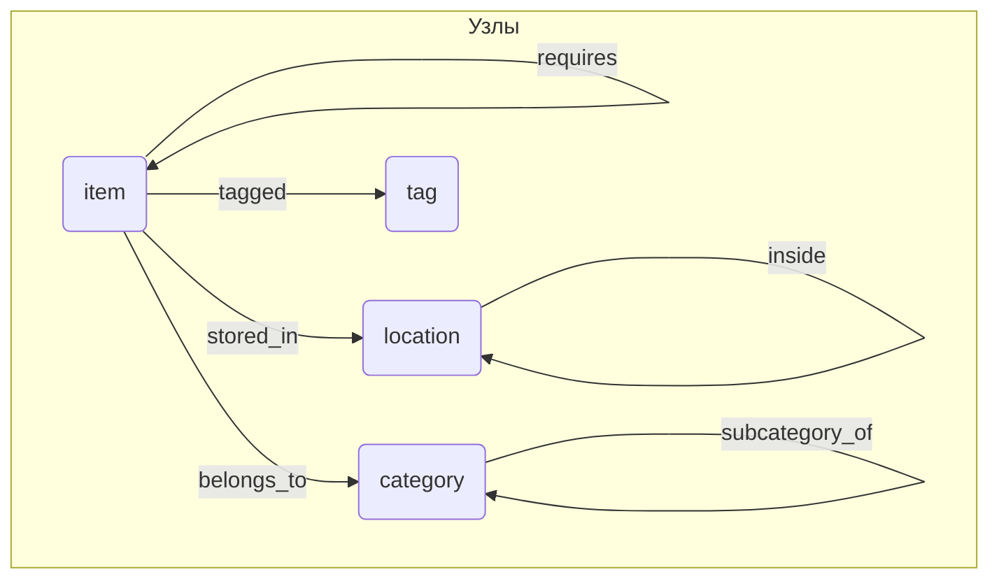
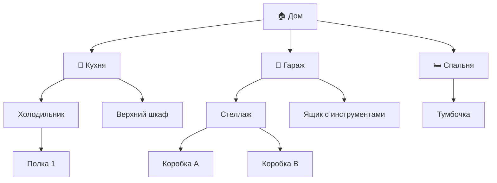
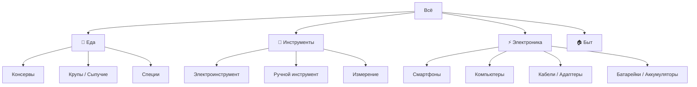

# Структура базы данных (SurrealDB)

## Концепция

Граф состоит из **узлов** (сущности) и **рёбер** (связи между ними).  
Все узлы имеют произвольные поля — никакой фиксированной схемы.

---

## Узлы (Tables)

| Таблица    | Описание                                              |
|------------|-------------------------------------------------------|
| `item`     | Любой физический предмет: еда, инструмент, электроника |
| `location` | Место хранения: дом → комната → мебель → полка → коробка |
| `category` | Иерархия категорий: Электроника → Смартфоны → Зарядки  |
| `tag`      | Произвольные метки: #срочно, #в_ремонте, #куплено_вместе |

---

## Рёбра (Relations)

| Связь            | От        | К          | Описание                              |
|------------------|-----------|------------|---------------------------------------|
| `stored_in`      | item      | location   | Предмет хранится в месте              |
| `belongs_to`     | item      | category   | Предмет относится к категории         |
| `tagged`         | item      | tag        | Предмет помечен тегом                 |
| `inside`         | location  | location   | Место вложено в другое место          |
| `subcategory_of` | category  | category   | Подкатегория                          |
| `part_of`        | item      | item       | Предмет входит в набор/комплект       |
| `compatible_with`| item      | item       | Совместимость (зарядка ↔ телефон)     |
| `requires`       | item      | item       | Зависимость (фонарик → батарейки)     |

---

## Диаграмма графа



---

## Иерархия мест хранения



---

## Иерархия категорий



---

## Примеры узлов с произвольными полями

### item (еда)
```json
{
  "id": "item:buckwheat_1",
  "name": "Гречка",
  "quantity": 2,
  "unit": "кг",
  "expiry_date": "2026-12-01",
  "brand": "Мистраль"
}
```

### item (инструмент)
```json
{
  "id": "item:drill_bosch",
  "name": "Дрель Bosch GSB 18V",
  "brand": "Bosch",
  "model": "GSB 18V-55",
  "voltage": 18,
  "condition": "хорошее",
  "purchase_date": "2023-04-15",
  "purchase_price": 12500
}
```

### item (электроника)
```json
{
  "id": "item:iphone_14",
  "name": "iPhone 14",
  "brand": "Apple",
  "serial": "DNPXC2XXXX",
  "color": "черный",
  "warranty_until": "2025-11-01",
  "purchase_price": 79000
}
```

### location
```json
{
  "id": "location:garage_shelf_a",
  "name": "Стеллаж A (гараж)",
  "description": "Левая сторона, у входа"
}
```

---

## SurrealDB: определения схемы

```surql
-- Узлы
DEFINE TABLE item SCHEMALESS;
DEFINE TABLE location SCHEMALESS;
DEFINE TABLE category SCHEMALESS;
DEFINE TABLE tag SCHEMALESS;

-- Рёбра
DEFINE TABLE stored_in TYPE RELATION FROM item TO location;
DEFINE TABLE belongs_to TYPE RELATION FROM item TO category;
DEFINE TABLE tagged TYPE RELATION FROM item TO tag;
DEFINE TABLE inside TYPE RELATION FROM location TO location;
DEFINE TABLE subcategory_of TYPE RELATION FROM category TO category;
DEFINE TABLE part_of TYPE RELATION FROM item TO item;
DEFINE TABLE compatible_with TYPE RELATION FROM item TO item;
DEFINE TABLE requires TYPE RELATION FROM item TO item;
```

---

## Пример запросов на SurrealQL

```surql
-- Найти все предметы в гараже (включая вложенные места)
SELECT * FROM item WHERE ->stored_in->location.*.id CONTAINSANY
  (SELECT VALUE id FROM location WHERE ->inside->location.*.name CONTAINS "Гараж");

-- Найти все инструменты Bosch
SELECT * FROM item WHERE ->belongs_to->category.*.name CONTAINS "Инструменты"
  AND brand = "Bosch";

-- Найти что совместимо с iPhone 14
SELECT ->compatible_with->item.* FROM item:iphone_14;

-- Найти еду с истекающим сроком (до конца месяца)
SELECT * FROM item WHERE expiry_date < time::now() + 30d;
```

---

## Открытые вопросы

- [ ] Нужно ли отслеживать **историю перемещений** предметов?
- [ ] Нужен ли учёт **расхода** (для еды: съели 500г из 2кг)?
- [ ] Несколько пользователей / ответственный за предмет?
- [ ] Фотографии предметов?
- [ ] Интеграция с магазинами / штрихкодами?
