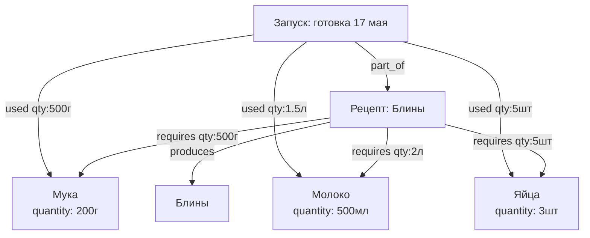
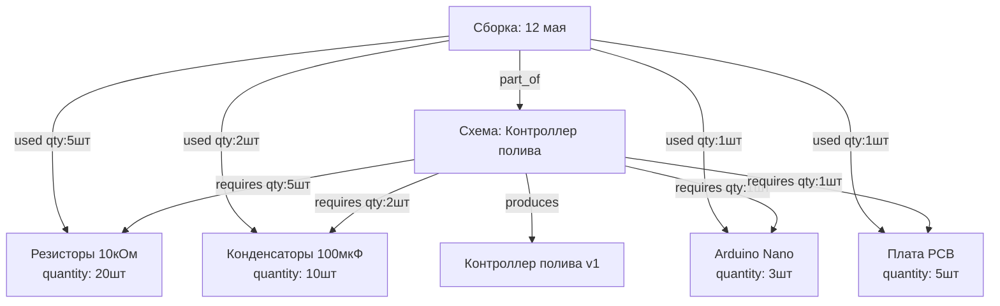
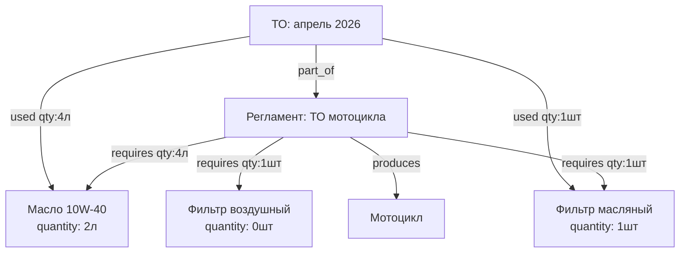
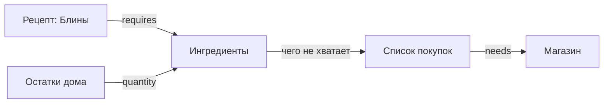
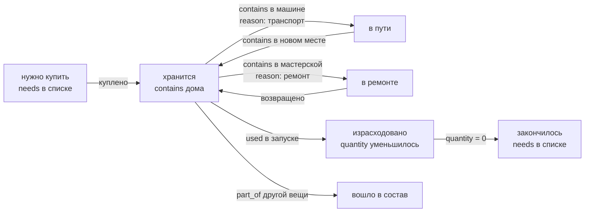

# Структура базы данных (SurrealDB)

## Концепция

Всё есть **вещь** (`thing`). Гараж, полка, коробка, мотоцикл, двигатель, батарейка, машина,
мастерская, магазин, список покупок, рецепт, процедура обслуживания — один тип узла.  
Смысл задаётся только рёбрами (связями) между вещами.

---

## Узлы

| Таблица | Описание |
|---------|----------|
| `thing` | Любая вещь: предмет, место, контейнер, транспорт, список, магазин, рецепт, процедура, запуск |

Поля у каждой вещи — произвольные. Никакой фиксированной схемы.

---

## Рёбра

| Связь | Описание | Поля на ребре |
|-------|----------|---------------|
| `contains` | Где физически находится вещь прямо сейчас | `reason`, `since` |
| `part_of` | Частью чего является семантически | — |
| `needs` | Что нужно купить (список → вещь) | `quantity`, `unit` |
| `requires` | Что нужно для выполнения (шаблон → ингредиент/деталь) | `quantity`, `unit` |
| `produces` | Что получается в результате (шаблон → результат) | — |
| `used` | Что фактически потрачено при запуске | `quantity`, `unit` |
| `related_to` | Произвольная связь с меткой | `label` |

**`reason` на ребре `contains`:**
- `хранение` — обычное место хранения
- `транспорт` — вещь едет в машине
- `ремонт` — вещь отдана в ремонт
- `покупка` — вещь в процессе покупки

---

## Сценарий: рецепт и приготовление еды

Рецепт описывает плановый расход. Каждое приготовление — отдельный запуск (`run`),
который фиксирует фактический расход и уменьшает остатки.



`requires` — плановые нормы из рецепта  
`used` — фактически потрачено (может отличаться)

---

## Сценарий: сборка электроники



---

## Сценарий: обслуживание техники



Воздушный фильтр не куплен → при запуске видно чего не хватает → добавляется в список покупок.

---

## Сценарий: от рецепта до магазина



Логика генерации списка покупок:
1. Берём `requires` рецепта/процедуры
2. Сравниваем с текущим `quantity` в инвентаре
3. Недостающее → `needs` в список покупок

---

## Жизненный цикл вещи



---

## SurrealDB: схема

```surql
-- Единственный тип узла
DEFINE TABLE thing SCHEMALESS;

-- Физическое местонахождение
DEFINE TABLE contains TYPE RELATION FROM thing TO thing SCHEMAFULL;
DEFINE FIELD reason ON contains TYPE option<string>; -- хранение / транспорт / ремонт / покупка
DEFINE FIELD since  ON contains TYPE option<datetime>;

-- Семантическая принадлежность (часть чего, запуск какого рецепта)
DEFINE TABLE part_of TYPE RELATION FROM thing TO thing;

-- Список покупок
DEFINE TABLE needs TYPE RELATION FROM thing TO thing SCHEMAFULL;
DEFINE FIELD quantity ON needs TYPE option<number>;
DEFINE FIELD unit     ON needs TYPE option<string>;

-- Плановый расход (рецепт/процедура → ингредиент/деталь)
DEFINE TABLE requires TYPE RELATION FROM thing TO thing SCHEMAFULL;
DEFINE FIELD quantity ON requires TYPE option<number>;
DEFINE FIELD unit     ON requires TYPE option<string>;

-- Результат выполнения
DEFINE TABLE produces TYPE RELATION FROM thing TO thing;

-- Фактический расход при запуске
DEFINE TABLE used TYPE RELATION FROM thing TO thing SCHEMAFULL;
DEFINE FIELD quantity ON used TYPE option<number>;
DEFINE FIELD unit     ON used TYPE option<string>;

-- Произвольная связь
DEFINE TABLE related_to TYPE RELATION FROM thing TO thing SCHEMAFULL;
DEFINE FIELD label ON related_to TYPE string;
```

---

## SurrealQL: примеры запросов

```surql
-- Что нужно купить для рецепта (чего не хватает в инвентаре)
SELECT
    ->requires->thing.* AS ingredient,
    ->requires.quantity AS needed,
    ->requires->thing.quantity AS have
FROM thing:pancake_recipe
WHERE ->requires->thing.quantity < ->requires.quantity;

-- История запусков рецепта
SELECT <-part_of<-thing.* FROM thing:pancake_recipe;

-- Суммарный расход ингредиента за все запуски
SELECT math::sum(quantity) AS total FROM used
WHERE out = thing:flour;

-- Все вещи в ремонте
SELECT ->contains->thing.* FROM thing WHERE ->contains[WHERE reason = "ремонт"];

-- Что сейчас в машине
SELECT ->contains->thing.* FROM thing:car;

-- Все части мотоцикла и где они находятся
LET $parts = SELECT <-part_of<-thing FROM thing:motorcycle;
SELECT name, <-contains<-thing.name AS location FROM $parts;

-- Всё содержимое гаража рекурсивно
SELECT ->contains->(thing FETCH *) FROM thing:garage DEPTH 6;
```

---

## YAML: описание схемы

```yaml
узел:
  тип: thing
  поля:
    обязательные:
      - название: текст
    необязательные:
      - описание: текст
      - количество: число       # текущий остаток
      - единица: текст          # кг, шт, л, м
      - куплено: дата
      - цена: число
      - заметки: текст
    дополнительные: любые

связи:
  contains:
    описание: физическое местонахождение прямо сейчас
    от: thing
    к: thing
    поля:
      - reason: текст           # хранение / транспорт / ремонт / покупка
      - since: дата

  part_of:
    описание: семантическая принадлежность или запуск принадлежит шаблону
    от: thing
    к: thing

  needs:
    описание: нужно купить (список → вещь)
    от: thing
    к: thing
    поля:
      - quantity: число
      - unit: текст

  requires:
    описание: плановый расход (шаблон → ингредиент/деталь)
    от: thing
    к: thing
    поля:
      - quantity: число
      - unit: текст

  produces:
    описание: результат выполнения шаблона
    от: thing
    к: thing

  used:
    описание: фактический расход при конкретном запуске
    от: thing  # запуск (run)
    к: thing   # ингредиент/деталь
    поля:
      - quantity: число
      - unit: текст

  related_to:
    описание: произвольная связь
    от: thing
    к: thing
    поля:
      - label: текст            # "совместим", "комплект", "см. также"
```

---

## Открытые вопросы

- [ ] История перемещений — хранить где вещь была раньше?
- [ ] Расписание обслуживания — через сколько км / дней следующее ТО?
- [ ] Фотографии вещей?
- [ ] Штрихкоды / QR-коды при добавлении?
- [ ] Несколько пользователей / ответственный за вещь?
- [ ] Повторяющиеся покупки — шаблон списка покупок?
