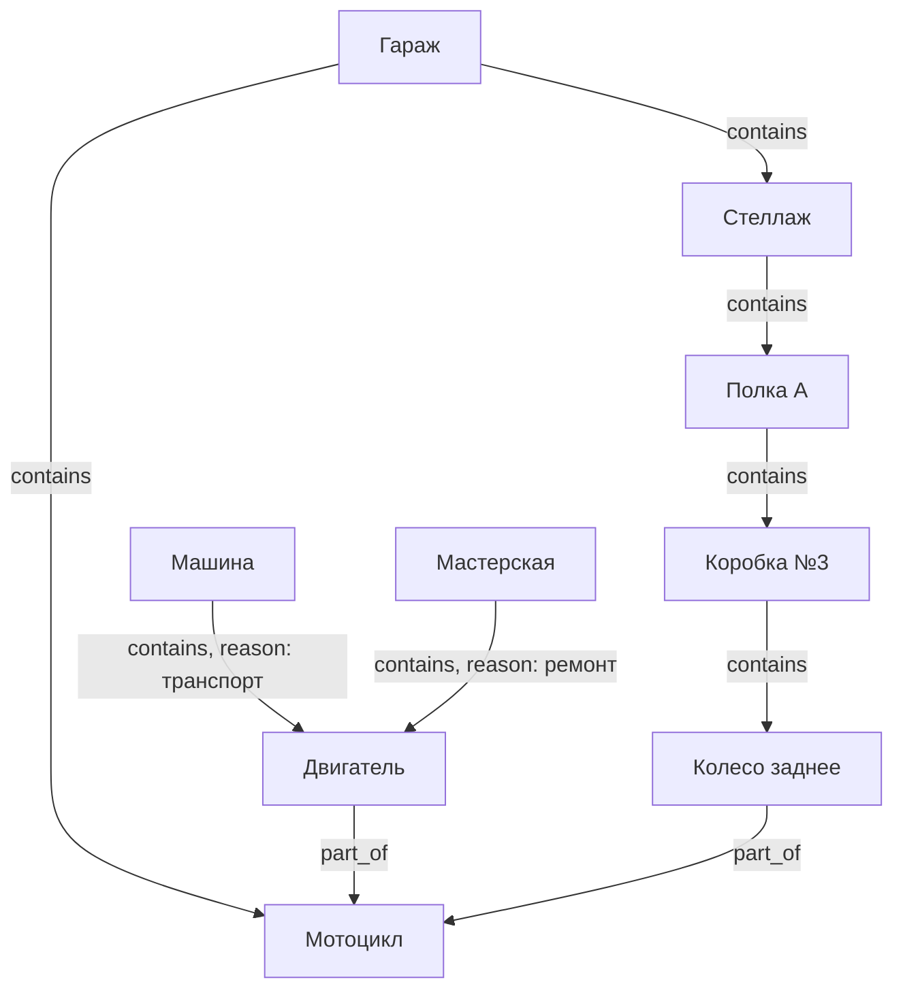
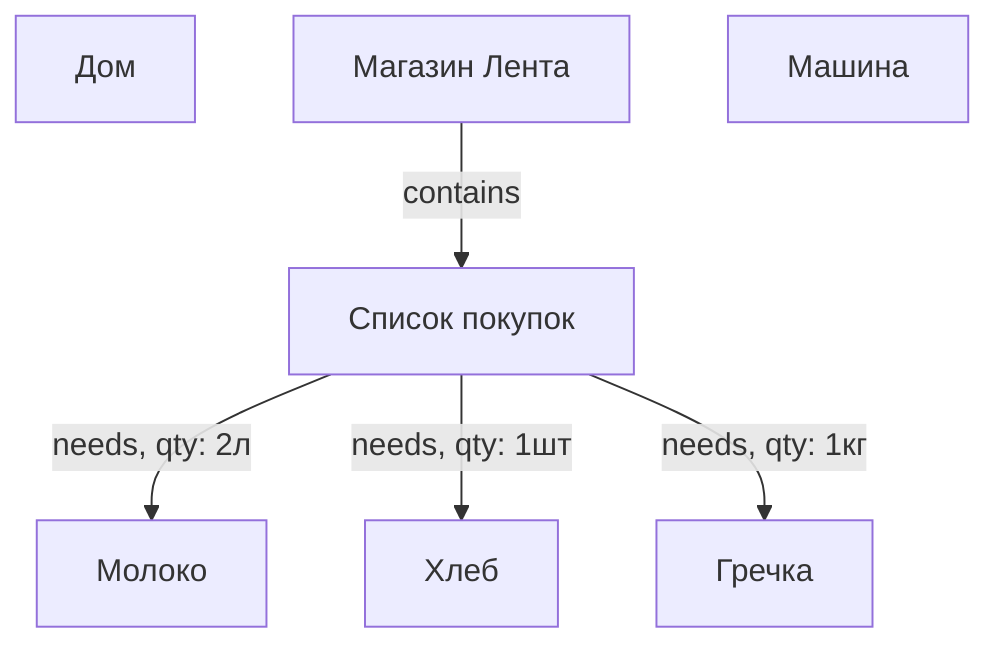
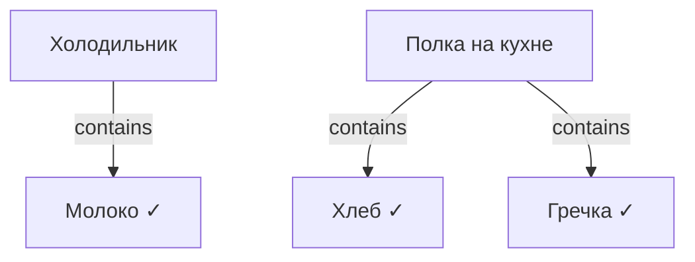
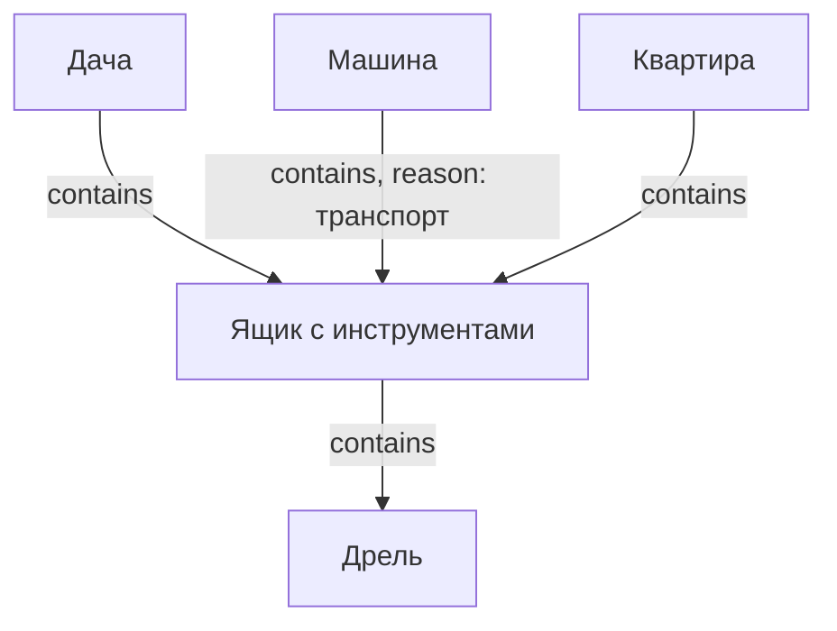
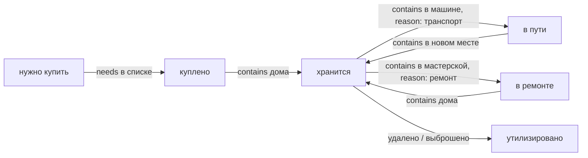

# Структура базы данных (SurrealDB)

## Концепция

Всё есть **вещь** (`thing`). Гараж, полка, коробка, мотоцикл, двигатель, батарейка, машина,
мастерская, магазин, список покупок — один тип узла.  
Смысл задаётся только рёбрами (связями) между вещами.

Один узел может одновременно:
- содержать другие вещи (быть контейнером)
- находиться внутри чего-то
- быть частью другой вещи
- быть местом назначения (магазин, мастерская)
- быть списком того, что нужно купить

---

## Узлы

| Таблица | Описание |
|---------|----------|
| `thing` | Любая вещь: предмет, место, контейнер, транспорт, список, магазин |

Поля у каждой вещи — произвольные. Никакой фиксированной схемы.

---

## Рёбра

| Связь | Описание | Поля на ребре |
|-------|----------|---------------|
| `contains` | Где физически находится вещь прямо сейчас | `reason`, `since` |
| `part_of` | Частью чего является семантически | — |
| `needs` | Что нужно купить (список → вещь) | `quantity`, `unit` |
| `related_to` | Произвольная связь с меткой | `label` |

**`reason` на ребре `contains`:**
- `хранение` — обычное место хранения
- `транспорт` — вещь едет в машине
- `ремонт` — вещь отдана в ремонт
- `покупка` — вещь в процессе покупки (в магазине, в корзине)

---

## Сценарий: мотоцикл разобран, двигатель сдан в ремонт



---

## Сценарий: поход в магазин



Когда товар куплен:
1. Вещь создаётся (или обновляется количество у существующей)
2. Убирается ребро `needs` из списка
3. Добавляется ребро `contains` от места хранения дома (холодильник, полка)



---

## Сценарий: перевозка вещей на машине



В пути: `Ящик` и `Дрель` содержатся в `Машине`.  
После приезда: `contains` меняется на `Квартира`.

---

## Жизненный цикл вещи



---

## SurrealDB: схема

```surql
-- Единственный тип узла
DEFINE TABLE thing SCHEMALESS;

-- Физическое местонахождение (с причиной)
DEFINE TABLE contains TYPE RELATION FROM thing TO thing SCHEMAFULL;
DEFINE FIELD reason ON contains TYPE option<string>; -- хранение / транспорт / ремонт / покупка
DEFINE FIELD since  ON contains TYPE option<datetime>;

-- Семантическая принадлежность
DEFINE TABLE part_of TYPE RELATION FROM thing TO thing;

-- Список покупок: что нужно купить
DEFINE TABLE needs TYPE RELATION FROM thing TO thing SCHEMAFULL;
DEFINE FIELD quantity ON needs TYPE option<number>;
DEFINE FIELD unit     ON needs TYPE option<string>;

-- Произвольная связь
DEFINE TABLE related_to TYPE RELATION FROM thing TO thing SCHEMAFULL;
DEFINE FIELD label ON related_to TYPE string;
```

---

## SurrealQL: примеры запросов

```surql
-- Где сейчас двигатель (путь вверх)
SELECT <-contains<-thing.* FROM thing:engine;

-- Все вещи в ремонте
SELECT ->contains->thing.* FROM thing:* WHERE ->contains.reason = "ремонт";

-- Что сейчас в машине
SELECT ->contains->thing.* FROM thing:car;

-- Текущий список покупок
SELECT ->needs->thing.* FROM thing:shopping_list_today;

-- Все части мотоцикла и где они находятся прямо сейчас
LET $parts = SELECT <-part_of<-thing.* FROM thing:motorcycle;
SELECT name, <-contains<-thing.name AS where FROM $parts;

-- Всё содержимое гаража рекурсивно (до 6 уровней)
SELECT ->contains->(thing FETCH *) FROM thing:garage DEPTH 6;
```

---

## YAML: описание схемы

```yaml
узел:
  тип: thing
  поля:
    обязательные:
      - название: текст
    необязательные:
      - описание: текст
      - количество: число
      - единица: текст        # кг, шт, л, м
      - куплено: дата
      - цена: число
      - заметки: текст
    дополнительные: любые     # без ограничений

связи:
  contains:
    описание: физическое местонахождение прямо сейчас
    от: thing
    к: thing
    поля:
      - reason: текст         # хранение / транспорт / ремонт / покупка
      - since: дата

  part_of:
    описание: семантическая принадлежность (часть чего)
    от: thing
    к: thing

  needs:
    описание: нужно купить (список покупок → вещь)
    от: thing
    к: thing
    поля:
      - quantity: число
      - unit: текст           # кг, шт, л

  related_to:
    описание: произвольная связь
    от: thing
    к: thing
    поля:
      - label: текст          # "совместим", "комплект", "см. также"
```

---

## Открытые вопросы

- [ ] История перемещений — хранить где вещь была раньше?
- [ ] Учёт расхода — уменьшать количество (для еды, расходников)?
- [ ] Фотографии вещей?
- [ ] Штрихкоды / QR-коды при добавлении?
- [ ] Несколько пользователей / ответственный за вещь?
- [ ] Повторяющиеся покупки — шаблон списка покупок?
