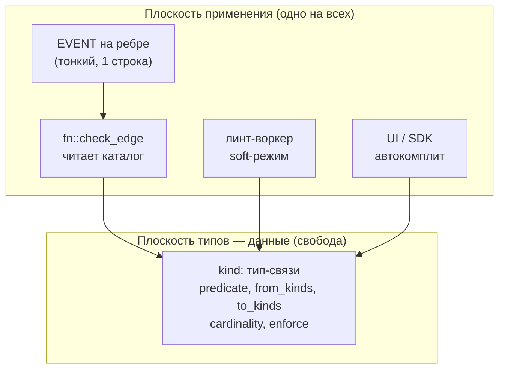

# Типизация связей — каталог рёбер

Как добавить Домовому типизацию отношений между узлами, **не отказываясь от свободы** schemaless-графа. Это ответ на постоянную критику: «в Anytype всё типизировано, а тут полная свобода — это сложно согласовать».

Смежные документы: модель данных — [`database.md`](database.md); модель доступа тем же приёмом «свобода в данных, enforcement — обобщённый» — [`access-control.md`](access-control.md).

## Критика, на которую отвечаем

> «У вас одна schemaless-таблица `thing` и рёбра `FROM thing TO thing` — значит, можно соединить что угодно с чем угодно. `RELATE задача->answered->сервер` пройдёт молча. Нет валидации, нет понимания, что к чему присоединяется, тяжело строить UI и онбордить. В Anytype каждый тип объекта и каждое отношение определены — там порядок.»

Критика бьёт в реальную дыру. Но она смешивает два разных понятия.

## Schemaless ≠ untyped

«Свобода» у нас — про **хранение**, а не про **семантику**. Два слоя типизации уже существуют:

- **узлы** мягко типизированы полем `kind` (`задача`, `человек`, `файл`, `сервис`…);
- **рёбра типизированы самим именем-предикатом** — `assigned_to`, `depends_on`, `derived_from` — это и есть типы связей.

Чего **нет** — и куда метит критика:

1. **ограничения на концы ребра** — какой `kind` каким предикатом можно соединять с каким `kind`;
2. **дискаверабилити** — машинно-читаемого ответа «что вообще можно присоединить к задаче».

Именно эти две вещи и надо закрыть — добавив слой типов, **не убивая** свойство «новый домен = новые `kind`, не новые таблицы».

## Почему нативная типизация SurrealDB здесь не помогает

SurrealDB умеет ограничивать концы ребра на уровне схемы:

```surql
DEFINE TABLE assigned_to TYPE RELATION FROM task TO person;  -- только task → person
```

Но это работает **между таблицами**. У нас всё — одна таблица `thing`, поэтому конструкция вырождается в `FROM thing TO thing` и не проверяет ничего. Вывод: типизация должна жить на уровне **`kind`**, а не таблиц. Разносить `thing` на `task`/`person`/… — значит стать Anytype и потерять ядро архитектуры. Это не вариант.

## Спектр вариантов

| # | Вариант | Механизм | Свобода | Гарантия |
|---|---------|----------|---------|----------|
| 0 | Статус-кво | `FROM thing TO thing` | 100% | нет |
| 1 | **Каталог связей как данные** | узлы `kind:тип-связи` описывают `(from_kinds, predicate, to_kinds, cardinality)` | высокая | дискаверабилити + опц. валидация |
| 2 | Soft-ASSERT на ребре | `ASSERT in.kind IN [...] AND out.kind IN [...]` | средняя | строгая, но хардкод в схему |
| 3 | Линт-воркер (schema-on-read) | периодический скан «нелегальных» рёбер → флаг | 100% | пост-фактум |
| 4 | App/SDK-типизация | UI/TS предлагает только валидные рёбра | 100% в БД | на уровне приложения |
| 5 | Native split-tables | разнести `thing` на таблицы + `FROM A TO B` | низкая | строгая (путь Anytype) |

Вариант 2 закрепляет допустимые `kind` в схеме → теряется «новый домен без миграции». Вариант 5 — отказ от ядра. Остаются 1, 3, 4 — и они отлично складываются вместе.

## Решение: каталог-как-данные + градуированное применение

Тот же приём, что разрешил [access-control](access-control.md): **типы связей живут как данные графа, а enforcement — один обобщённый механизм, читающий эти данные.**



### Тип связи — это узел

```surql
CREATE thing:`relspec_assigned_to` SET
  kind        = 'тип-связи',
  predicate   = 'assigned_to',
  from_kinds  = ['задача','обращение','платёж'],   -- NONE = «любой kind»
  to_kinds    = ['человек','группа'],
  cardinality = 'many-to-one',                      -- у задачи один исполнитель
  enforce     = true,                               -- true = блокировать; false = только линт
  description = 'Кто отвечает за выполнение',
  created_at  = time::now();
```

`from_kinds`/`to_kinds = NONE` означает «любой» — так описываются принципиально свободные рёбра (см. `can_access`, `related_to` ниже).

### Градация строгости — флаг `enforce`

Свобода не бинарна. Каждый тип связи сам выбирает режим:

- `enforce = true` — для несущих рёбер, по которым ходят воркеры и права (`assigned_to`, `depends_on`, `can_access`, `derived_from`). Нарушение блокируется на записи.
- `enforce = false` — для свободного хвоста (`related_to`). Каталог только **описывает** ожидание; линт помечает странности, но не мешает.

Это и есть *gradual typing*: строго там, где важно; свободно там, где хвост.

### Enforcement: общая функция + тонкие события

Логика — в одной функции; на каждом ребре — однострочное событие-обёртка.

```surql
-- Единая проверка: читает каталог по предикату
DEFINE FUNCTION fn::check_edge($predicate: string, $in: record, $out: record) {
    LET $spec = (SELECT from_kinds, to_kinds, enforce FROM thing
                 WHERE kind = 'тип-связи' AND predicate = $predicate)[0];
    IF $spec = NONE OR $spec.enforce = false { RETURN true; };  -- нет правила / soft → пропускаем
    LET $ok_from = $spec.from_kinds = NONE OR $in.kind  IN $spec.from_kinds;
    LET $ok_to   = $spec.to_kinds   = NONE OR $out.kind IN $spec.to_kinds;
    IF !($ok_from AND $ok_to) {
        THROW 'Недопустимая связь: ' + <string>$in.kind
            + ' -' + $predicate + '-> ' + <string>$out.kind;
    };
    RETURN true;
};

-- Тонкая обёртка на ребре (одна строка на каждый предикат с enforce=true)
DEFINE EVENT typecheck ON TABLE assigned_to WHEN $event = 'CREATE'
    THEN fn::check_edge('assigned_to', $after.in, $after.out);

DEFINE EVENT typecheck ON TABLE depends_on  WHEN $event = 'CREATE'
    THEN fn::check_edge('depends_on', $after.in, $after.out);

DEFINE EVENT typecheck ON TABLE derived_from WHEN $event = 'CREATE'
    THEN fn::check_edge('derived_from', $after.in, $after.out);
```

Логика централизована; добавить enforced-ребро = одна строка `DEFINE EVENT`. Поменять правило = `UPDATE` узла каталога, **без миграции схемы**.

### Soft-режим: линт-воркер

Для `enforce = false` (и для аудита уже накопленных данных) — запрос, находящий нарушения постфактум:

```surql
-- все assigned_to, нарушающие каталог
LET $spec = (SELECT from_kinds, to_kinds FROM thing
             WHERE kind = 'тип-связи' AND predicate = 'assigned_to')[0];
SELECT id, in.kind AS from_kind, out.kind AS to_kind FROM assigned_to
WHERE !(in.kind IN $spec.from_kinds) OR !(out.kind IN $spec.to_kinds);
```

Воркер прогоняет это по всем предикатам раз в N минут и помечает узлы/рёбра флагом `_lint_warning` для разбора — никого не блокируя.

### Дискаверабилити: автокомплит из каталога

Главный пункт критики («непонятно, что к чему подключается») закрывается одним запросом:

```surql
-- что можно присоединить, ИСХОДЯ из узла kind = 'задача'?
SELECT predicate, to_kinds, cardinality, description FROM thing
WHERE kind = 'тип-связи' AND ('задача' IN from_kinds OR from_kinds = NONE);
```

UI рисует из этого меню: «от задачи: `assigned_to` → человек/группа, `depends_on` → задача, `part_of` → проект…». Ровно тот же UX, что в Anytype, — но источник истины это данные, а не схема.

### Кардинальность

`cardinality` чаще дешевле проверять линтом, чем на каждой записи:

```surql
-- задачи с более чем одним исполнителем (нарушение many-to-one)
SELECT in AS task, count() AS assignees FROM assigned_to
GROUP BY in HAVING assignees > 1;
```

При желании это же условие можно встроить в `fn::check_edge` (посчитать существующие рёбра до вставки) — но это write-time стоимость, поэтому по умолчанию оставляем линту.

## Примеры

### Каталог: типовой набор

```surql
-- Несущие рёбра — строго
CREATE thing:`relspec_depends_on` SET kind='тип-связи', predicate='depends_on',
  from_kinds=['задача','сервис'], to_kinds=['задача','сервис'],
  cardinality='many-to-many', enforce=true;

CREATE thing:`relspec_contains` SET kind='тип-связи', predicate='contains',
  from_kinds=['локация','контейнер','сервер'], to_kinds=NONE,   -- содержать можно что угодно
  cardinality='one-to-many', enforce=true;

CREATE thing:`relspec_answered` SET kind='тип-связи', predicate='answered',
  from_kinds=['попытка'], to_kinds=['вопрос'],
  cardinality='many-to-one', enforce=true;

CREATE thing:`relspec_derived_from` SET kind='тип-связи', predicate='derived_from',
  from_kinds=NONE, to_kinds=NONE,           -- происхождение — у любого артефакта
  cardinality='many-to-one', enforce=true;

-- Принципиально свободные рёбра — описаны, но не блокируются
CREATE thing:`relspec_can_access` SET kind='тип-связи', predicate='can_access',
  from_kinds=NONE, to_kinds=NONE, cardinality='many-to-many', enforce=false,
  description='Доступ — это политика-данные, ограничивать концы нельзя';

CREATE thing:`relspec_related_to` SET kind='тип-связи', predicate='related_to',
  from_kinds=NONE, to_kinds=NONE, cardinality='many-to-many', enforce=false,
  description='Свободная связь с меткой — намеренно без ограничений';
```

### Допустимые vs отклонённые

```surql
-- ✅ проходит: задача → человек
RELATE thing:`task_to_bmw`->assigned_to->thing:`user_papa`;

-- ❌ THROW: «Недопустимая связь: задача -answered-> сервер»
RELATE thing:`task_to_bmw`->answered->thing:`server_proxmox`;

-- ✅ проходит даже бессмысленное по can_access — enforce=false, это политика
RELATE thing:`user_son`->can_access->thing:`task_to_bmw` SET permissions=['view'];
```

### Новый домен = одна запись, не миграция

Добавляем CRM: «сделка ссылается на контакт». В Anytype — миграция схемы (новый relation type, версия онтологии). Здесь:

```surql
CREATE thing:`relspec_about_crm` SET kind='тип-связи', predicate='about',
  from_kinds=['сделка'], to_kinds=['контакт','клиент'],
  cardinality='many-to-one', enforce=true;
-- либо просто расширить существующий relspec_about: UPDATE ... SET from_kinds += 'сделка';
```

Одна запись (или один `UPDATE`) — и новый домен типизирован, провалидирован и виден в автокомплите. Ноль миграций.

## Каталог ест свою собачью еду

`kind:тип-связи` — это обычные `thing`. Значит, к нему **бесплатно** применяется всё остальное:

- **версионирование** — `supersedes` между версиями правила (ужесточили `to_kinds` — старая версия осталась для аудита);
- **доступ** — `can_access` решает, кто вправе менять каталог (управление типами = привилегия);
- **мультиязычность** — `_i18n` даёт человекочитаемые имена связей на разных языках в UI;
- **federation** — каталог путешествует с данными при синхронизации.

Метамодель живёт по тем же законам, что и данные. Отдельной «системы типов» городить не нужно.

## Чем это бьёт Anytype на его поле

| Критика «у Anytype всё типизировано» | Ответ Домового |
|--------------------------------------|----------------|
| «у тебя нет типов связей» | есть — но как **данные** (`kind:тип-связи`), а не зашитая схема |
| «непонятно, что к чему подключается» | каталог → дискаверабилити и автокомплит, как в Anytype |
| «ничто не валидирует связи» | `enforce=true` даёт ту же гарантию, что schema-on-write |
| «зато Anytype гибкий через типы» | **ты гибче**: новый тип связи = запись/`UPDATE`, у них = миграция онтологии |
| «свобода = хаос» | свобода **градуируется per-edge**: строго где важно, свободно где хвост |

Суть: выбор не между «свободой» и «типизацией». Типизация делается **поздносвязанной и расширяемой данными**. Anytype фиксирует типы в схеме (миграция на каждое изменение); Домовой — в графе (запись на каждое изменение), с теми же проверками, но без migration-боли. Это gradual typing для графа.

## Честные границы / открытые вопросы

- **Стоимость EVENT на запись.** Каждое enforced-ребро делает SELECT по каталогу при вставке. Кэшировать каталог (он меняется редко) — в памяти приложения или materialized-узлом.
- **Кардинальность на записи дорогая.** По умолчанию — линтом; write-time только для критичных инвариантов.
- **THROW в EVENT vs ASSERT.** Точный локус блокировки (EVENT/ASSERT с подзапросом/app-слой) — деталь реализации; источник истины один — каталог.
- **Гонки.** Параллельные вставки нарушающих кардинальность рёбер EVENT-проверкой полностью не ловятся — нужен либо уникальный индекс, либо линт-сверка.
- **Миграция накопленных данных.** Ввод `enforce=true` на существующем графе — сначала прогнать линт (#3), почистить, потом включать блокировку.

## Практические инварианты

- Тип связи — это `thing` (`kind:тип-связи`), не строка в схеме.
- Логика проверки — в `fn::check_edge`; на ребре — только тонкая обёртка-`EVENT`.
- `enforce` градуирует строгость per-edge: несущие — строго, хвост — свободно.
- `from_kinds`/`to_kinds = NONE` = «любой» — для принципиально свободных рёбер.
- UI и онбординг читают каталог; не хардкодить допустимые связи в приложении.
- Новый домен = запись/`UPDATE` в каталоге, не миграция.
- Перед включением `enforce` на живых данных — прогнать линт и почистить.
