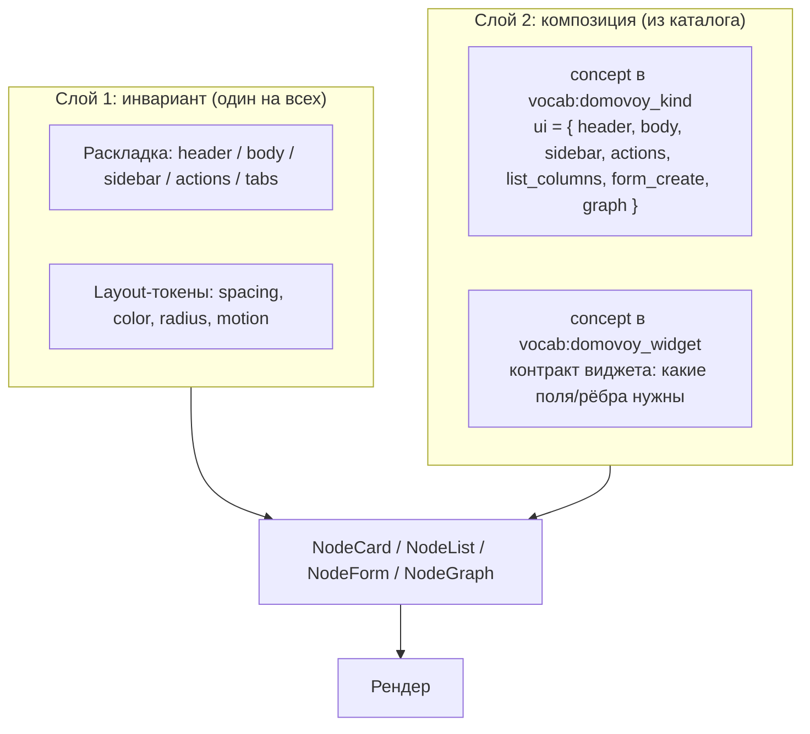

# UI как данные — единый интерфейс для свободного графа

Как построить UI поверх Домового, чтобы стиль был один, домены — десятки, а кода — мало.

Связанные документы:
- модель данных — [`database.md`](database.md);
- типы узлов — [`kind-audit.md`](kind-audit.md);
- типизация связей и SKOS-словари — [`relation-typing.md`](relation-typing.md);
- модель доступа — [`access-control.md`](access-control.md).

## Проблема

У нас 27 канонических `kind`, ~65 категорий, ~10 живых доменов (инвентарь, задачи, медицина, IT, обучение, AI-чаты, плейбуки, документы, торговля, садоводство). Если на каждый `kind` рисовать отдельный набор экранов (список, карточка, форма, граф-узел) — это:

- **100+ хардкоженных компонент** для базы;
- **разъезжающийся стиль** между доменами (медицина пишется одним днём, инвентарь — другим);
- **новая категория = код-релиз**, что убивает гибкость каталога;
- **i18n** прибивается к каждому компоненту отдельно;
- права/aлл-у-сабилити дублируются.

Это та же ловушка, что Anytype-критика «у вас свобода данных, но как же UI», только теперь — изнутри.

## Решение: те же два слоя, что разрешили access-control и типизацию

> **UI = инвариантная раскладка + декларативная композиция виджетов из каталога.**

Стиль приходит из неизменной раскладки. Домен — из композиции, которую читаем из `vocab:domovoy_kind` (тот же словарь, который уже описывает типы узлов).



## Анатомия виджета

Виджет — **переиспользуемый фрагмент UI с типизированным контрактом на данные графа**. Их ~30 на всю систему, не 100+ карточек.

Три уровня по широте применения:

| Уровень | Контракт | Примеры | Работает для |
|---|---|---|---|
| **Universal** | любой узел | `Title`, `Description`, `Tags`, `Breadcrumb`, `ActivityFeed`, `WikidataLink`, `LangBadge` | всего |
| **Edge-based** | узел имеет ребро X | `AssigneeAvatar` (→assigned_to), `LocationCrumb` (←contains), `Subtasks` (→part_of), `LentToCard` (→lent_to), `DerivedFromTree` (→derived_from), `DependsOn` (→depends_on) | всех `kind` с этим ребром |
| **Field-based** | узел имеет поле X | `StatusChip` (.status), `Odometer` (.counter_value), `LifecycleStage` (.stage), `Currency` (.amount+.currency), `WeightDisplay` (.weight_kg), `MimeIcon` (.mime) | всех `kind` с этим полем |

`AssigneeAvatar` работает одинаково для `task`, `appeal`, `incident`, `payment` — везде, где есть `→assigned_to→person`. Не привязывается к `kind` — привязывается к **форме данных**.

### Виджет — это первоклассный узел в `vocab:domovoy_widget`

```surql
CREATE thing:`vocab_widget` SET
  kind='vocabulary', identifier='domovoy_widget', source='internal',
  _i18n={ ru:{label:'Виджеты UI'}, en:{label:'UI widgets'} };

CREATE thing:`widget_status_chip` SET
  kind='concept', identifier='StatusChip',
  contract={
    requires_fields: ['status'],
    optional_fields: ['priority']
  },
  source='built-in',                           -- built-in | plugin | custom
  _i18n={ ru:{label:'Статус'}, en:{label:'Status'} };
RELATE thing:`widget_status_chip`->part_of->thing:`vocab_widget`;
```

Виджеты тоже едят свою собачью еду: версионирование через `supersedes`, доступ через `can_access`, переводы через `_i18n`, документация виджета в `description` и `wikidata`-якорь, если есть.

## Композиция: поле `ui` на концепте kind

Для каждого `kind`-концепта в `vocab:domovoy_kind` лежит блок `ui`, описывающий **где что показывается**:

```surql
CREATE thing:`concept_kind_task` SET
  kind='concept', identifier='task',
  _i18n={ ru:{label:'Задача'}, en:{label:'Task'} },
  ui={
    -- Шапка (горизонтально, слева направо)
    header:  ['StatusChip', 'Title', 'AssigneeAvatar', 'DueDate', 'PriorityChip'],
    -- Основное тело
    body:    ['Description', 'CustomFields'],
    -- Боковая панель — связанные узлы
    sidebar: ['Subtasks', 'DependsOn', 'About', 'Attachments'],
    -- Вкладки (lazy-load)
    tabs:    ['Comments', 'History', 'Activity'],
    -- Быстрые действия
    actions: ['mark_done', 'reassign', 'snooze', 'add_subtask'],
    -- Колонки в табличном виде
    list_columns: ['StatusChip', 'Title', 'AssigneeAvatar', 'DueDate'],
    -- Поля формы создания
    form_create:  ['Title', 'Description', 'AssigneeSelect', 'DueDatePicker', 'PriorityPicker'],
    -- Иконка/цвет/форма в граф-визуализации
    graph: { icon:'check-square', color:'auto:status', shape:'rounded' }
  };
RELATE thing:`concept_kind_task`->part_of->thing:`vocab_domovoy_kind`;
```

Та же декларация для `device`:

```surql
ui = {
  header: ['RoleChip', 'OnlineIndicator', 'Title', 'Hostname', 'WikidataLink'],
  body:   ['Description', 'NetworkInfo', 'OSInfo'],
  sidebar:['LocationCrumb', 'ContainedItems', 'RunningServices', 'AccessGrants'],
  tabs:   ['Logs', 'Incidents', 'Inventory'],
  actions:['ssh', 'reboot', 'update_inventory', 'change_role'],
  list_columns: ['RoleChip', 'Title', 'Hostname', 'OnlineIndicator'],
  graph: { icon:'server', color:'auto:online', shape:'rectangle' }
}
```

И `plant`:

```surql
ui = {
  header: ['LifecycleStage', 'Title', 'SpeciesLink'],
  body:   ['LocationCrumb', 'CarerInfo'],
  sidebar:['CareSchedule', 'HealthLog', 'HarvestTimeline'],
  actions:['log_watering', 'log_fertilizing', 'mark_harvested', 'photo'],
  list_columns: ['LifecycleStage', 'Title', 'SpeciesLink', 'LastWatered'],
  graph: { icon:'sprout', color:'auto:stage', shape:'circle' }
}
```

## Один компонент рендерит всё

В коде (Next.js / React) — **одна** карточка:

```tsx
function NodeCard({ nodeId }: { nodeId: string }) {
  const node    = useNode(nodeId);                                    // SELECT thing
  const concept = useConcept('domovoy_kind', node.kind);              // SELECT concept
  const layout  = concept.ui ?? DEFAULTS;
  const lang    = useUILanguage();

  return (
    <Card>
      <Header>
        {layout.header.map(name => <Widget key={name} name={name} node={node} lang={lang} />)}
      </Header>
      <Body>
        {layout.body.map(name => <Widget name={name} node={node} lang={lang} />)}
      </Body>
      <Sidebar>
        {layout.sidebar.map(name => <Widget name={name} node={node} lang={lang} />)}
      </Sidebar>
      <Tabs items={layout.tabs} node={node} />
      <Actions items={layout.actions} node={node} />
    </Card>
  );
}
```

`<Widget>` — диспетчер: по имени достаёт из реестра конкретный React-компонент и передаёт ему `node` + `lang`. Реестр виджетов соответствует `vocab:domovoy_widget` — slug → компонент.

Та же история для остальных мест:

```tsx
<NodeList kind="task" />               // читает layout.list_columns
<NodeForm kind="task" mode="create"/>  // читает layout.form_create
<NodeGraph rootId={...} />             // читает layout.graph для каждого узла
```

**27 kinds × 4 экрана = 108 компонент → 4 компонента + ~30 виджетов.**

## Трёхступенчатая эскалация

Не всё описывается декларативно — и это нормально. Лестница такая:

| Уровень | Когда | Сколько кода |
|---|---|---|
| **1. Чистый generic** | каталог пуст / новый `kind` не описан | поле = строка, ребро = ссылка. Уродливо, но работает с первого дня |
| **2. Каталог-декларация** | в концепте есть `ui={...}` | ~80% реальных кейсов; нет нового кода |
| **3. Custom-компонент** | сложный домен (граф-вью пайплайна, дашборд ML-метрик, видеомонтаж) | редко; регистрируется в реестре виджетов под своим slug, дальше — обычный виджет |

Это та же лестница, что в `relation-typing.md` (`enforce: off / soft / strict`) — есть рабочий дефолт, есть декларативное усиление, есть escape hatch.

## Формы, списки, граф-вью — всё через тот же `ui`

### Формы создания/редактирования

Поля и валидация **выводятся** из:
- `ui.form_create` концепта kind — какие виджеты в каком порядке;
- `vocab:domovoy_edge` — какие рёбра нужны, какие `from_kinds`/`to_kinds` (для AssigneeSelect, AboutPicker);
- DB-`ASSERT` и `EVENT` (`fn::check_edge`) — финальная валидация на записи.

Один движок форм генерирует UI и валидацию из декларации. Не нужен FormSchema-движок поверх (Zod, react-hook-form) — он есть, но он подцепляется к данным концепта, а не к фиксированной структуре.

### Списки

`<NodeList kind="task">` читает:
- `ui.list_columns` — колонки;
- `vocab:domovoy_status` концепты — какие статусы существуют и в каких цветах (для фильтров и StatusChip-рендера);
- доступные права (`can_access`) — какие колонки/действия видны конкретному пользователю.

### Граф-визуализация

В `graph: { icon, color, shape }`:
- `icon` — слаг иконки (lucide) или URL (можно даже Wikidata-картинка концепта);
- `color: 'auto:status'` — компилируется в функцию: цвет читается из текущего значения статуса через `vocab:domovoy_status`;
- `shape` — форма узла в выбранной библиотеке (React Flow / Cytoscape).

Рёбра тоже через каталог: `vocab:domovoy_edge` концепт даёт `_i18n.label`, цвет линии, стиль (solid/dashed).

## Что это даёт

| Хотим | Как получается |
|---|---|
| **Единый стиль** | раскладка одна, Tailwind-токены одни, виджеты дизайнятся раз |
| **Богатство домена** | виджеты держат специфику (StatusChip знает цвета, Odometer строит график) |
| **Расширяемость без релиза** | новая категория или kind = новая декларация в каталоге, UI обновляется на лету |
| **Многоязычность** | метки из `_i18n` каталога концептов (то же место, что для меток типов и категорий) |
| **A11y и темизация** | один раз в виджетах, единообразно везде |
| **Тесты** | тестируем 30 виджетов × контракт, не 27 карточек × 4 экрана |
| **Граф-вью** | икона/цвет/форма читаются из того же `ui.graph` без дублирования |
| **Права** | `can_access` через тот же движок ([`access-control.md`](access-control.md)) фильтрует, что видно в шапке/панели/действиях |
| **Плагины** | новый виджет → новый узел в `vocab:domovoy_widget` → доступен сразу |

## Параллели в индустрии

Мы не изобретаем, мы кристаллизуем то, что зрелые системы уже пришли к:

| Система | Их название | Их паттерн |
|---|---|---|
| **Notion** | Properties + Views | свойства определяют рендер; виды компонуют их в layout |
| **Anytype** | Relations + Types | те же relations + те же types ↔ наши `concept`s в словарях |
| **Salesforce** | Page Layouts | layout-объекты в метаданных кастомизируют рендер |
| **Atlassian Forge / JIRA** | Field configurations + Custom field types | meta-data drives UI |
| **Microsoft Dataverse / Power Apps** | Forms, Views, Site map | всё в метаданных, рендерится универсальным движком |
| **Backstage (Spotify)** | Software Catalog + Plugins | компонентная композиция плагинов на узел |

Все они пришли к одному, потому что 100+ компонентов не масштабируется. Мы это получаем графом из коробки.

## Слой темизации

Layout-токены — это тоже словарь:

```surql
CREATE thing:`vocab_ui_token` SET kind='vocabulary', identifier='domovoy_ui_token';

CREATE thing:`token_color_danger` SET kind='concept', identifier='color.danger',
  value='#dc2626', _i18n={ ru:{label:'Опасность'}, en:{label:'Danger'} };
RELATE thing:`token_color_danger`->part_of->thing:`vocab_ui_token`;
```

Темы — это альтернативные словари (`domovoy_ui_token_dark`, `domovoy_ui_token_high_contrast`), переключатель темы выбирает активный. Это позволяет:
- хранить пользовательские темы как обычные узлы (с правами и шарингом);
- версионировать через `supersedes`;
- импортировать чужие темы из других инстанций.

## Стартовый набор виджетов (≈30 на старте)

Не финальный список — но порядок величины:

**Universal (8)**: `Title`, `Description`, `Tags`, `Breadcrumb`, `ActivityFeed`, `WikidataLink`, `LangBadge`, `Timestamps`.

**Edge-based (12)**: `AssigneeAvatar`, `LocationCrumb`, `ContainedItems`, `Subtasks`, `DependsOn`, `About`, `Attachments`, `Participants`, `LentToCard`, `DerivedFromTree`, `LinkedTo`, `Comments`.

**Field-based (10)**: `StatusChip`, `PriorityChip`, `RoleChip`, `LifecycleStage`, `Odometer`, `Currency`, `WeightDisplay`, `MimeIcon`, `OnlineIndicator`, `DueDate`.

**Actions (специальный класс, ~5 универсальных)**: `MarkDone`, `Reassign`, `Snooze`, `Delete`, `Share`. Доменные действия — на kind-концепте.

## Открытые архитектурные вопросы — на твоё подумать

1. **Где хранить `ui` метаданные** — прямо на концепте `kind` (как выше) или в отдельных «view»-узлах?
   - **За концепт:** проще, одно место правды, один JOIN.
   - **За отдельные view:** поддержка нескольких раскладок (компакт/детальная/мобильная), пользовательские view, шаринг макетов.
   - *Рекомендация на старте: на концепте; вынести в отдельные `view`-узлы при появлении потребности.*

2. **Виджеты — встроенные React-компоненты или Web Components / micro-frontends?**
   - **React:** проще, прямой Tailwind/shadcn, одна сборка.
   - **WC/MFE:** позволяет подключать виджеты из плагинов без пересборки фронта.
   - *Рекомендация: React на старте; интерфейс виджета (`node`, `lang`) спроектировать совместимым с MFE-обёрткой на будущее.*

3. **`ui` — JSON-объект или граф рёбер `widget_position`?**
   - **JSON:** проще, читается одним SELECT.
   - **Граф:** позволяет версионировать каждую перестановку, делиться раскладками, права на отдельные виджеты.
   - *Рекомендация: JSON на старте; миграция в граф — детерминированная при росте.*

4. **Action-виджеты — как стандартизировать?**
   - Контракт «action принимает `node`, возвращает мутацию» — где описан, как валидируется?
   - Подключение к движку плейбуков (`worker-playbook`) — action может запустить плейбук вместо прямой мутации.
   - *Открыто — обсуждаем при дизайне actions.*

5. **Граф-визуализация — React Flow / Cytoscape / Sigma / D3?**
   - В CLAUDE.md помечено как нерешённое; кандидат React Flow.
   - *Решаем после спайка-прототипа.*

6. **Мобильная раскладка** — отдельный `ui.mobile = {...}` блок на концепте, или automatic responsive из `header`/`body`?
   - *Рекомендация: automatic responsive; явный `ui.mobile` — escape hatch.*

7. **Пользовательские раскладки** — может ли пользователь перетащить виджеты у себя, не меняя глобальную раскладку?
   - **За:** настройка интерфейса под себя.
   - **Против:** разъезжается consistency между членами семьи.
   - *Рекомендация: позволить; персональные раскладки — узлы `view` с `can_access {edit: self}`; глобальная — admin-only.*

## План спайка (если/когда приступим)

1. **Скелет**: `<NodeCard>` + `<Widget>`-диспетчер + 3 виджета (`Title`, `StatusChip`, `Description`).
2. **Один kind**: декларация `ui` для `task`. Рендер из seed.
3. **Расширение**: добавить ещё 5 виджетов, ещё 2 kind (`item`, `device`). Демо разнообразия раскладок при единой шапке.
4. **Списки + формы**: `<NodeList>` + `<NodeForm>` по тем же декларациям. Подтверждает универсальность.
5. **i18n + темы**: переключатель языка и тёмная тема через словари. Подтверждает Tier 0 i18n.
6. **Граф-вью**: один экран React Flow с тем же `ui.graph`. Подтверждает целостность.

Каждый шаг — отдельный коммит/PR, видимо ходящее демо.

## Резюме

> UI Домового — это **тот же словарь-управляемый движок**, что для access-control, типизации связей и категорий. Раскладка инвариантна и даёт единый стиль; композиция виджетов на каждый `kind` декларируется в концепте и даёт богатство домена. Виджеты — ~30 переиспользуемых фрагментов с типизированным контрактом, не 100+ карточек. Новая категория или kind — это **запись в каталоге**, не релиз кода. Многоязычие, темизация, права, действия — всё едет по тому же графу.

Это слон, разделённый на сосиски: ~30 виджетов + 4 универсальных компонента + декларация в каталоге. Когда дойдёт до спайка — план выше, шесть шагов.
